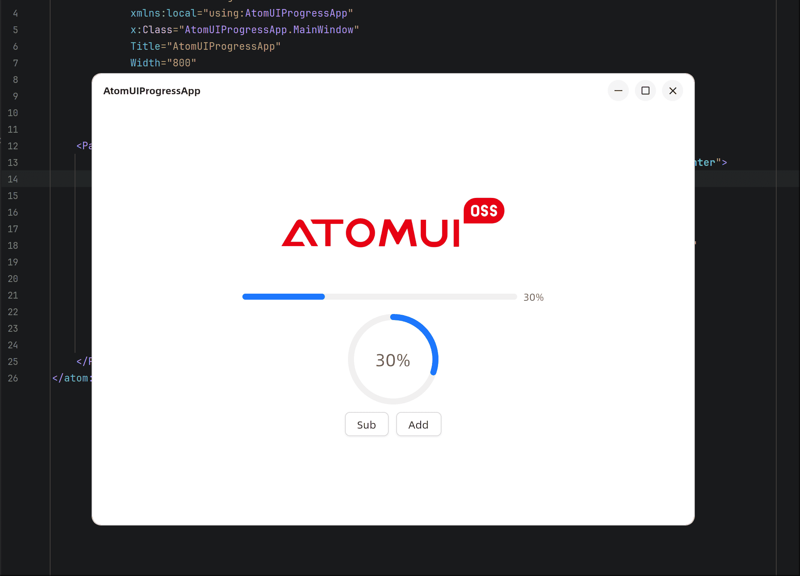

本章我们将从零开始，循序渐进的开发您的第一个 `AtomUI` 应用程序，通过这个学习例子您可以快速上手 AtomUI 的应用开发。
我们将开发一个简单的应用，这个应用显示 `AtomUI OSS` 的 `Logo`，然后再 `Logo` 下显示一个圆形进度条，然后有两个按钮，可以增加或减少进度值。

> [!NOTE]
> 本教程的源码可以在我们示例库找到 [Samples/AtomUIProgressApp](https://github.com/chinware/AtomUI.Samples/tree/develop/AtomUIProgressApp)

