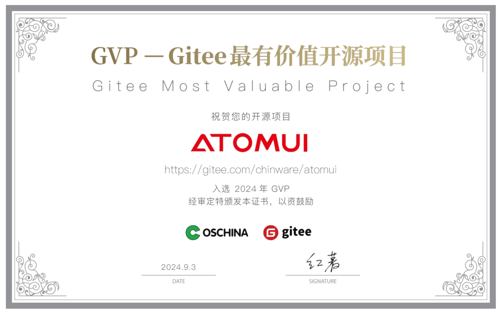

AtomUI 是基于 .NET 的 Ant Design 5.0 实现，致力于将优秀高效的设计语言和控件体验带到 Avalonia/.NET 跨平台桌面软件研发领域，最大限度释放研发工程师的开发效率。

### AtomUI 主要特性
#### 跨平台
AtomUI 基于 .NET 强大的跨平台特性，实现在 Windows、Linux 和 macOS 等不同平台渲染出统一的 UI 效果，帮助软件研发团队以最小的代价高效地实现跨平台一致的用户体验，大大提升生产效率。

#### 丰富的组件库
AtomUI 提供了大量的高质量组件，涵盖了常见的 UI 元素和交互组件。这些组件不仅在多平台下有统一的外观与强大的功能，更提供了丰富的配置选项，满足了各种复杂的界面需求。

#### 美观的设计
AtomUI 最大限度的复现了 Ant Design 5.0 设计语言到桌面软件研发领域，具有现代化和清晰的外观风格，使得用户界面看起来非常专业和吸引人。

#### 高度可定制
AtomUI 通过 Design Token 体系实现灵活配置。支持动态主题切换，可自定义颜色、字体、间距等全局变量，并通过算法生成衍生色系，提供 ConfigProvider 统一管理组件样式，实现多作用域的主题定制能力。

#### 模块化设计
AtomUI 允许开发者在特定交互事件发生时，定义自定义行为，提供丰富的 API 和配置选项，允许开发者根据不同的使用场景进行功能扩展，让跨平台桌面软件主题更换成本不再高昂。

#### 完善的文档
AtomUI 提供全面、结构清晰的用户手册，涵盖组件库、设计规范和开发实践。手册详细展示每个组件的属性、方法及使用场景，配合可交互的代码示例和实时预览，降低上手门槛。同时，包含主题定制、国际化配置等进阶指南，并针对常见问题提供解决方案。

### 感谢 Gitee 对我们 AtomUI OSS 的认可
