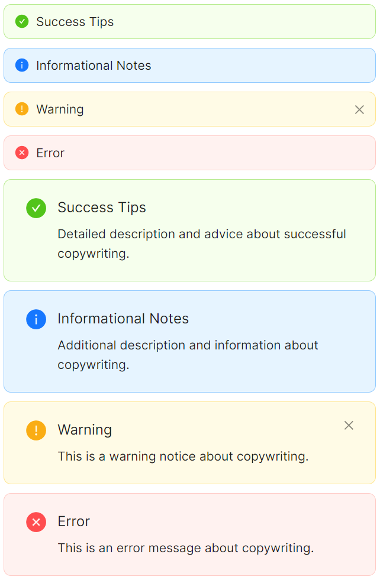
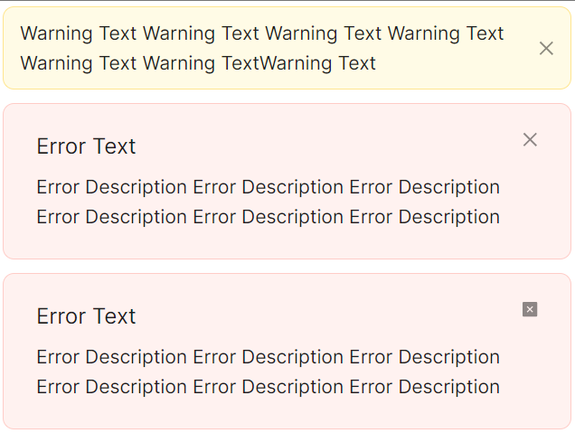
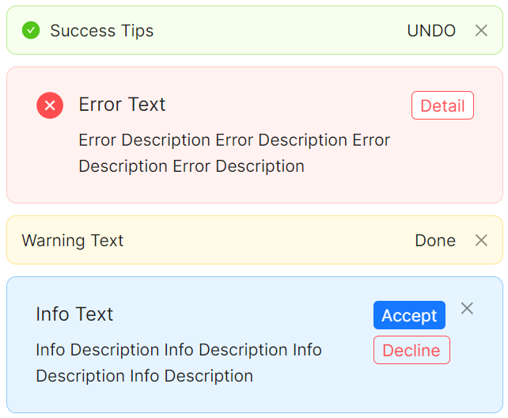
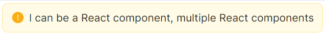

# Alert 快速入门

## 前置条件

- NuGet 安装 `Avalonia`
- NuGet 安装 `AtomUI`

## 基础用法

Alert 提供四种类型，通过 `Type` 属性设置，分别表达不同的语义。Message 内容可直接作为 Alert 的 Content 书写。


```xaml
<StackPanel Orientation="Vertical" Spacing="10">
    <atom:Alert Type="Success">Success Text</atom:Alert>
    <atom:Alert Type="Info">Info Text</atom:Alert>
    <atom:Alert Type="Warning">Warning Text</atom:Alert>
    <atom:Alert Type="Error">Error Text</atom:Alert>
</StackPanel>
```

| Type | 说明 | 对应图标 |
|---|---|---|
| `Success` | 操作成功提示 | CheckCircleFilled |
| `Info` | 一般信息提示 | InfoCircleFilled |
| `Warning` | 警告提示 | ExclamationCircleFilled |
| `Error` | 错误/危险提示 | CloseCircleFilled |

## 显示图标

设置 `IsShowIcon="True"` 在提示信息前显示类型对应的语义图标，帮助用户快速识别信息级别。



```xaml
<StackPanel Orientation="Vertical" Spacing="10">
    <atom:Alert Type="Success" IsShowIcon="True">Success Tips</atom:Alert>
    <atom:Alert Type="Info" IsShowIcon="True">Informational Notes</atom:Alert>
    <atom:Alert Type="Warning" IsShowIcon="True">Warning</atom:Alert>
    <atom:Alert Type="Error" IsShowIcon="True">Error</atom:Alert>
</StackPanel>
```

## 描述信息

通过 `Description` 属性添加辅助描述文本。当同时设置 Message 和 Description 时，Alert 以双行模式展示：标题加粗、描述在下方。


```xaml
<StackPanel Orientation="Vertical" Spacing="10">
    <atom:Alert Type="Success"
                Message="Success Text"
                Description="Detailed description and advice about successful copywriting." />
    <atom:Alert Type="Info"
                Message="Info Text"
                IsShowIcon="True"
                Description="Additional description and information about copywriting." />
    <atom:Alert Type="Warning"
                Message="Warning Text"
                IsShowIcon="True"
                Description="This is a warning notice about copywriting." />
    <atom:Alert Type="Error"
                Message="Error Text"
                IsShowIcon="True"
                Description="This is an error message about copywriting." />
</StackPanel>
```

## 可关闭

设置 `IsClosable="True"` 显示关闭按钮。可通过 `CloseIcon` 自定义关闭图标。



```xaml
<StackPanel Orientation="Vertical" Spacing="10">
    <atom:Alert Type="Warning" IsClosable="True">
        Warning Text Warning Text Warning Text
    </atom:Alert>
    <atom:Alert Type="Error" IsClosable="True"
                Description="Error Description Error Description">
        Error Text
    </atom:Alert>
    <!-- 自定义关闭图标 -->
    <atom:Alert Type="Error" IsClosable="True"
                CloseIcon="{atom:IconProvider CloseSquareFilled}"
                Description="Error Description Error Description">
        Error Text
    </atom:Alert>
</StackPanel>
```

关闭事件通过 `CloseRequest` 事件获取：

```csharp
alert.CloseRequest += (sender, args) =>
{
    // 处理关闭逻辑
};
```

## 自定义操作

通过 `ExtraAction` 属性在 Alert 右侧插入自定义操作区域，支持放置按钮或任意控件。



```xaml
<atom:Alert Type="Success" IsShowIcon="True" IsClosable="True">
    <atom:Alert.ExtraAction>
        <atom:Button ButtonType="Text" SizeType="Small">UNDO</atom:Button>
    </atom:Alert.ExtraAction>
    Success Tips
</atom:Alert>

<atom:Alert Type="Error" IsShowIcon="True"
            Description="Error Description Error Description">
    <atom:Alert.ExtraAction>
        <atom:Button ButtonType="Default" SizeType="Small" IsDanger="True">
            Detail
        </atom:Button>
    </atom:Alert.ExtraAction>
    Error Text
</atom:Alert>
```

也可以放置多个操作按钮：

```xaml
<atom:Alert Type="Info" IsClosable="True"
            Description="Info Description Info Description">
    <atom:Alert.ExtraAction>
        <StackPanel Orientation="Vertical" Spacing="5">
            <atom:Button ButtonType="Primary" SizeType="Small">Accept</atom:Button>
            <atom:Button SizeType="Small" IsDanger="True" IsGhost="True">Decline</atom:Button>
        </StackPanel>
    </atom:Alert.ExtraAction>
    Info Text
</atom:Alert>
```

## 文案轮播

当消息文本过长时，设置 `IsMessageMarqueEnabled="True"` 开启跑马灯滚动效果。



```xaml
<atom:Alert Type="Warning" IsShowIcon="True" IsMessageMarqueEnabled="True">
    This is a long message that will scroll automatically when the text overflows the alert container
</atom:Alert>
```
