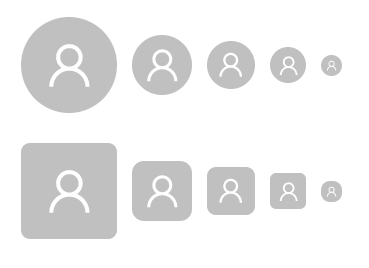
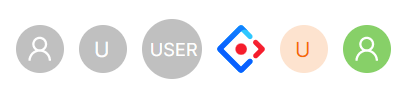
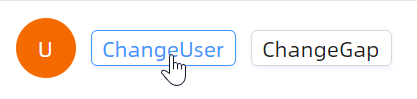

# Avatar 快速入门

### 基础配置条件

* Nuget安装Avalonia
* Nuget安装AtomUI

## 基本用法

最基础的头像组件用法。通过 `Icon` 属性传入 AtomUI 内置图标，通过 `Shape` 属性设置头像形状，通过 `Size` 或 `SizeType` 属性设置头像大小。

```xaml
<StackPanel Orientation="Vertical" Spacing="20">
    <StackPanel Orientation="Horizontal" Spacing="10">
        <atom:Avatar Icon="{atom:IconProvider UserOutlined}" Size="64" />
        <atom:Avatar Icon="{atom:IconProvider UserOutlined}" SizeType="Large" />
        <atom:Avatar Icon="{atom:IconProvider UserOutlined}" />
        <atom:Avatar Icon="{atom:IconProvider UserOutlined}" SizeType="Small" />
        <atom:Avatar Icon="{atom:IconProvider UserOutlined}" Size="14" />
    </StackPanel>

    <StackPanel Orientation="Horizontal" Spacing="10">
        <atom:Avatar Shape="Square" Icon="{atom:IconProvider UserOutlined}" Size="64" />
        <atom:Avatar Shape="Square" Icon="{atom:IconProvider UserOutlined}" SizeType="Large" />
        <atom:Avatar Shape="Square" Icon="{atom:IconProvider UserOutlined}" />
        <atom:Avatar Shape="Square" Icon="{atom:IconProvider UserOutlined}" SizeType="Small" />
        <atom:Avatar Shape="Square" Icon="{atom:IconProvider UserOutlined}" Size="14" />
    </StackPanel>
</StackPanel>
```



## 头像类型

Avatar 组件支持图片、`Icon` 以及文字三种类型。其中 `Icon` 和文字类型可以自定义图标颜色及背景色。

```xaml
<StackPanel>
    <atom:Avatar Icon="{atom:IconProvider UserOutlined}" />
    <atom:Avatar>U</atom:Avatar>
    <atom:Avatar Size="40">USER</atom:Avatar>
    <atom:Avatar Src="avares://AtomUIGallery/Assets/AvatarShowCase/AntDesign.svg" />
    <atom:Avatar Background="#fde3cf" Foreground="#f56a00">U</atom:Avatar>
    <atom:Avatar Background="#87d068" Icon="{atom:IconProvider UserOutlined}" />
</StackPanel>
```



## 文字内边距

对于文字类型的头像，当字符串较长时，字体大小会根据头像宽度自动调整。通过 `Gap` 属性可以设置文字距离左右两侧边界的像素值。

```xaml
<StackPanel Orientation="Horizontal" Spacing="10">
    <atom:Avatar Background="{Binding AvatarBackground}"
                 Gap="{Binding AvatarGap}"
                 SizeType="Large"
                 Text="{Binding AvatarText}"/>
    <atom:Button Name="ChangeUserButton"
                 ButtonType="Default"
                 SizeType="Small"
                 VerticalAlignment="Center">
        ChangeUser
    </atom:Button>
    <atom:Button Name="ChangeGapButton"
                 ButtonType="Default"
                 SizeType="Small"
                 VerticalAlignment="Center">
        ChangeGap
    </atom:Button>
</StackPanel>
```

code-behind 文件：
```csharp
using AtomUIGallery.ShowCases.ViewModels;
using Avalonia.ReactiveUI;
using ReactiveUI;
namespace AtomUIGallery.ShowCases.Views;

public partial class AvatarShowCase : ReactiveUserControl<AvatarViewModel>
{
    public AvatarShowCase()
    {
        InitializeComponent();
        this.WhenActivated(disposables =>
        {
            if (DataContext is AvatarViewModel viewModel)
            {
                ChangeUserButton.Click += viewModel.HandleChangeUserClicked;
                ChangeGapButton.Click  += viewModel.HandleChangeGapClicked;
            }
        });
    }
}
```

ViewModel 文件：
```csharp
using System.Reactive.Disposables;
using ReactiveUI;

namespace AtomUIGallery.ShowCases.ViewModels;

public class AvatarViewModel : ReactiveObject, IRoutableViewModel, IActivatableViewModel
{
    public const string ID = "Avatar";
    public ViewModelActivator Activator { get; }
    public IScreen HostScreen { get; }

    public string UrlPathSegment { get; } = ID;

    private string? _avatarText;

    public string? AvatarText
    {
        get => _avatarText;
        set => this.RaiseAndSetIfChanged(ref _avatarText, value);
    }

    private double? _avatarGap;

    public double? AvatarGap
    {
        get => _avatarGap;
        set => this.RaiseAndSetIfChanged(ref _avatarGap, value);
    }

    private string? _avatarBackground;

    public string? AvatarBackground
    {
        get => _avatarBackground;
        set => this.RaiseAndSetIfChanged(ref _avatarBackground, value);
    }

    private int _textCurrentIndex = 0;
    private int _gapCurrentIndex = 0;

    private List<string> _userList;
    private List<string> _colorList;
    private List<double> _gapList;

    public AvatarViewModel(IScreen screen)
    {
        Activator  = new ViewModelActivator();
        HostScreen = screen;
        _userList  = ["U", "Lucy", "Tom", "Edward"];
        _colorList = ["#f56a00", "#7265e6", "#ffbf00", "#00a2ae"];
        _gapList   = [4, 3, 2, 1];
        this.WhenActivated((CompositeDisposable disposables) =>
        {
            SetupAvatarText();
            SetupAvatarGap();
        });
    }

    private void SetupAvatarText()
    {
        var index = (_textCurrentIndex++) % 4;
        AvatarText       = _userList[index];
        AvatarBackground = _colorList[index];
    }

    private void SetupAvatarGap()
    {
        var index = (_gapCurrentIndex++) % 4;
        AvatarGap = _gapList[index];
    }

    public void HandleChangeUserClicked(object? sender, EventArgs e)
    {
        SetupAvatarText();
    }

    public void HandleChangeGapClicked(object? sender, EventArgs e)
    {
        SetupAvatarGap();
    }
}
```



## 角标

Avatar 组件支持与 `CountBadge` 和 `DotBadge` 配合使用，实现消息数量提示功能。

```xaml
<StackPanel>
    <atom:CountBadge Count="5">
        <atom:Avatar Shape="Square" Icon="{atom:IconProvider UserOutlined}" />
    </atom:CountBadge>
    <atom:DotBadge>
        <atom:Avatar Shape="Square" Icon="{atom:IconProvider UserOutlined}" />
    </atom:DotBadge>
</StackPanel>
```


## 头像组

通过 `AvatarGroup` 组件实现多头像组合展示。可使用 `MaxDisplayCount` 属性控制最大显示数量，超出部分将自动折叠。

```xaml
<StackPanel Orientation="Vertical" Spacing="20">
    <atom:AvatarGroup>
        <atom:Avatar Src="avares://AtomUIGallery/Assets/AvatarShowCase/PeopleAvatar1.svg"/>
        <atom:Avatar Background="#f56a00">K</atom:Avatar>
        <atom:Avatar Background="#87d068" Icon="{atom:IconProvider UserOutlined}" />
        <atom:Avatar Icon="{atom:IconProvider AntDesignOutlined}" Background="#1677ff"/>
    </atom:AvatarGroup>
    <atom:Separator/>
    <atom:AvatarGroup MaxDisplayCount="2"
                      FoldInfoAvatarForeground="#f56a00"
                      FoldInfoAvatarBackground="#fde3cf">
        <atom:Avatar Src="avares://AtomUIGallery/Assets/AvatarShowCase/PeopleAvatar2.svg"/>
        <atom:Avatar Background="#f56a00">K</atom:Avatar>
        <atom:Avatar Background="#87d068" Icon="{atom:IconProvider UserOutlined}" />
        <atom:Avatar Icon="{atom:IconProvider AntDesignOutlined}" Background="#1677ff"/>
    </atom:AvatarGroup>
    <atom:Separator/>
    <atom:AvatarGroup MaxDisplayCount="2"
                      FoldInfoAvatarForeground="#f56a00"
                      FoldInfoAvatarBackground="#fde3cf"
                      SizeType="Large">
        <atom:Avatar Src="avares://AtomUIGallery/Assets/AvatarShowCase/PeopleAvatar3.svg"/>
        <atom:Avatar Background="#f56a00">K</atom:Avatar>
        <atom:Avatar Background="#87d068" Icon="{atom:IconProvider UserOutlined}" />
        <atom:Avatar Icon="{atom:IconProvider AntDesignOutlined}" Background="#1677ff"/>
    </atom:AvatarGroup>
    <atom:Separator/>
    <atom:AvatarGroup MaxDisplayCount="2"
                      FoldInfoAvatarForeground="#f56a00"
                      FoldInfoAvatarBackground="#fde3cf"
                      SizeType="Large"
                      FoldAvatarFlyoutTriggerType="Click">
        <atom:Avatar BitmapSrc="/Assets/AvatarShowCase/PeopleAvatar4.png"/>
        <atom:Avatar Background="#f56a00">K</atom:Avatar>
        <atom:Avatar Background="#87d068" Icon="{atom:IconProvider UserOutlined}" />
        <atom:Avatar Icon="{atom:IconProvider AntDesignOutlined}" Background="#1677ff"/>
    </atom:AvatarGroup>
    <atom:Separator/>
    <atom:AvatarGroup Shape="Square">
        <atom:Avatar Background="#fde3cf">A</atom:Avatar>
        <atom:Avatar Background="#f56a00">K</atom:Avatar>
        <atom:Avatar Background="#87d068" Icon="{atom:IconProvider UserOutlined}" />
        <atom:Avatar Icon="{atom:IconProvider AntDesignOutlined}" Background="#1677ff"/>
    </atom:AvatarGroup>
</StackPanel>
```


