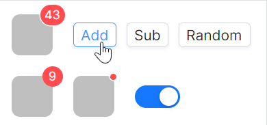

# 动态模式

可以通过事件动态调整数字大小，也可以实现一键清除红点（强迫症福音）。



axaml文件：
```axaml
// 下面代码中Binding的属性，请自行修改为实际项目中的属性名称
<StackPanel>
    <StackPanel Orientation="Horizontal" Spacing="20">
        <atom:CountBadge Count="{Binding DynamicBadgeCount}" OverflowCount="99">
            <Border Width="40"
                    Height="40"
                    Background="rgb(191,191,191)"
                    CornerRadius="8" />
        </atom:CountBadge>
        <StackPanel VerticalAlignment="Center"
                    Orientation="Horizontal"
                    Spacing="10">
            <atom:Button Command="{Binding AddDynamicBadgeCount}" SizeType="Small">Add</atom:Button>
            <atom:Button Command="{Binding SubDynamicBadgeCount}" SizeType="Small">Sub</atom:Button>
            <atom:Button Command="{Binding RandomDynamicBadgeCount}" SizeType="Small">Random</atom:Button>
        </StackPanel>
    </StackPanel>
    <StackPanel Orientation="Horizontal" Spacing="20">
        <atom:CountBadge BadgeIsVisible="{Binding DynamicDotBadgeVisible}" Count="9">
            <Border Width="40"
                    Height="40"
                    Background="rgb(191,191,191)"
                    CornerRadius="8" />
        </atom:CountBadge>
        <atom:DotBadge BadgeIsVisible="{Binding DynamicDotBadgeVisible}">
            <Border Width="40"
                    Height="40"
                    Background="rgb(191,191,191)"
                    CornerRadius="8" />
        </atom:DotBadge>
        <atom:ToggleSwitch VerticalAlignment="Center"
                           IsChecked="{Binding DynamicDotBadgeVisible, Mode=TwoWay}" />
    </StackPanel>
</StackPanel>
```

code-behind文件：
```csharp
public partial class BadgeShowCase : ReactiveUserControl<BadgeViewModel>
{
    public BadgeShowCase()
    {
        InitializeComponent();
    }
}
```

view-model文件：
```csharp
using System.Reactive.Disposables;
using ReactiveUI;

public class BadgeViewModel : ReactiveObject, IRoutableViewModel, IActivatableViewModel
{
    public ViewModelActivator Activator { get; }

    public const string ID = "Badge";

    public IScreen HostScreen { get; }

    public string UrlPathSegment { get; } = ID;

    private double _dynamicBadgeCount = 5;

    public double DynamicBadgeCount
    {
        get => _dynamicBadgeCount;
        set => this.RaiseAndSetIfChanged(ref _dynamicBadgeCount, value);
    }

    private bool _dynamicDotBadgeVisible = true;

    public bool DynamicDotBadgeVisible
    {
        get => _dynamicDotBadgeVisible;
        set => this.RaiseAndSetIfChanged(ref _dynamicDotBadgeVisible, value);
    }

    private bool _standaloneSwitchChecked;

    public bool StandaloneSwitchChecked
    {
        get => _standaloneSwitchChecked;
        set => this.RaiseAndSetIfChanged(ref _standaloneSwitchChecked, value);
    }

    private double _standaloneBadgeCount1;

    public double StandaloneBadgeCount1
    {
        get => _standaloneBadgeCount1;
        set => this.RaiseAndSetIfChanged(ref _standaloneBadgeCount1, value);
    }

    private double _standaloneBadgeCount2;

    public double StandaloneBadgeCount2
    {
        get => _standaloneBadgeCount2;
        set => this.RaiseAndSetIfChanged(ref _standaloneBadgeCount2, value);
    }

    private double _standaloneBadgeCount3;

    public double StandaloneBadgeCount3
    {
        get => _standaloneBadgeCount3;
        set => this.RaiseAndSetIfChanged(ref _standaloneBadgeCount3, value);
    }

    public BadgeViewModel(IScreen screen)
    {
        Activator = new ViewModelActivator();
        this.WhenActivated((CompositeDisposable disposables) =>
        {
            this.WhenAnyValue(vm => vm.StandaloneSwitchChecked)
                .Subscribe(HandleStandaloneSwitchChecked)
                .DisposeWith(disposables);
        });
        HostScreen = screen;
    }

    private void HandleStandaloneSwitchChecked(bool value)
    {
        if (value)
        {
            StandaloneBadgeCount1 = 11;
            StandaloneBadgeCount2 = 25;
            StandaloneBadgeCount3 = 109;
        }
        else
        {
            StandaloneBadgeCount1 = 0;
            StandaloneBadgeCount2 = 0;
            StandaloneBadgeCount3 = 0;
        }
    }

    public void AddDynamicBadgeCount()
    {
        DynamicBadgeCount += 1;
    }

    public void SubDynamicBadgeCount()
    {
        var value = DynamicBadgeCount;
        value             -= 1;
        value             =  Math.Max(value, 0);
        DynamicBadgeCount =  value;
    }

    public void RandomDynamicBadgeCount()
    {
        var random = new Random();
        DynamicBadgeCount = random.Next(0, 110);
    }
}
```