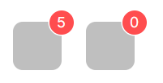
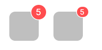
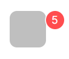
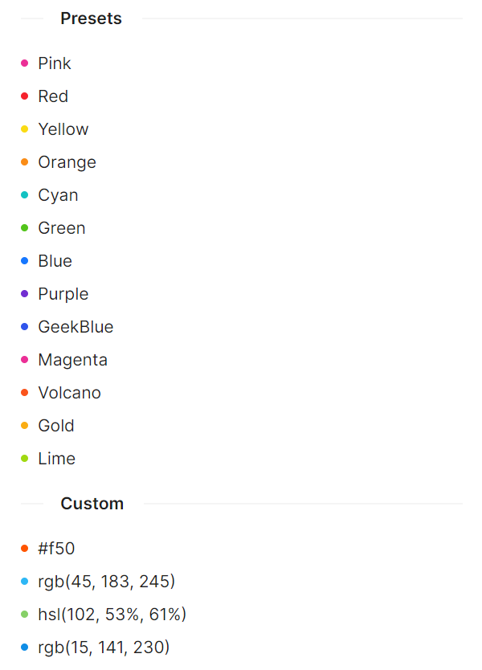

# Badge 快速入门

## 前置条件

- Nuget 安装 Avalonia
- Nuget 安装 AtomUI

---

## CountBadge 计数徽标

### 基础用法

最基础的计数徽标用法。通过 `Count` 属性设置显示的数字，`ShowZero` 属性控制计数为 0 时是否仍然显示徽标。



```xaml
<StackPanel>
    <atom:CountBadge Count="5">
        <Border Width="40"
                Height="40"
                Background="rgb(191,191,191)"
                CornerRadius="8" />
    </atom:CountBadge>
    <atom:CountBadge Count="0" ShowZero="True">
        <Border Width="40"
                Height="40"
                Background="rgb(191,191,191)"
                CornerRadius="8" />
    </atom:CountBadge>
</StackPanel>
```

### 溢出计数

通过 `OverflowCount` 属性设定数字溢出的上限值。当 `Count` 超过 `OverflowCount` 时，将显示为 `{OverflowCount}+` 的形式。默认溢出上限为 99。


```xaml
<StackPanel>
    <atom:CountBadge Count="99">
        <Border Width="40"
                Height="40"
                Background="rgb(191,191,191)"
                CornerRadius="8" />
    </atom:CountBadge>
    <atom:CountBadge Count="100">
        <Border Width="40"
                Height="40"
                Background="rgb(191,191,191)"
                CornerRadius="8" />
    </atom:CountBadge>
    <atom:CountBadge Count="99" OverflowCount="10">
        <Border Width="40"
                Height="40"
                Background="rgb(191,191,191)"
                CornerRadius="8" />
    </atom:CountBadge>
    <atom:CountBadge Count="1000" OverflowCount="999">
        <Border Width="40"
                Height="40"
                Background="rgb(191,191,191)"
                CornerRadius="8" />
    </atom:CountBadge>
</StackPanel>
```

### 角标大小控制

通过 `Size` 属性设定计数角标的尺寸大小。支持 `Default` 和 `Small` 两种尺寸。



```xaml
<StackPanel>
    <atom:CountBadge Count="5">
        <Border Width="40"
                Height="40"
                Background="rgb(191,191,191)"
                CornerRadius="8" />
    </atom:CountBadge>
    <atom:CountBadge Count="5" Size="Small">
        <Border Width="40"
                Height="40"
                Background="rgb(191,191,191)"
                CornerRadius="8" />
    </atom:CountBadge>
</StackPanel>
```

### 位置偏移

通过 `Offset` 属性设定计数角标相对于默认位置的偏移量。



```xaml
<StackPanel>
    <atom:CountBadge Count="5" Offset="10, 10">
        <Border Width="40"
                Height="40"
                Background="rgb(191,191,191)"
                CornerRadius="8" />
    </atom:CountBadge>
</StackPanel>
```

### 独立使用模式

不包裹任何子元素时，CountBadge 将直接显示数字角标本身，适用于需要在界面中独立展示计数的场景。


```xaml
// 下面代码中 Binding 的属性，请自行修改为实际项目中的属性名称
<StackPanel Orientation="Horizontal" Spacing="10">
    <atom:ToggleSwitch IsChecked="{Binding StandaloneSwitchChecked}" />
    <atom:CountBadge BadgeColor="#faad14"
                     Count="{Binding StandaloneBadgeCount1}"
                     ShowZero="True" />
    <atom:CountBadge Count="{Binding StandaloneBadgeCount2}" />
    <atom:CountBadge BadgeColor="#52c41a" Count="{Binding StandaloneBadgeCount3}" />
</StackPanel>
```

### 动态计数

通过数据绑定实现动态调整计数值，结合 `BadgeIsVisible` 属性可以实现徽标的显示和隐藏切换。


axaml 文件：
```xaml
// 下面代码中 Binding 的属性，请自行修改为实际项目中的属性名称
<StackPanel>
    <StackPanel Orientation="Horizontal" Spacing="20">
        <atom:CountBadge Count="{Binding DynamicBadgeCount}" OverflowCount="99">
            <Border Width="40"
                    Height="40"
                    Background="rgb(191,191,191)"
                    CornerRadius="8" />
        </atom:CountBadge>
        <StackPanel VerticalAlignment="Center"
                    Orientation="Horizontal"
                    Spacing="10">
            <atom:Button Command="{Binding AddDynamicBadgeCount}" SizeType="Small">Add</atom:Button>
            <atom:Button Command="{Binding SubDynamicBadgeCount}" SizeType="Small">Sub</atom:Button>
            <atom:Button Command="{Binding RandomDynamicBadgeCount}" SizeType="Small">Random</atom:Button>
        </StackPanel>
    </StackPanel>
    <StackPanel Orientation="Horizontal" Spacing="20">
        <atom:CountBadge BadgeIsVisible="{Binding DynamicDotBadgeVisible}" Count="9">
            <Border Width="40"
                    Height="40"
                    Background="rgb(191,191,191)"
                    CornerRadius="8" />
        </atom:CountBadge>
        <atom:DotBadge BadgeIsVisible="{Binding DynamicDotBadgeVisible}">
            <Border Width="40"
                    Height="40"
                    Background="rgb(191,191,191)"
                    CornerRadius="8" />
        </atom:DotBadge>
        <atom:ToggleSwitch VerticalAlignment="Center"
                           IsChecked="{Binding DynamicDotBadgeVisible, Mode=TwoWay}" />
    </StackPanel>
</StackPanel>
```

ViewModel 文件：
```csharp
using System.Reactive.Disposables;
using ReactiveUI;

public class BadgeViewModel : ReactiveObject, IRoutableViewModel, IActivatableViewModel
{
    public ViewModelActivator Activator { get; }

    public const string ID = "Badge";

    public IScreen HostScreen { get; }

    public string UrlPathSegment { get; } = ID;

    private double _dynamicBadgeCount = 5;

    public double DynamicBadgeCount
    {
        get => _dynamicBadgeCount;
        set => this.RaiseAndSetIfChanged(ref _dynamicBadgeCount, value);
    }

    private bool _dynamicDotBadgeVisible = true;

    public bool DynamicDotBadgeVisible
    {
        get => _dynamicDotBadgeVisible;
        set => this.RaiseAndSetIfChanged(ref _dynamicDotBadgeVisible, value);
    }

    private bool _standaloneSwitchChecked;

    public bool StandaloneSwitchChecked
    {
        get => _standaloneSwitchChecked;
        set => this.RaiseAndSetIfChanged(ref _standaloneSwitchChecked, value);
    }

    private double _standaloneBadgeCount1;

    public double StandaloneBadgeCount1
    {
        get => _standaloneBadgeCount1;
        set => this.RaiseAndSetIfChanged(ref _standaloneBadgeCount1, value);
    }

    private double _standaloneBadgeCount2;

    public double StandaloneBadgeCount2
    {
        get => _standaloneBadgeCount2;
        set => this.RaiseAndSetIfChanged(ref _standaloneBadgeCount2, value);
    }

    private double _standaloneBadgeCount3;

    public double StandaloneBadgeCount3
    {
        get => _standaloneBadgeCount3;
        set => this.RaiseAndSetIfChanged(ref _standaloneBadgeCount3, value);
    }

    public BadgeViewModel(IScreen screen)
    {
        Activator = new ViewModelActivator();
        this.WhenActivated((CompositeDisposable disposables) =>
        {
            this.WhenAnyValue(vm => vm.StandaloneSwitchChecked)
                .Subscribe(HandleStandaloneSwitchChecked)
                .DisposeWith(disposables);
        });
        HostScreen = screen;
    }

    private void HandleStandaloneSwitchChecked(bool value)
    {
        if (value)
        {
            StandaloneBadgeCount1 = 11;
            StandaloneBadgeCount2 = 25;
            StandaloneBadgeCount3 = 109;
        }
        else
        {
            StandaloneBadgeCount1 = 0;
            StandaloneBadgeCount2 = 0;
            StandaloneBadgeCount3 = 0;
        }
    }

    public void AddDynamicBadgeCount()
    {
        DynamicBadgeCount += 1;
    }

    public void SubDynamicBadgeCount()
    {
        var value = DynamicBadgeCount;
        value             -= 1;
        value             =  Math.Max(value, 0);
        DynamicBadgeCount =  value;
    }

    public void RandomDynamicBadgeCount()
    {
        var random = new Random();
        DynamicBadgeCount = random.Next(0, 110);
    }
}
```

---

## DotBadge 圆点徽标

### 红点标记

最基础的红点标记用法，用于在图标或链接上添加未读提示。通过 `Offset` 属性调整红点的位置。


```xaml
<StackPanel Orientation="Horizontal">
    <atom:DotBadge Offset="-7,8">
        <atom:Button ButtonType="Link" Icon="{atom:IconProvider Kind=NotificationOutlined}" />
    </atom:DotBadge>
    <atom:DotBadge Offset="-14,12">
        <atom:Button ButtonType="Link" Content="Link something" />
    </atom:DotBadge>
    <atom:Button ButtonType="Link" Content="Link something" />
</StackPanel>
```

### 状态标记

使用 `Status` 属性表达互联网业务中常见的五种状态。配合 `Text` 属性可以在状态圆点旁显示说明文字。此模式下无需包裹子元素，属于独立使用方式。


```xaml
<StackPanel>
    <StackPanel Orientation="Horizontal" Spacing="10">
        <atom:DotBadge Status="Success" />
        <atom:DotBadge Status="Error" />
        <atom:DotBadge Status="Default" />
        <atom:DotBadge Status="Processing" />
        <atom:DotBadge Status="Warning" />
    </StackPanel>
    <StackPanel Orientation="Vertical" Spacing="10">
        <atom:DotBadge Status="Success" Text="Success" />
        <atom:DotBadge Status="Error" Text="Error" />
        <atom:DotBadge Status="Default" Text="Default" />
        <atom:DotBadge Status="Processing" Text="Processing" />
        <atom:DotBadge Status="Warning" Text="Warning" />
    </StackPanel>
</StackPanel>
```

### 预设颜色与自定义颜色

通过 `DotColor` 属性设置圆点颜色。AtomUI 内置了大量预设颜色名称，同时也支持直接传入 HEX、RGB、HSL 等格式的自定义色值。



```xaml
<StackPanel>
    <atom:Separator Title="Presets"
                    FontWeight="SemiBold"
                    TitlePosition="Left" />
    <StackPanel Orientation="Vertical" Spacing="10">
        <atom:DotBadge DotColor="Pink" Text="Pink" />
        <atom:DotBadge DotColor="Red" Text="Red" />
        <atom:DotBadge DotColor="Yellow" Text="Yellow" />
        <atom:DotBadge DotColor="Orange" Text="Orange" />
        <atom:DotBadge DotColor="Cyan" Text="Cyan" />
        <atom:DotBadge DotColor="Green" Text="Green" />
        <atom:DotBadge DotColor="Blue" Text="Blue" />
        <atom:DotBadge DotColor="Purple" Text="Purple" />
        <atom:DotBadge DotColor="GeekBlue" Text="GeekBlue" />
        <atom:DotBadge DotColor="Magenta" Text="Magenta" />
        <atom:DotBadge DotColor="Volcano" Text="Volcano" />
        <atom:DotBadge DotColor="Gold" Text="Gold" />
        <atom:DotBadge DotColor="Lime" Text="Lime" />
    </StackPanel>
    <atom:Separator Title="Custom"
                    FontWeight="SemiBold"
                    TitlePosition="Left" />
    <StackPanel Orientation="Vertical" Spacing="10">
        <atom:DotBadge DotColor="#f50" Text="#f50" />
        <atom:DotBadge DotColor="rgb(45, 183, 245)" Text="rgb(45, 183, 245)" />
        <atom:DotBadge DotColor="hsl(102, 53%, 61%)" Text="hsl(102, 53%, 61%)" />
        <atom:DotBadge DotColor="rgb(15, 141, 230)" Text="rgb(15, 141, 230)" />
    </StackPanel>
</StackPanel>
```

---

## RibbonBadge 缎带徽标

### 基础用法与颜色设置

RibbonBadge 包裹子元素后可生成缎带样式的徽标。通过 `Text` 属性设置缎带上的文字内容，通过 `RibbonColor` 属性设置缎带颜色（支持预设颜色名称和自定义色值）。

### 位置控制

通过 `Placement` 属性控制缎带的位置，支持 `Start`（左侧）和 `End`（右侧，默认值）两种放置方式。


```xaml
<StackPanel>
    <atom:RibbonBadge Text="精益求精，打造体验优秀的 UISDK">
        <Border Height="80"
                Padding="10,0,10,0"
                BorderBrush="#d9d9d9"
                BorderThickness="1"
                CornerRadius="6">
            <StackPanel Orientation="Vertical">
                <atom:TextBlock Height="38"
                           FontWeight="Bold"
                           LineHeight="38">
                    Pushes open the window
                </atom:TextBlock>
                <atom:Separator LineColor="#d9d9d9" Orientation="Horizontal" />
                <atom:TextBlock Margin="0,10,0,0">and raises the spyglass.</atom:TextBlock>
            </StackPanel>
        </Border>
    </atom:RibbonBadge>

    <atom:RibbonBadge RibbonColor="Pink" Text="甲辰计划雄起">
        <Border Height="80"
                Padding="10,0,10,0"
                BorderBrush="#d9d9d9"
                BorderThickness="1"
                CornerRadius="6">
            <StackPanel Orientation="Vertical">
                <TextBlock Height="38"
                           FontWeight="Bold"
                           LineHeight="38">
                    Pushes open the window
                </TextBlock>
                <atom:Separator LineColor="#d9d9d9" Orientation="Horizontal" />
                <TextBlock Margin="0,10,0,0">and raises the spyglass.</TextBlock>
            </StackPanel>
        </Border>
    </atom:RibbonBadge>

    <atom:RibbonBadge RibbonColor="Cyan" Text="Avalonia 非常优秀">
        <Border Height="80"
                Padding="10,0,10,0"
                BorderBrush="#d9d9d9"
                BorderThickness="1"
                CornerRadius="6">
            <StackPanel Orientation="Vertical">
                <TextBlock Height="38"
                           FontWeight="Bold"
                           LineHeight="38">
                    Pushes open the window
                </TextBlock>
                <atom:Separator LineColor="#d9d9d9" Orientation="Horizontal" />
                <TextBlock Margin="0,10,0,0">and raises the spyglass.</TextBlock>
            </StackPanel>
        </Border>
    </atom:RibbonBadge>

    <atom:RibbonBadge RibbonColor="Green" Text="Hippies">
        <Border Height="80"
                Padding="10,0,10,0"
                BorderBrush="#d9d9d9"
                BorderThickness="1"
                CornerRadius="6">
            <StackPanel Orientation="Vertical">
                <TextBlock Height="38"
                           FontWeight="Bold"
                           LineHeight="38">
                    Pushes open the window
                </TextBlock>
                <atom:Separator LineColor="#d9d9d9" Orientation="Horizontal" />
                <TextBlock Margin="0,10,0,0">and raises the spyglass.</TextBlock>
            </StackPanel>
        </Border>
    </atom:RibbonBadge>

    <atom:RibbonBadge Placement="Start"
                      RibbonColor="purple"
                      Text="Hippies">
        <Border Height="80"
                Padding="10,0,10,0"
                BorderBrush="#d9d9d9"
                BorderThickness="1"
                CornerRadius="6">
            <StackPanel Orientation="Vertical">
                <TextBlock Height="38"
                           FontWeight="Bold"
                           LineHeight="38">
                    Pushes open the window
                </TextBlock>
                <atom:Separator LineColor="#d9d9d9" Orientation="Horizontal" />
                <TextBlock Margin="0,10,0,0">and raises the spyglass.</TextBlock>
            </StackPanel>
        </Border>
    </atom:RibbonBadge>

    <atom:RibbonBadge Placement="Start"
                      RibbonColor="volcano"
                      Text="Hippies">
        <Border Height="80"
                Padding="10,0,10,0"
                BorderBrush="#d9d9d9"
                BorderThickness="1"
                CornerRadius="6">
            <StackPanel Orientation="Vertical">
                <TextBlock Height="38"
                           FontWeight="Bold"
                           LineHeight="38">
                    Pushes open the window
                </TextBlock>
                <atom:Separator LineColor="#d9d9d9" Orientation="Horizontal" />
                <TextBlock Margin="0,10,0,0">and raises the spyglass.</TextBlock>
            </StackPanel>
        </Border>
    </atom:RibbonBadge>

    <atom:RibbonBadge Placement="Start"
                      RibbonColor="magenta"
                      Text="Hippies">
        <Border Height="80"
                Padding="10,0,10,0"
                BorderBrush="#d9d9d9"
                BorderThickness="1"
                CornerRadius="6">
            <StackPanel Orientation="Vertical">
                <TextBlock Height="38"
                           FontWeight="Bold"
                           LineHeight="38">
                    Pushes open the window
                </TextBlock>
                <atom:Separator LineColor="#d9d9d9" Orientation="Horizontal" />
                <TextBlock Margin="0,10,0,0">and raises the spyglass.</TextBlock>
            </StackPanel>
        </Border>
    </atom:RibbonBadge>

</StackPanel>
```
