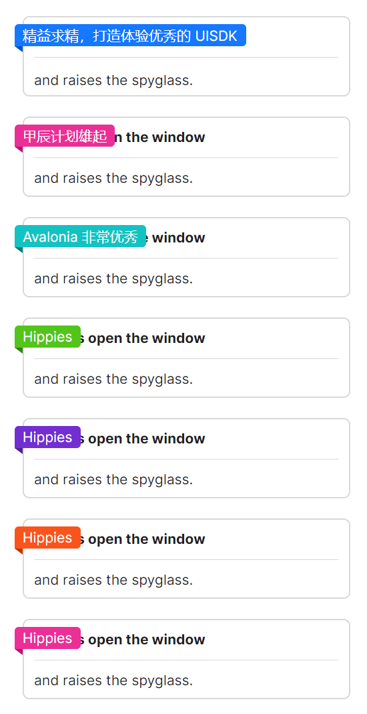

# 缎带

`RibbonBadge` 包裹子元素（强烈建议使用AtomUI组件），可以制作出非常精美的缎带样徽标。



```axaml
<StackPanel>
    <atom:RibbonBadge Text="精益求精，打造体验优秀的 UISDK">
        <Border Height="80"
                Padding="10,0,10,0"
                BorderBrush="#d9d9d9"
                BorderThickness="1"
                CornerRadius="6">
            <StackPanel Orientation="Vertical">
                <atom:TextBlock Height="38"
                           FontWeight="Bold"
                           LineHeight="38">
                    Pushes open the window
                </atom:TextBlock>
                <atom:Separator LineColor="#d9d9d9" Orientation="Horizontal" />
                <atom:TextBlock Margin="0,10,0,0">and raises the spyglass.</atom:TextBlock>
            </StackPanel>
        </Border>
    </atom:RibbonBadge>

    <atom:RibbonBadge RibbonColor="Pink" Text="甲辰计划雄起">
        <Border Height="80"
                Padding="10,0,10,0"
                BorderBrush="#d9d9d9"
                BorderThickness="1"
                CornerRadius="6">
            <StackPanel Orientation="Vertical">
                <TextBlock Height="38"
                           FontWeight="Bold"
                           LineHeight="38">
                    Pushes open the window
                </TextBlock>
                <atom:Separator LineColor="#d9d9d9" Orientation="Horizontal" />
                <TextBlock Margin="0,10,0,0">and raises the spyglass.</TextBlock>
            </StackPanel>
        </Border>
    </atom:RibbonBadge>

    <atom:RibbonBadge RibbonColor="Cyan" Text="Avalonia 非常优秀">
        <Border Height="80"
                Padding="10,0,10,0"
                BorderBrush="#d9d9d9"
                BorderThickness="1"
                CornerRadius="6">
            <StackPanel Orientation="Vertical">
                <TextBlock Height="38"
                           FontWeight="Bold"
                           LineHeight="38">
                    Pushes open the window
                </TextBlock>
                <atom:Separator LineColor="#d9d9d9" Orientation="Horizontal" />
                <TextBlock Margin="0,10,0,0">and raises the spyglass.</TextBlock>
            </StackPanel>
        </Border>
    </atom:RibbonBadge>

    <atom:RibbonBadge RibbonColor="Green" Text="Hippies">
        <Border Height="80"
                Padding="10,0,10,0"
                BorderBrush="#d9d9d9"
                BorderThickness="1"
                CornerRadius="6">
            <StackPanel Orientation="Vertical">
                <TextBlock Height="38"
                           FontWeight="Bold"
                           LineHeight="38">
                    Pushes open the window
                </TextBlock>
                <atom:Separator LineColor="#d9d9d9" Orientation="Horizontal" />
                <TextBlock Margin="0,10,0,0">and raises the spyglass.</TextBlock>
            </StackPanel>
        </Border>
    </atom:RibbonBadge>

    <atom:RibbonBadge Placement="Start"
                      RibbonColor="purple"
                      Text="Hippies">
        <Border Height="80"
                Padding="10,0,10,0"
                BorderBrush="#d9d9d9"
                BorderThickness="1"
                CornerRadius="6">
            <StackPanel Orientation="Vertical">
                <TextBlock Height="38"
                           FontWeight="Bold"
                           LineHeight="38">
                    Pushes open the window
                </TextBlock>
                <atom:Separator LineColor="#d9d9d9" Orientation="Horizontal" />
                <TextBlock Margin="0,10,0,0">and raises the spyglass.</TextBlock>
            </StackPanel>
        </Border>
    </atom:RibbonBadge>

    <atom:RibbonBadge Placement="Start"
                      RibbonColor="volcano"
                      Text="Hippies">
        <Border Height="80"
                Padding="10,0,10,0"
                BorderBrush="#d9d9d9"
                BorderThickness="1"
                CornerRadius="6">
            <StackPanel Orientation="Vertical">
                <TextBlock Height="38"
                           FontWeight="Bold"
                           LineHeight="38">
                    Pushes open the window
                </TextBlock>
                <atom:Separator LineColor="#d9d9d9" Orientation="Horizontal" />
                <TextBlock Margin="0,10,0,0">and raises the spyglass.</TextBlock>
            </StackPanel>
        </Border>
    </atom:RibbonBadge>

    <atom:RibbonBadge Placement="Start"
                      RibbonColor="magenta"
                      Text="Hippies">
        <Border Height="80"
                Padding="10,0,10,0"
                BorderBrush="#d9d9d9"
                BorderThickness="1"
                CornerRadius="6">
            <StackPanel Orientation="Vertical">
                <TextBlock Height="38"
                           FontWeight="Bold"
                           LineHeight="38">
                    Pushes open the window
                </TextBlock>
                <atom:Separator LineColor="#d9d9d9" Orientation="Horizontal" />
                <TextBlock Margin="0,10,0,0">and raises the spyglass.</TextBlock>
            </StackPanel>
        </Border>
    </atom:RibbonBadge>

</StackPanel>
```