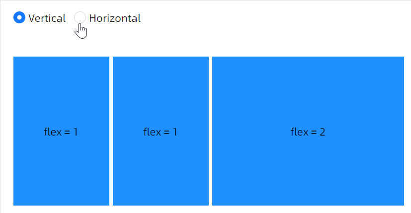
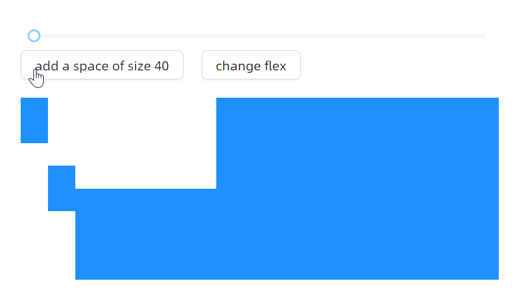
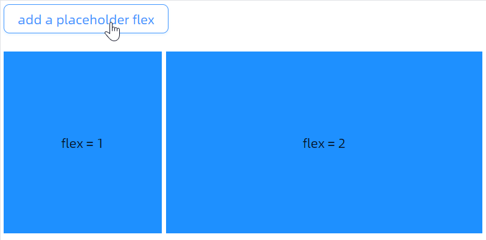

# 快速入门

### 基础配置条件

* Nuget 安装 Avalonia
* Nuget 安装 AtomUI

---

### 基础用法

最基本的用法是将子元素放入 `BoxPanel` 中，通过 `Orientation` 属性控制排列方向。以下示例通过顶部单选按钮动态切换 `BoxPanel` 的方向。


```xaml
<StackPanel
    Margin="20"
    Orientation="Vertical"
    Spacing="20">

    <atom:BoxPanel Margin="0,0,0,20" Orientation="Horizontal" Spacing="10">
        <atom:RadioButton IsChecked="True" x:Name="Vertical">Vertical</atom:RadioButton>
        <atom:RadioButton x:Name="Horizontal">Horizontal</atom:RadioButton>
    </atom:BoxPanel>

    <Panel Height="200">
        <atom:BoxPanel
            Margin="0,0,0,10"
            Orientation="Vertical"
            Spacing="10"
            x:Name="BasicBoxPanel">
            <Panel Background="DodgerBlue" atom:BoxPanel.Flex="1" />
            <Panel Background="DodgerBlue" atom:BoxPanel.Flex="1" />
            <Panel Background="DodgerBlue" atom:BoxPanel.Flex="1" />
            <Panel Background="DodgerBlue" atom:BoxPanel.Flex="1" />
        </atom:BoxPanel>
    </Panel>
</StackPanel>
```

---

### Flex 弹性布局

通过设置附加属性 `atom:BoxPanel.Flex` 的值，可以让子元素按比例分配可用空间。例如，两个 `Flex="1"` 和一个 `Flex="2"` 的子元素将按 1:1:2 的比例分配空间。



```xaml
<StackPanel
    Margin="20"
    Orientation="Vertical"
    Spacing="20">

    <atom:BoxPanel Margin="0,0,0,20" Orientation="Horizontal" Spacing="10">
        <atom:RadioButton IsChecked="True" x:Name="Vertical1">Vertical</atom:RadioButton>
        <atom:RadioButton x:Name="Horizontal1">Horizontal</atom:RadioButton>
    </atom:BoxPanel>

    <atom:BoxPanel
        Height="200"
        Orientation="Horizontal"
        Spacing="5"
        x:Name="FlexBoxPanel">
        <Panel Background="DodgerBlue" atom:BoxPanel.Flex="1">
            <TextBlock TextAlignment="Center" VerticalAlignment="Center">
                flex = 1
            </TextBlock>
        </Panel>
        <Panel Background="DodgerBlue" atom:BoxPanel.Flex="1">
            <TextBlock TextAlignment="Center" VerticalAlignment="Center">
                flex = 1
            </TextBlock>
        </Panel>
        <Panel Background="DodgerBlue" atom:BoxPanel.Flex="2">
            <TextBlock TextAlignment="Center" VerticalAlignment="Center">
                flex = 2
            </TextBlock>
        </Panel>
    </atom:BoxPanel>
</StackPanel>
```

---

### 子元素对齐

子元素可以通过 `VerticalAlignment` 属性控制在交叉轴上的位置，支持 Stretch、Top、Center、Bottom 四种对齐方式。同时也可以将固定尺寸元素与 Flex 弹性元素混合使用。


```xaml
<StackPanel
    Margin="20"
    Orientation="Vertical"
    Spacing="20">

    <atom:BoxPanel
        Height="200"
        Orientation="Horizontal"
        Spacing="5">
        <Panel
            Background="DodgerBlue"
            Height="50"
            VerticalAlignment="Top">
            <Border Width="30" />
        </Panel>
        <Panel
            Background="DodgerBlue"
            Height="50"
            VerticalAlignment="Center">
            <Border Width="30" />
        </Panel>
        <Panel
            Background="DodgerBlue"
            Height="100"
            VerticalAlignment="Bottom"
            atom:BoxPanel.Flex="1" />
        <Panel Background="DodgerBlue" atom:BoxPanel.Flex="2" />
    </atom:BoxPanel>
</StackPanel>
```

---

### 间距调节

通过 `Spacing` 属性可以统一设置子元素之间的间距。以下示例使用 `Slider` 控件实时调整间距大小，并演示了动态添加固定间距和修改 Flex 值的操作。



```xaml
<StackPanel
    Margin="20"
    Orientation="Vertical"
    Spacing="20">

    <atom:VBoxPanel Orientation="Vertical">
        <atom:Slider
            IsEnabled="{Binding NormalEnabled}"
            Maximum="50"
            Minimum="0"
            TickFrequency="5"
            Value="10"
            ValueChanged="HandleSpaceSliderValueChanged"
            x:Name="SpaceSlider" />
        <atom:HBoxPanel Orientation="Horizontal" Spacing="20">
            <atom:Button Click="HandleAddSpaceButtonClicked" x:Name="AddSpaceButton">add a space of size 40</atom:Button>
            <atom:Button Click="HandleChangFlexButtonClicked" x:Name="ChangFlexButton">change flex</atom:Button>
        </atom:HBoxPanel>
    </atom:VBoxPanel>
    <atom:BoxPanel
        Height="200"
        Orientation="Horizontal"
        Spacing="5"
        x:Name="ChangeSpaceBoxPanel">
        <Panel
            Background="DodgerBlue"
            Height="50"
            VerticalAlignment="Top">
            <Border Width="30" />
        </Panel>
        <Panel
            Background="DodgerBlue"
            Height="50"
            VerticalAlignment="Center">
            <Border Width="30" />
        </Panel>
        <Panel
            Background="DodgerBlue"
            Height="100"
            VerticalAlignment="Bottom"
            atom:BoxPanel.Flex="1" />
        <Panel Background="DodgerBlue" atom:BoxPanel.Flex="2" />
    </atom:BoxPanel>
</StackPanel>
```

---

### 动态 Flex 占位

在运行时可以通过 `AddFlex` 方法动态向 `BoxPanel` 添加弹性占位元素。这在需要动态调整布局或辅助调试 UI 时非常有用。



```xaml
<StackPanel
    Margin="20"
    Orientation="Vertical"
    Spacing="20">

    <WrapPanel>
        <atom:Button Click="HandleAddFlexButtonClicked" x:Name="AddFlexButton">add a placeholder flex</atom:Button>
    </WrapPanel>

    <atom:BoxPanel
        Height="200"
        Orientation="Horizontal"
        Spacing="5"
        x:Name="AddPlaceholderBoxPanel">
        <Panel Background="DodgerBlue" atom:BoxPanel.Flex="1">
            <TextBlock TextAlignment="Center" VerticalAlignment="Center">
                flex = 1
            </TextBlock>
        </Panel>
        <Panel Background="DodgerBlue" atom:BoxPanel.Flex="2">
            <TextBlock TextAlignment="Center" VerticalAlignment="Center">
                flex = 2
            </TextBlock>
        </Panel>
    </atom:BoxPanel>
</StackPanel>
```

---

### 公用文件

code-behind 文件：
```csharp
using AtomUI.Controls;
using AtomUIGallery.ShowCases.ViewModels;
using Avalonia.Controls.Primitives;
using Avalonia.Interactivity;
using Avalonia.Layout;
using Avalonia.ReactiveUI;
using ReactiveUI;

public partial class BoxPanelShowCase : ReactiveUserControl<BoxPanelViewModel>
{
    public BoxPanelShowCase()
    {
        this.WhenActivated(disposables => { });
        InitializeComponent();

        Vertical.IsCheckedChanged += HandleModeChecked;

        Horizontal.IsCheckedChanged += HandleModeChecked;

        Vertical1.IsCheckedChanged += HandleMode1Checked;

        Horizontal1.IsCheckedChanged += HandleMode1Checked;
    }


    private void HandleMode1Checked(object? sender, RoutedEventArgs e)
    {
        if (sender is RadioButton button)
        {
            if (button.Content?.ToString() == "Vertical")
            {
                FlexBoxPanel.Orientation = Orientation.Vertical;
            }
            else if (button.Content?.ToString() == "Horizontal")
            {
                FlexBoxPanel.Orientation = Orientation.Horizontal;
            }
        }
    }

    private void HandleModeChecked(object? sender, RoutedEventArgs e)
    {
        if (sender is RadioButton button)
        {
            if (button.Content?.ToString() == "Vertical")
            {
                BasicBoxPanel.Orientation = Orientation.Vertical;
            }
            else if (button.Content?.ToString() == "Horizontal")
            {
                BasicBoxPanel.Orientation = Orientation.Horizontal;
            }
        }
    }

    private void HandleSpaceSliderValueChanged(object? sender, RangeBaseValueChangedEventArgs e)
    {
        ChangeSpaceBoxPanel.Spacing = e.NewValue;
    }

    private void HandleAddSpaceButtonClicked(object? sender, RoutedEventArgs e)
    {
        if (e.Source is Button button && button.Content?.ToString() == "add a space of size 40")
        {
            ChangeSpaceBoxPanel.AddSpacing(40);
            AddSpaceButton.Content = "remove the space of size 40";
        }
        else
        {
            ChangeSpaceBoxPanel.Children.Remove(ChangeSpaceBoxPanel.Children[4]);
            AddSpaceButton.Content = "add a space of size 40";
        }
    }

    private void HandleChangFlexButtonClicked(object? sender, RoutedEventArgs e)
    {
            BoxPanel.SetFlex(ChangeSpaceBoxPanel.Children[3], BoxPanel.GetFlex(ChangeSpaceBoxPanel.Children[3]) == 1 ? 2 : 1);
    }

    private void HandleAddFlexButtonClicked(object? sender, RoutedEventArgs e)
    {
        if (e.Source is Button button && button.Content?.ToString() == "add a placeholder flex")
        {
            AddPlaceholderBoxPanel.AddFlex(1);
            AddFlexButton.Content = "remove the placeholder flex";
        }
        else
        {
            AddPlaceholderBoxPanel.Children.Remove(AddPlaceholderBoxPanel.Children[2]);
            AddFlexButton.Content = "add a placeholder flex";
        }
    }
}
```

view-model 文件：
```csharp
using ReactiveUI;

public class BoxPanelViewModel : ReactiveObject, IRoutableViewModel
{
    public const string ID = "BoxPanelShowCase";

    public IScreen HostScreen { get; }

    public string UrlPathSegment { get; } = ID;

    public BoxPanelViewModel(IScreen screen)
    {
        HostScreen = screen;
    }
}
```
