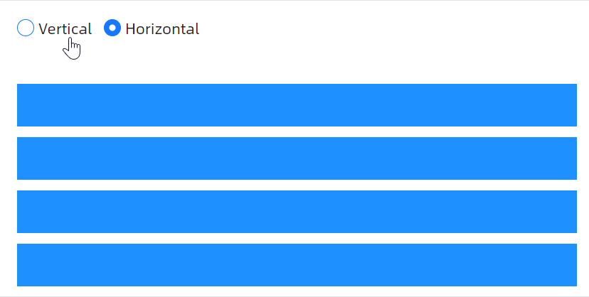

# BoxPanel 概述

### 简介

`BoxPanel` 是 AtomUI 提供的一种通用弹性布局面板，其设计灵感来源于 CSS Flexbox 布局模型。通过 `BoxPanel`，开发者可以轻松实现灵活的水平或垂直方向布局，支持子元素按比例分配空间、对齐控制以及间距调节等常见布局需求。

### 何时使用

- 需要在水平或垂直方向上排列子元素时
- 需要子元素按比例弹性分配可用空间时
- 需要精确控制子元素在主轴和交叉轴上的对齐方式时
- 需要动态调整元素间距或换行排列时
- 替代多层嵌套 `StackPanel` 实现复杂布局时

### 主要功能

* **双方向布局** — 通过 `Orientation` 属性支持水平（Horizontal）和垂直（Vertical）两种排列方向
* **Flex 弹性布局** — 通过附加属性 `BoxPanel.Flex` 为子元素分配弹性比例，实现空间按比例分配
* **主轴对齐** — 通过 `JustifyContent` 属性控制子元素在主轴方向上的分布方式（FlexStart、FlexEnd、Center、SpaceBetween、SpaceAround、SpaceEvenly）
* **交叉轴对齐** — 通过 `AlignItems` 属性控制子元素在交叉轴方向上的对齐方式（Stretch、FlexStart、FlexEnd、Center）
* **单独对齐** — 通过附加属性 `BoxPanel.AlignSelf` 为单个子元素覆盖默认的交叉轴对齐方式
* **间距控制** — 通过 `Spacing`、`ColumnSpacing`、`RowSpacing` 属性精细控制元素之间的间距
* **换行支持** — 通过 `Wrap` 属性控制子元素是否在空间不足时自动换行
* **排序控制** — 通过附加属性 `BoxPanel.Order` 调整子元素的显示顺序而不改变 XAML 中的结构
* **动态占位** — 支持在运行时动态添加或移除弹性占位元素
