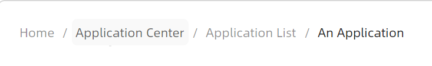
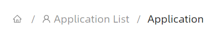
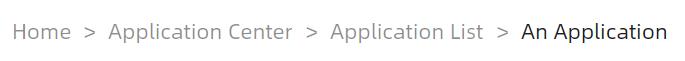
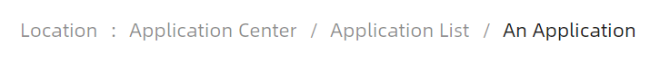

# 快速入门

### 基础配置条件

* Nuget安装Avalonia
* Nuget安装AtomUI

### 基础用法

最基础的使用方法，一眼懂，唯一需要留意的是 `NavigateContext` 属性，这个属性的作用是为了让路径上携带开发者自定义的一些用于扩展的数据。



```axaml
<StackPanel>
    <atom:Breadcrumb>
        <atom:BreadcrumbItem>Home</atom:BreadcrumbItem>
        <atom:BreadcrumbItem NavigateContext="#">Application Center</atom:BreadcrumbItem>
        <atom:BreadcrumbItem NavigateContext="#">Application List</atom:BreadcrumbItem>
        <atom:BreadcrumbItem>An Application</atom:BreadcrumbItem>
    </atom:Breadcrumb>
</StackPanel>
```

### 图标

有时需要在路径中显示一些图标，此时便可以设定 `atom:BreadcrumbItem` 控件的 `Icon` 属性来设定需要的图标（图标来源于 `AtomUI` 的图标库）。



```axaml
<StackPanel>
    <atom:Breadcrumb>
        <atom:BreadcrumbItem Icon="{atom:IconProvider Kind=HomeOutlined}"></atom:BreadcrumbItem>
        <atom:BreadcrumbItem Icon="{atom:IconProvider Kind=UserOutlined}" NavigateContext="#">Application List</atom:BreadcrumbItem>
        <atom:BreadcrumbItem>Application</atom:BreadcrumbItem>
    </atom:Breadcrumb>
</StackPanel>
```

### 路径参数

在基础示例中曾经讲述过了，不再赘述。


```axaml
<StackPanel>
    <atom:Breadcrumb NavigateRequest="HandleNavigateRequest">
        <atom:BreadcrumbItem>Users</atom:BreadcrumbItem>
        <atom:BreadcrumbItem NavigateContext="Param(1)">Param</atom:BreadcrumbItem>
    </atom:Breadcrumb>
</StackPanel>
```

### 分隔符

可以通过给 `atom:Breadcrumb` 组件的 `Separator` 属性设定一个值来改变分隔符，此时整个面包屑导航条中的分割符都将会被修改。



```axaml
<StackPanel>
    <atom:Breadcrumb Separator=">">
        <atom:BreadcrumbItem>Home</atom:BreadcrumbItem>
        <atom:BreadcrumbItem NavigateContext="#">Application Center</atom:BreadcrumbItem>
        <atom:BreadcrumbItem NavigateContext="#">Application List</atom:BreadcrumbItem>
        <atom:BreadcrumbItem>An Application</atom:BreadcrumbItem>
    </atom:Breadcrumb>
</StackPanel>
```

有一些业务场景中仅仅需要修改面包屑导航条中某一项的分隔符，此时可以通过给 `atom:BreadcrumbItem` 控件的 `Separator` 属性设定一个值来改变分隔符。


```axaml
<StackPanel>
    <atom:Breadcrumb>
        <atom:BreadcrumbItem Separator=":">Location</atom:BreadcrumbItem>
        <atom:BreadcrumbItem NavigateContext="#">Application Center</atom:BreadcrumbItem>
        <atom:BreadcrumbItem NavigateContext="#">Application List</atom:BreadcrumbItem>
        <atom:BreadcrumbItem>An Application</atom:BreadcrumbItem>
    </atom:Breadcrumb>
</StackPanel>
```

### 模板生成

可以通过 `ItemTemplate` 属性来快速生成面包屑导航条。通过使用mvvm方式动态修改数据来动态修改面包屑导航条，这种使用方式应该是最常见的使用方式了。



```axaml
<StackPanel>
    <atom:Breadcrumb ItemsSource="{Binding BreadcrumbItems}"
                     x:DataType="viewModels:BreadcrumbViewModel">
        <atom:Breadcrumb.ItemTemplate>
            <DataTemplate>
                <TextBlock Text="{Binding Content}"/>
            </DataTemplate>
        </atom:Breadcrumb.ItemTemplate>
    </atom:Breadcrumb>
</StackPanel>
```

code-behind文件：
```csharp
using AtomUI.Controls;
using AtomUI.Controls.Primitives;
using AtomUIGallery.ShowCases.ViewModels;
using Avalonia;
using Avalonia.Controls;
using Avalonia.ReactiveUI;
using ReactiveUI;

public partial class BreadcrumbShowCase : ReactiveUserControl<BreadcrumbViewModel>
{
    private WindowMessageManager? _messageManager;
    public BreadcrumbShowCase()
    {
        InitializeComponent();
        this.WhenActivated(disposables =>
        {
            if (DataContext is BreadcrumbViewModel viewModel)
            {
                viewModel.BreadcrumbItems = [
                    new BreadcrumbItemData()
                    {
                        Separator = ":",
                        Content = "Location"
                    },
                    new BreadcrumbItemData()
                    {
                        NavigateContext = "#",
                        Content = "Application Center"
                    },
                    new BreadcrumbItemData()
                    {
                        NavigateContext = "#",
                        Content         = "Application List"
                    },
                    new BreadcrumbItemData()
                    {
                        Content         = "An Application"
                    }
                ];
            }
        });
    }
    
    protected override void OnAttachedToVisualTree(VisualTreeAttachmentEventArgs e)
    {
        base.OnAttachedToVisualTree(e);
        var topLevel = TopLevel.GetTopLevel(this);
        _messageManager = new WindowMessageManager(topLevel)
        {
            MaxItems = 10
        };
    }

    private void HandleNavigateRequest(object? sender, BreadcrumbNavigateEventArgs eventArgs)
    {
        _messageManager?.Show(new Message(
            $"Navigate context: {eventArgs.BreadcrumbItem.NavigateContext}"
        ));
    }
}
```

view-model文件：
```csharp
using AtomUI.Controls;
using ReactiveUI;

public class BreadcrumbViewModel : ReactiveObject, IRoutableViewModel
{
    public const string ID = "Breadcrumb";
    
    public IScreen HostScreen { get; }
    
    public string UrlPathSegment { get; } = ID;
    
    private List<BreadcrumbItemData> _breadcrumbItems = [];
    
    public List<BreadcrumbItemData> BreadcrumbItems
    {
        get => _breadcrumbItems;
        set => this.RaiseAndSetIfChanged(ref _breadcrumbItems, value);
    }
    
    public BreadcrumbViewModel(IScreen screen)
    {
        HostScreen = screen;
    }
}
```