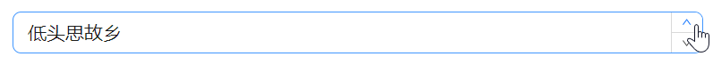
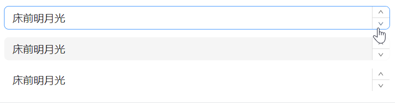
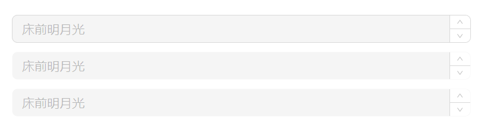
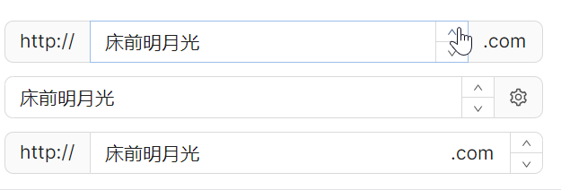
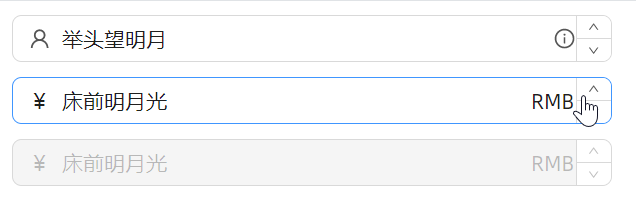
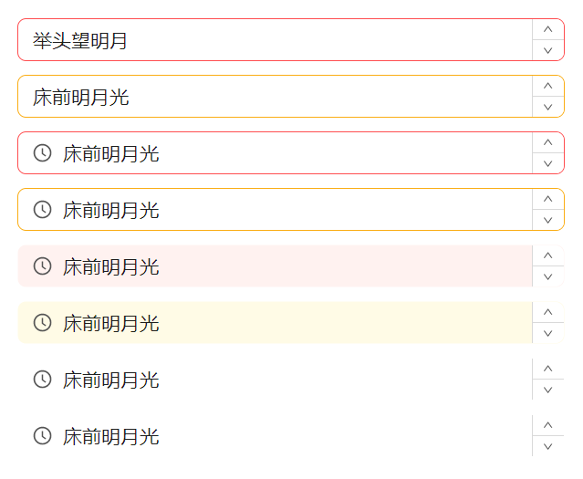

# 快速入门

### 基础配置条件

* Nuget安装Avalonia
* Nuget安装AtomUI

### 基础用法

`ButtonSpinner` 继承了 `Avalonia.Controls.ButtonSpinner` 类。

下面示例中点击上下箭头时，会获取当前诗句在整体诗歌中的偏移量，然后将偏移量根据不同操作做加法或减法，再根据新的偏移量值获取响应的诗句并展示到UI中。



```axaml
<atom:ButtonSpinner>
    <atom:TextBlock
        HorizontalAlignment="Left"
        VerticalAlignment="Center"
        Text="床前明月光" />
</atom:ButtonSpinner>
```

### 大小尺寸

通过 `SizeType` 属性设置组件大小，可选值有`Large`、`Middle`、`Small`。


```axaml
<StackPanel Orientation="Vertical" Spacing="10" Margin="0, 0, 20, 0">
    <atom:ButtonSpinner SizeType="Large">
        <atom:TextBlock
            HorizontalAlignment="Left"
            VerticalAlignment="Center"
            Text="床前明月光" />
    </atom:ButtonSpinner>
    <atom:ButtonSpinner SizeType="Middle">
        <atom:TextBlock
            HorizontalAlignment="Left"
            VerticalAlignment="Center"
            Text="床前明月光" />
    </atom:ButtonSpinner>
    <atom:ButtonSpinner SizeType="Small">
        <atom:TextBlock
            HorizontalAlignment="Left"
            VerticalAlignment="Center"
            Text="床前明月光" />
    </atom:ButtonSpinner>
</StackPanel>
```

### 多种变体

变体的作用在于更好的融于不同的UI设计风格，是视觉方向的属性。其属性名为 `StyleVariant`，可选值有Outline、Filled、Borderless。



```axaml
<StackPanel Orientation="Vertical" Spacing="10">
    <atom:ButtonSpinner StyleVariant="Outline">
        <atom:TextBlock
            HorizontalAlignment="Left"
            VerticalAlignment="Center"
            Text="床前明月光" />
    </atom:ButtonSpinner>
    <atom:ButtonSpinner StyleVariant="Filled">
        <atom:TextBlock
            HorizontalAlignment="Left"
            VerticalAlignment="Center"
            Text="床前明月光" />
    </atom:ButtonSpinner>
    <atom:ButtonSpinner StyleVariant="Borderless">
        <atom:TextBlock
            HorizontalAlignment="Left"
            VerticalAlignment="Center"
            Text="床前明月光" />
    </atom:ButtonSpinner>
</StackPanel>
```

### 禁用

老规矩，`IsEnabled` 设定为True直接一把禁用。



```axaml
<StackPanel Orientation="Vertical" Spacing="10">
    <atom:ButtonSpinner StyleVariant="Outline" IsEnabled="False">
        <atom:TextBlock
            HorizontalAlignment="Left"
            VerticalAlignment="Center"
            Text="床前明月光" />
    </atom:ButtonSpinner>
    <atom:ButtonSpinner StyleVariant="Filled" IsEnabled="False">
        <atom:TextBlock
            HorizontalAlignment="Left"
            VerticalAlignment="Center"
            Text="床前明月光" />
    </atom:ButtonSpinner>
    <atom:ButtonSpinner StyleVariant="Borderless" IsEnabled="False">
        <atom:TextBlock
            HorizontalAlignment="Left"
            VerticalAlignment="Center"
            Text="床前明月光" />
    </atom:ButtonSpinner>
</StackPanel>
```

### Pre/Post tab

有时候需要在输入框的左侧或者右侧添加一些内容，这时就可以使用 `LeftAddOn` 和 `RightAddOn` 属性。
* `LeftAddOn` 表示输入框左侧位置的Pre Tab，其值可以是一个图标，也可以是字符串。
* `RightAddOn` 表示输入框右侧位置的Pre Tab，其值可以是一个图标，也可以是字符串。



```axaml
<StackPanel Orientation="Vertical" Spacing="10">
    <atom:ButtonSpinner
        LeftAddOn="http://"
        RightAddOn=".com"
        Width="400"
        HorizontalAlignment="Left">
        <atom:TextBlock
            HorizontalAlignment="Left"
            VerticalAlignment="Center"
            Text="床前明月光" />
    </atom:ButtonSpinner>

    <atom:ButtonSpinner
        RightAddOn="{atom:IconProvider Kind=SettingOutlined}"
        Width="400"
        HorizontalAlignment="Left">
        <atom:TextBlock
            HorizontalAlignment="Left"
            VerticalAlignment="Center"
            Text="床前明月光" />
    </atom:ButtonSpinner>

    <atom:ButtonSpinner
        LeftAddOn="http://"
        Width="400"
        HorizontalAlignment="Left"
        InnerRightContent=".com">
        <atom:TextBlock
            HorizontalAlignment="Left"
            VerticalAlignment="Center"
            Text="床前明月光" />
    </atom:ButtonSpinner>
</StackPanel>
```

### 前缀/后缀

前后缀和前面刚展示过的Pre/Post Tab略不太一样，

* `InnerLeftContent` 则作为内部内容，位于输入框内部的左侧，是输入框的一部分。
* `InnerRightContent` 则作为内部内容，位于输入框内部的右侧，是输入框的一部分。

`InnerRightContent` 与 `RightAddOn` 区别是：前者更趋向于为输入框内部的补充，而后者更趋向于为输入框外部的装饰。



```axaml
<StackPanel Orientation="Vertical" Spacing="10">

    <atom:ButtonSpinner
        InnerLeftContent="{atom:IconProvider Kind=UserOutlined, NormalFilledColor=#D7D7D7}"
        InnerRightContent="{atom:IconProvider Kind=InfoCircleOutlined, NormalFilledColor=#8C8C8C}"
        Width="400"
        HorizontalAlignment="Left">
        <atom:TextBlock
            HorizontalAlignment="Left"
            VerticalAlignment="Center"
            Text="床前明月光" />
    </atom:ButtonSpinner>

    <atom:ButtonSpinner
        InnerLeftContent="￥"
        InnerRightContent="RMB"
        Width="400"
        HorizontalAlignment="Left">
        <atom:TextBlock
            HorizontalAlignment="Left"
            VerticalAlignment="Center"
            Text="床前明月光" />
    </atom:ButtonSpinner>

    <atom:ButtonSpinner
        InnerLeftContent="￥" InnerRightContent="RMB" IsEnabled="False"
        Width="400"
        HorizontalAlignment="Left">
        <atom:TextBlock
            HorizontalAlignment="Left"
            VerticalAlignment="Center"
            Text="床前明月光" />
    </atom:ButtonSpinner>

</StackPanel>
```

### 状态色

`Status` 属性可以一键设定组件的状态色，用于向用户传达一种明确的意图。可选值有Default、Error、Warning。



```axaml
<StackPanel Orientation="Vertical" Spacing="10" Margin="0, 0, 20, 0">
    <atom:ButtonSpinner
        Status="Error"
        Width="400"
        HorizontalAlignment="Left">
        <atom:TextBlock
            HorizontalAlignment="Left"
            VerticalAlignment="Center"
            Text="床前明月光" />
    </atom:ButtonSpinner>
    <atom:ButtonSpinner
        Status="Warning"
        Width="400"
        HorizontalAlignment="Left">
        <atom:TextBlock
            HorizontalAlignment="Left"
            VerticalAlignment="Center"
            Text="床前明月光" />
    </atom:ButtonSpinner>

    <atom:ButtonSpinner
        Status="Error"
        Width="400"
        InnerLeftContent="{atom:IconProvider Kind=ClockCircleOutlined}"
        HorizontalAlignment="Left">
        <atom:TextBlock
            HorizontalAlignment="Left"
            VerticalAlignment="Center"
            Text="床前明月光" />
    </atom:ButtonSpinner>

    <atom:ButtonSpinner
        Status="Warning"
        Width="400"
        InnerLeftContent="{atom:IconProvider Kind=ClockCircleOutlined}"
        HorizontalAlignment="Left">
        <atom:TextBlock
            HorizontalAlignment="Left"
            VerticalAlignment="Center"
            Text="床前明月光" />
    </atom:ButtonSpinner>

    <atom:ButtonSpinner
        Status="Error"
        Width="400"
        InnerLeftContent="{atom:IconProvider Kind=ClockCircleOutlined}"
        HorizontalAlignment="Left"
        StyleVariant="Filled">
        <atom:TextBlock
            HorizontalAlignment="Left"
            VerticalAlignment="Center"
            Text="床前明月光" />
    </atom:ButtonSpinner>

    <atom:ButtonSpinner
        Status="Warning"
        Width="400"
        InnerLeftContent="{atom:IconProvider Kind=ClockCircleOutlined}"
        HorizontalAlignment="Left"
        StyleVariant="Filled">
        <atom:TextBlock
            HorizontalAlignment="Left"
            VerticalAlignment="Center"
            Text="床前明月光" />
    </atom:ButtonSpinner>


    <atom:ButtonSpinner
        Status="Error"
        Width="400"
        InnerLeftContent="{atom:IconProvider Kind=ClockCircleOutlined}"
        HorizontalAlignment="Left"
        StyleVariant="Borderless">
        <atom:TextBlock
            HorizontalAlignment="Left"
            VerticalAlignment="Center"
            Text="床前明月光" />
    </atom:ButtonSpinner>

    <atom:ButtonSpinner
        Status="Warning"
        Width="400"
        InnerLeftContent="{atom:IconProvider Kind=ClockCircleOutlined}"
        HorizontalAlignment="Left"
        StyleVariant="Borderless">
        <atom:TextBlock
            HorizontalAlignment="Left"
            VerticalAlignment="Center"
            Text="床前明月光" />
    </atom:ButtonSpinner>

</StackPanel>
```

### 公共文件

code-behind文件：
```csharp
using AtomUIGallery.ShowCases.ViewModels;
using Avalonia.Controls;
using Avalonia.LogicalTree;
using Avalonia.ReactiveUI;
using Avalonia.VisualTree;
using ReactiveUI;
using ButtonSpinner = AtomUI.Controls.ButtonSpinner;

public partial class ButtonSpinnerShowCase : ReactiveUserControl<ButtonSpinnerViewModel>
{
    public ButtonSpinnerShowCase()
    {
        this.WhenActivated(disposables =>
        {
            BindSpinHandleRecursively(this);
        });
        InitializeComponent();
    }

    private void BindSpinHandleRecursively(Control control)
    {
        if (control is ButtonSpinner spinner)
        {
            if (DataContext is ButtonSpinnerViewModel viewModel)
            {
                spinner.Spin += viewModel.HandleSpin;
            }
        }
        else
        {
            foreach (var item in control.GetVisualChildren())
            {
                if (item is Control childControl)
                {
                    BindSpinHandleRecursively(childControl);
                }
            }
        }
    }
}
```

view-model文件：
```csharp
using Avalonia.Controls;
using ReactiveUI;
using ButtonSpinner = AtomUI.Controls.ButtonSpinner;

public class ButtonSpinnerViewModel : ReactiveObject, IRoutableViewModel
{
    public const string ID = "ButtonSpinner";

    public IScreen HostScreen { get; }

    public string UrlPathSegment { get; } = ID;

    public ButtonSpinnerViewModel(IScreen screen)
    {
        HostScreen = screen;
    }
    
    public void HandleSpin(object? sender, SpinEventArgs e)
    {
        if (sender is ButtonSpinner buttonSpinner)
        {
            if (buttonSpinner.Content is TextBlock textBlock)
            {
                var value = Array.IndexOf(_spinnerItems, textBlock.Text);
                if (e.Direction == SpinDirection.Increase)
                {
                    value++;
                }
                else
                {
                    value--;
                }

                if (value < 0)
                {
                    value = _spinnerItems.Length - 1;
                }
                else if (value >= _spinnerItems.Length)
                {
                    value = 0;
                }

                textBlock.Text = _spinnerItems[value];
            }
        }
    }

    private readonly string[] _spinnerItems =
    {
        "床前明月光",
        "疑是地上霜",
        "举头望明月",
        "低头思故乡"
    };
}
```