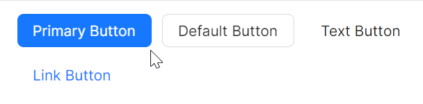
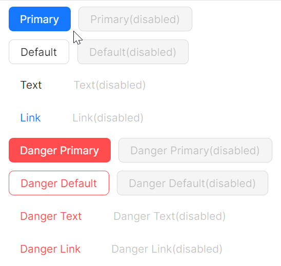

# 基础用法

### 按钮类型

通过 `ButtonType` 设定不同类型type的按钮。



```axaml
<StackPanel>
    <atom:Button ButtonType="Primary">Primary Button</atom:Button>
    <atom:Button>Default Button</atom:Button>
    <atom:Button ButtonType="Text">Text Button</atom:Button>
    <atom:Button ButtonType="Link">Link Button</atom:Button>
</StackPanel>
```

### 按钮外观

按钮的外观由 `Shape` 与 `ButtonType` 共同决定。

`Shape` 属性：一共有Default、Circle、Round三个值，分别对应默认按钮、圆形按钮、圆角按钮；默认为Default。

`ButtonType` 属性：一共有Primary、Default、Text、Link四个值，分别对应主要按钮、默认按钮、文本按钮、链接按钮；默认为Default。

```axaml
<StackPanel>
    <atom:Button ButtonType="Primary" Shape="Round">Primary</atom:Button>
    <atom:Button Shape="Round">Default</atom:Button>
    <atom:Button ButtonType="Text" Shape="Round">Text</atom:Button>
    <atom:Button ButtonType="Link" Shape="Round">Link</atom:Button>
    
    <atom:Button ButtonType="Primary" Shape="Circle">AA</atom:Button>
    <atom:Button Shape="Circle">AA</atom:Button>
    <atom:Button ButtonType="Text" Shape="Circle">AA</atom:Button>
    <atom:Button ButtonType="Link" Shape="Circle">AA</atom:Button>
</StackPanel>
```

### 按钮大小

按钮的大小由 `SizeType` 属性决定，一共有Large、Middle、Small三个值；默认为Middle。


```axaml
<StackPanel>
    <atom:Button SizeType="Small">Text</atom:Button>
    <atom:Button>Text</atom:Button>
    <atom:Button SizeType="Middle">Text</atom:Button>
    <atom:Button SizeType="Large">Text</atom:Button>
</StackPanel>
```

### 按钮禁用

按钮的禁用属性由 `IsEnabled` 属性决定，一共有True和False两个值；默认为True。



```axaml
<StackPanel>
    <atom:Button ButtonType="Primary" IsEnabled="False">Primary(disabled)</atom:Button>
    <atom:Button ButtonType="Default" IsEnabled="False">Default(disabled)</atom:Button>
    <atom:Button ButtonType="Text" IsEnabled="False">Text(disabled)</atom:Button>
    <atom:Button ButtonType="Link" IsEnabled="False">Link(disabled)</atom:Button>
</StackPanel>
```