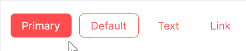

# 危险标识按钮

按钮的危险属性由 `IsDanger` 属性决定，一共有True和False两个值；默认为False。



```axaml
<StackPanel>
    <atom:Button ButtonType="Primary" IsDanger="True">Primary</atom:Button>
    <atom:Button ButtonType="Default" IsDanger="True">Default</atom:Button>
    <atom:Button ButtonType="Text" IsDanger="True">Text</atom:Button>
    <atom:Button ButtonType="Link" IsDanger="True">Link</atom:Button>
</StackPanel>
```