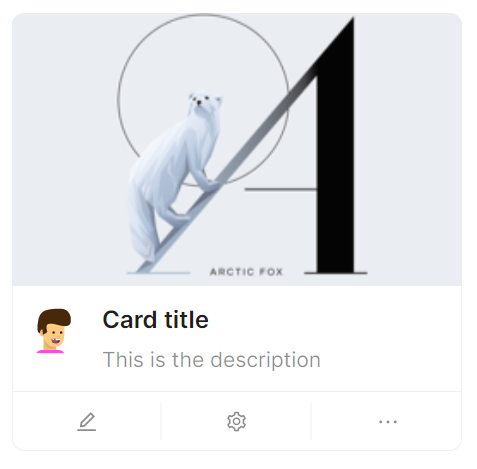

# 自定义卡片（二）

通过组合 `Card` 组件的 `Cover` 、 `Actions` 等属性以及 `CardMetaContent` 子组件，可以创建一个具有封面、头像、内容、操作按钮的卡片。



```axaml
<atom:Card Width="300">
    <atom:Card.Cover>
        <Image Source="/Assets/CardShowCase/Cover2.png" />
    </atom:Card.Cover>

    <atom:CardMetaContent Header="Card title"
                          Content="This is the description">
        <atom:CardMetaContent.Avatar>
            <atom:Avatar Src="avares://AtomUIGallery/Assets/AvatarShowCase/PeopleAvatar1.svg"/>
        </atom:CardMetaContent.Avatar>
    </atom:CardMetaContent>
    <atom:Card.Actions>
        <atom:IconButton Icon="{atom:IconProvider Kind=EditOutlined}"/>
        <atom:IconButton Icon="{atom:IconProvider Kind=SettingOutlined}"/>
        <atom:IconButton Icon="{atom:IconProvider Kind=EllipsisOutlined}"/>
    </atom:Card.Actions>
</atom:Card>
```