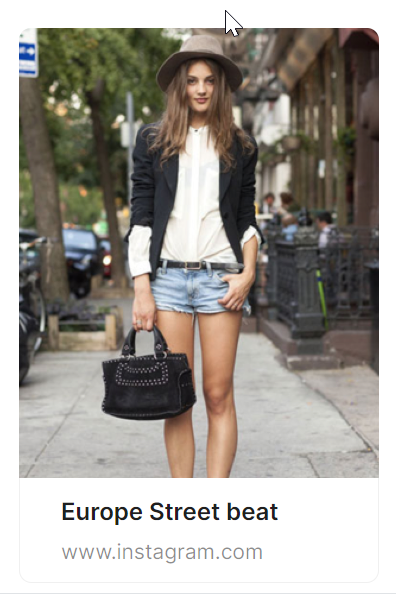

# 自定义卡片

通过 `CardMetaContent` 子组件可以实现内容更加丰富的展示样式。



```axaml
<atom:Card Width="240" IsHoverable="True">
    <atom:Card.Cover>
        <Image Source="/Assets/CardShowCase/Cover1.png" />
    </atom:Card.Cover>
    <atom:CardMetaContent Header="Europe Street beat"
                          Content="www.instagram.com"/>
</atom:Card>
```