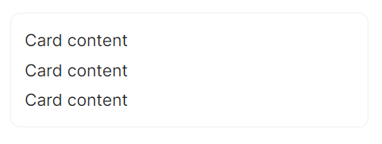
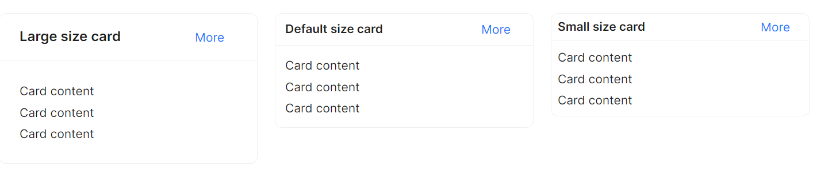

# Card 快速入门

### 基础配置条件

* Nuget安装Avalonia
* Nuget安装AtomUI

### 基础用法

最基础最小配置化的Card组件。



```axaml
<atom:Card Width="300">
    <StackPanel Orientation="Vertical" Spacing="3">
        <atom:TextBlock>Card content</atom:TextBlock>
        <atom:TextBlock>Card content</atom:TextBlock>
        <atom:TextBlock>Card content</atom:TextBlock>
    </StackPanel>
</atom:Card>
```

### 大小尺寸

通过 `SizeType` 属性设置大小尺寸，注意：同时设定Width="300"将会固定宽度。



```axaml
<StackPanel>
    <atom:Card Header="Large size card" SizeType="Large" Width="300">
        <atom:Card.Extra>
            <atom:HyperLinkButton>More</atom:HyperLinkButton>
        </atom:Card.Extra>
        <StackPanel Orientation="Vertical" Spacing="3">
            <atom:TextBlock>Card content</atom:TextBlock>
            <atom:TextBlock>Card content</atom:TextBlock>
            <atom:TextBlock>Card content</atom:TextBlock>
        </StackPanel>
    </atom:Card>

    <atom:Card Header="Default size card" SizeType="Middle" Width="300">
        <atom:Card.Extra>
            <atom:HyperLinkButton>More</atom:HyperLinkButton>
        </atom:Card.Extra>
        <StackPanel Orientation="Vertical" Spacing="3">
            <atom:TextBlock>Card content</atom:TextBlock>
            <atom:TextBlock>Card content</atom:TextBlock>
            <atom:TextBlock>Card content</atom:TextBlock>
        </StackPanel>
    </atom:Card>

    <atom:Card Header="Small size card" SizeType="Small" Width="300">
        <atom:Card.Extra>
            <atom:HyperLinkButton>More</atom:HyperLinkButton>
        </atom:Card.Extra>
        <StackPanel Orientation="Vertical" Spacing="3">
            <atom:TextBlock>Card content</atom:TextBlock>
            <atom:TextBlock>Card content</atom:TextBlock>
            <atom:TextBlock>Card content</atom:TextBlock>
        </StackPanel>
    </atom:Card>
</StackPanel>
```