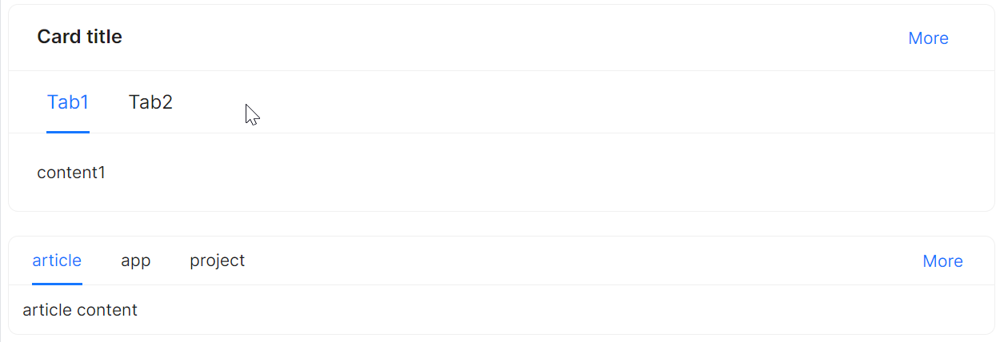
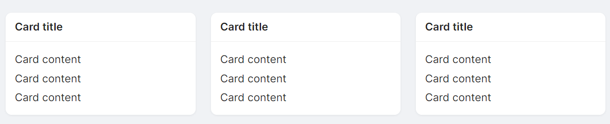

# Card 快速入门

### 基础配置条件

- Nuget 安装 Avalonia
- Nuget 安装 AtomUI

### 基础用法

最简单的卡片，仅包含内容区域，无标题。


```xaml
<atom:Card Width="300">
    <StackPanel Orientation="Vertical" Spacing="3">
        <atom:TextBlock>Card content</atom:TextBlock>
        <atom:TextBlock>Card content</atom:TextBlock>
        <atom:TextBlock>Card content</atom:TextBlock>
    </StackPanel>
</atom:Card>
```

### 多尺寸卡片

通过 `SizeType` 属性设置卡片尺寸，支持 `Large`、`Middle`（默认）、`Small` 三种规格。可通过 `Header` 设置标题，通过 `Extra` 插槽设置右上角额外操作。


```xaml
<StackPanel>
    <atom:Card Header="Large size card" SizeType="Large" Width="300">
        <atom:Card.Extra>
            <atom:HyperLinkButton>More</atom:HyperLinkButton>
        </atom:Card.Extra>
        <StackPanel Orientation="Vertical" Spacing="3">
            <atom:TextBlock>Card content</atom:TextBlock>
            <atom:TextBlock>Card content</atom:TextBlock>
            <atom:TextBlock>Card content</atom:TextBlock>
        </StackPanel>
    </atom:Card>

    <atom:Card Header="Default size card" SizeType="Middle" Width="300">
        <atom:Card.Extra>
            <atom:HyperLinkButton>More</atom:HyperLinkButton>
        </atom:Card.Extra>
        <StackPanel Orientation="Vertical" Spacing="3">
            <atom:TextBlock>Card content</atom:TextBlock>
            <atom:TextBlock>Card content</atom:TextBlock>
            <atom:TextBlock>Card content</atom:TextBlock>
        </StackPanel>
    </atom:Card>

    <atom:Card Header="Small size card" SizeType="Small" Width="300">
        <atom:Card.Extra>
            <atom:HyperLinkButton>More</atom:HyperLinkButton>
        </atom:Card.Extra>
        <StackPanel Orientation="Vertical" Spacing="3">
            <atom:TextBlock>Card content</atom:TextBlock>
            <atom:TextBlock>Card content</atom:TextBlock>
            <atom:TextBlock>Card content</atom:TextBlock>
        </StackPanel>
    </atom:Card>
</StackPanel>
```

### 内嵌卡片

将 `IsInnerMode` 设置为 `True`，可在主卡片内部嵌套子卡片，用于展示层级关系。


```xaml
<atom:Card Header="Card title" HorizontalAlignment="Stretch" SizeType="Large">
    <StackPanel Orientation="Vertical" Spacing="20">
        <atom:Card Header="Card title" HorizontalAlignment="Stretch" IsInnerMode="True">
            <atom:Card.Extra>
                <atom:HyperLinkButton>More</atom:HyperLinkButton>
            </atom:Card.Extra>
            <StackPanel Orientation="Vertical" Spacing="3">
                <atom:TextBlock>Card content</atom:TextBlock>
                <atom:TextBlock>Card content</atom:TextBlock>
                <atom:TextBlock>Card content</atom:TextBlock>
            </StackPanel>
        </atom:Card>

        <atom:Card Header="Card title" HorizontalAlignment="Stretch" IsInnerMode="True">
            <atom:Card.Extra>
                <atom:HyperLinkButton>More</atom:HyperLinkButton>
            </atom:Card.Extra>
            <StackPanel Orientation="Vertical" Spacing="3">
                <atom:TextBlock>Card content</atom:TextBlock>
                <atom:TextBlock>Card content</atom:TextBlock>
                <atom:TextBlock>Card content</atom:TextBlock>
            </StackPanel>
        </atom:Card>
    </StackPanel>
</atom:Card>
```

### Tab 卡片

通过 `CardTabsContent` 子组件创建标签页，可在单张卡片内切换展示不同内容。



```xaml
<StackPanel Orientation="Vertical">
   <atom:Card Header="Card title" HorizontalAlignment="Stretch" SizeType="Large">
       <atom:Card.Extra>
           <atom:HyperLinkButton>More</atom:HyperLinkButton>
       </atom:Card.Extra>
       <atom:CardTabsContent>
           <atom:TabItem Header="Tab1">content1</atom:TabItem>
           <atom:TabItem Header="Tab2">content2</atom:TabItem>
       </atom:CardTabsContent>
   </atom:Card>

   <atom:Card HorizontalAlignment="Stretch">
       <atom:CardTabsContent>
           <atom:CardTabsContent.TabBarExtraContent>
               <atom:HyperLinkButton>More</atom:HyperLinkButton>
           </atom:CardTabsContent.TabBarExtraContent>
           <atom:TabItem Header="article">article content</atom:TabItem>
           <atom:TabItem Header="app">app content</atom:TabItem>
           <atom:TabItem Header="project">project content</atom:TabItem>
       </atom:CardTabsContent>
   </atom:Card>
</StackPanel>
```

### 无边框卡片

将 `StyleVariant` 设置为 `Borderless`，可使用无边框样式。无边框卡片适合在有背景色的区域中使用，与背景融为一体。


```xaml
<Border Padding="20" Background="{Binding BorderlessFrameBg}">
    <atom:Card Header="Card title" Width="300" StyleVariant="Borderless">
        <atom:Card.Extra>
            <atom:HyperLinkButton>More</atom:HyperLinkButton>
        </atom:Card.Extra>
        <StackPanel Orientation="Vertical" Spacing="3">
            <atom:TextBlock>Card content</atom:TextBlock>
            <atom:TextBlock>Card content</atom:TextBlock>
            <atom:TextBlock>Card content</atom:TextBlock>
        </StackPanel>
    </atom:Card>
</Border>
```

### 自定义封面卡片

通过 `Cover` 属性设置卡片封面图，结合 `CardMetaContent` 子组件展示标题与描述信息。设置 `IsHoverable` 可启用悬停效果。


```xaml
<atom:Card Width="240" IsHoverable="True">
    <atom:Card.Cover>
        <Image Source="/Assets/CardShowCase/Cover1.png" />
    </atom:Card.Cover>
    <atom:CardMetaContent Header="Europe Street beat"
                          Content="www.instagram.com"/>
</atom:Card>
```

### 带操作栏的复杂卡片

通过组合 `Cover`、`Actions` 属性以及 `CardMetaContent` 子组件，可以创建包含封面、头像、内容描述和底部操作按钮的卡片。


```xaml
<atom:Card Width="300">
    <atom:Card.Cover>
        <Image Source="/Assets/CardShowCase/Cover2.png" />
    </atom:Card.Cover>

    <atom:CardMetaContent Header="Card title"
                          Content="This is the description">
        <atom:CardMetaContent.Avatar>
            <atom:Avatar Src="avares://AtomUIGallery/Assets/AvatarShowCase/PeopleAvatar1.svg"/>
        </atom:CardMetaContent.Avatar>
    </atom:CardMetaContent>
    <atom:Card.Actions>
        <atom:IconButton Icon="{atom:IconProvider Kind=EditOutlined}"/>
        <atom:IconButton Icon="{atom:IconProvider Kind=SettingOutlined}"/>
        <atom:IconButton Icon="{atom:IconProvider Kind=EllipsisOutlined}"/>
    </atom:Card.Actions>
</atom:Card>
```

### 加载状态

通过 `IsLoading` 属性控制卡片的加载状态。当值为 `True` 时，卡片内容上方会显示加载遮罩。


```xaml
<StackPanel>
   <atom:ToggleSwitch IsChecked="{Binding IsLoading, Mode=TwoWay}"/>
   <atom:Card MinWidth="300" IsLoading="{Binding IsLoading}">
       <atom:CardMetaContent Header="Card title">
           <atom:CardMetaContent.Avatar>
               <atom:Avatar Src="avares://AtomUIGallery/Assets/AvatarShowCase/PeopleAvatar1.svg"/>
           </atom:CardMetaContent.Avatar>
           <StackPanel Orientation="Vertical" Spacing="3">
               <atom:TextBlock>This is the description</atom:TextBlock>
               <atom:TextBlock>This is the description</atom:TextBlock>
           </StackPanel>
       </atom:CardMetaContent>
       <atom:Card.Actions>
           <atom:IconButton Icon="{atom:IconProvider Kind=EditOutlined}"/>
           <atom:IconButton Icon="{atom:IconProvider Kind=SettingOutlined}"/>
           <atom:IconButton Icon="{atom:IconProvider Kind=EllipsisOutlined}"/>
       </atom:Card.Actions>
   </atom:Card>
</StackPanel>
```

### 网格卡片

通过 `CardGridContent` 与 `CardGridItem` 子组件，实现网格布局的卡片。


```xaml
<atom:Card HorizontalAlignment="Stretch" Header="Card Title" SizeType="Large">
    <atom:CardGridContent ColumnDefinitions="*, *, *, *"
                          RowDefinitions="Auto, Auto">
        <atom:CardGridItem Row="0" Column="0">Content</atom:CardGridItem>
        <atom:CardGridItem Row="0" Column="1" IsHoverable="False">Content</atom:CardGridItem>
        <atom:CardGridItem Row="0" Column="2">Content</atom:CardGridItem>
        <atom:CardGridItem Row="0" Column="3">Content</atom:CardGridItem>
        <atom:CardGridItem Row="1" Column="0">Content</atom:CardGridItem>
        <atom:CardGridItem Row="1" Column="1">Content</atom:CardGridItem>
        <atom:CardGridItem Row="1" Column="2">Content</atom:CardGridItem>
    </atom:CardGridContent>
</atom:Card>
```

### 栅格布局卡片

配合 `Grid` 栅格布局使用，可实现卡片预览墙效果。



```xaml
<Border Padding="20">
    <Grid RowDefinitions="*" ColumnDefinitions="*, *, *" ColumnSpacing="20">
        <atom:Card Header="Card title" StyleVariant="Borderless" Grid.Row="0" Grid.Column="0" HorizontalAlignment="Stretch">
            <StackPanel Orientation="Vertical" Spacing="3">
                <atom:TextBlock>Card content</atom:TextBlock>
                <atom:TextBlock>Card content</atom:TextBlock>
                <atom:TextBlock>Card content</atom:TextBlock>
            </StackPanel>
        </atom:Card>
        <atom:Card Header="Card title" StyleVariant="Borderless" Grid.Row="0" Grid.Column="1" HorizontalAlignment="Stretch">
            <StackPanel Orientation="Vertical" Spacing="3">
                <atom:TextBlock>Card content</atom:TextBlock>
                <atom:TextBlock>Card content</atom:TextBlock>
                <atom:TextBlock>Card content</atom:TextBlock>
            </StackPanel>
        </atom:Card>
        <atom:Card Header="Card title" StyleVariant="Borderless" Grid.Row="0" Grid.Column="2" HorizontalAlignment="Stretch">
            <StackPanel Orientation="Vertical" Spacing="3">
                <atom:TextBlock>Card content</atom:TextBlock>
                <atom:TextBlock>Card content</atom:TextBlock>
                <atom:TextBlock>Card content</atom:TextBlock>
            </StackPanel>
        </atom:Card>
    </Grid>
</Border>
```
