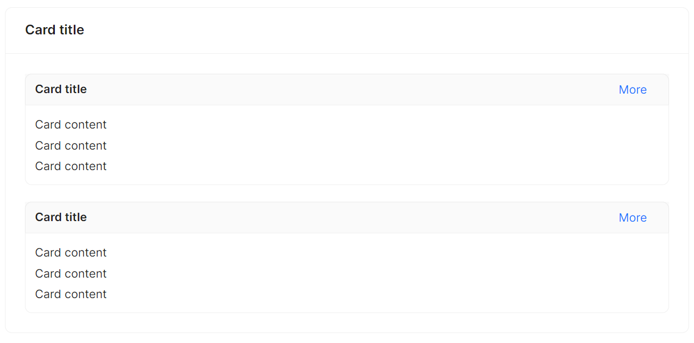

# 内部卡片

在一个主卡片内部嵌套多个子卡片，更好地展示层级关系。将 `IsInnerMode` 设定为True即可实现内部嵌套卡片。



```axaml
<atom:Card Header="Card title" HorizontalAlignment="Stretch" SizeType="Large">
    <StackPanel Orientation="Vertical" Spacing="20">
        <atom:Card Header="Card title" HorizontalAlignment="Stretch" IsInnerMode="True">
            <atom:Card.Extra>
                <atom:HyperLinkButton>More</atom:HyperLinkButton>
            </atom:Card.Extra>
            <StackPanel Orientation="Vertical" Spacing="3">
                <atom:TextBlock>Card content</atom:TextBlock>
                <atom:TextBlock>Card content</atom:TextBlock>
                <atom:TextBlock>Card content</atom:TextBlock>
            </StackPanel>
        </atom:Card>

        <atom:Card Header="Card title" HorizontalAlignment="Stretch" IsInnerMode="True">
            <atom:Card.Extra>
                <atom:HyperLinkButton>More</atom:HyperLinkButton>
            </atom:Card.Extra>
            <StackPanel Orientation="Vertical" Spacing="3">
                <atom:TextBlock>Card content</atom:TextBlock>
                <atom:TextBlock>Card content</atom:TextBlock>
                <atom:TextBlock>Card content</atom:TextBlock>
            </StackPanel>
        </atom:Card>
    </StackPanel>
</atom:Card>
```