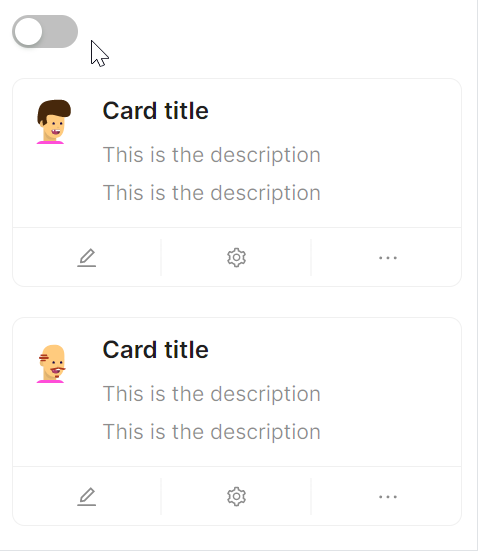

# loading状态

通过 `IsLoading` 属性，实现loading状态。当 `IsLoading` 为True时，会通过在正式内容的 `Card` 上方显示loading遮罩的方式实现loading状态。



```axaml
// 通过绑定IsLoading属性，实现loading状态
<StackPanel>
   <atom:ToggleSwitch IsChecked="{Binding IsLoading, Mode=TwoWay}"/>
   <atom:Card MinWidth="300" IsLoading="{Binding IsLoading}">
       <atom:CardMetaContent Header="Card title">
           <atom:CardMetaContent.Avatar>
               <atom:Avatar Src="avares://AtomUIGallery/Assets/AvatarShowCase/PeopleAvatar1.svg"/>
           </atom:CardMetaContent.Avatar>
           <StackPanel Orientation="Vertical" Spacing="3">
               <atom:TextBlock>This is the description</atom:TextBlock>
               <atom:TextBlock>This is the description</atom:TextBlock>
           </StackPanel>
       </atom:CardMetaContent>
       <atom:Card.Actions>
           <atom:IconButton Icon="{atom:IconProvider Kind=EditOutlined}"/>
           <atom:IconButton Icon="{atom:IconProvider Kind=SettingOutlined}"/>
           <atom:IconButton Icon="{atom:IconProvider Kind=EllipsisOutlined}"/>
       </atom:Card.Actions>
   </atom:Card>

   <atom:Card MinWidth="300" IsLoading="{Binding IsLoading}">
       <atom:CardMetaContent Header="Card title">
           <atom:CardMetaContent.Avatar>
               <atom:Avatar Src="avares://AtomUIGallery/Assets/AvatarShowCase/PeopleAvatar2.svg"/>
           </atom:CardMetaContent.Avatar>
           <StackPanel Orientation="Vertical" Spacing="3">
               <atom:TextBlock>This is the description</atom:TextBlock>
               <atom:TextBlock>This is the description</atom:TextBlock>
           </StackPanel>
       </atom:CardMetaContent>
       <atom:Card.Actions>
           <atom:IconButton Icon="{atom:IconProvider Kind=EditOutlined}"/>
           <atom:IconButton Icon="{atom:IconProvider Kind=SettingOutlined}"/>
           <atom:IconButton Icon="{atom:IconProvider Kind=EllipsisOutlined}"/>
       </atom:Card.Actions>
   </atom:Card>
</StackPanel>
```