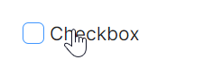
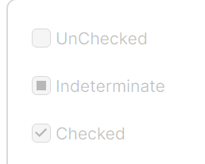
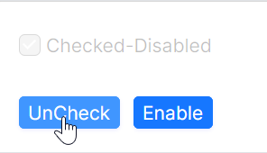
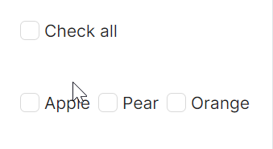
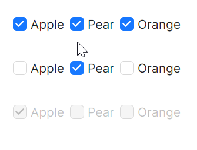

# CheckBox 快速入门

### 前置条件

* 通过 NuGet 安装 Avalonia
* 通过 NuGet 安装 AtomUI

在 AXAML 文件中引入 AtomUI 命名空间：

```xaml
xmlns:atom="https://atomui.net"
```

---

### 基础用法

最简单的 `CheckBox`，点击即可在选中和未选中之间切换。



```xaml
<StackPanel HorizontalAlignment="Left">
    <atom:CheckBox>Checkbox</atom:CheckBox>
</StackPanel>
```

---

### 禁用与半选状态

通过 `IsEnabled` 控制是否可用，通过 `IsChecked` 控制选中状态。当 `IsChecked` 的值为 `{x:Null}` 时表示不确定（半选）状态。



```xaml
<StackPanel HorizontalAlignment="Left" Spacing="10" Orientation="Vertical">
    <atom:CheckBox IsChecked="False" IsEnabled="False">UnChecked</atom:CheckBox>
    <atom:CheckBox IsChecked="{x:Null}" IsEnabled="False">Indeterminate</atom:CheckBox>
    <atom:CheckBox IsChecked="True" IsEnabled="False">Checked</atom:CheckBox>
</StackPanel>
```

---

### MVVM 方式控制 CheckBox

通过 MVVM 数据绑定动态控制 `IsChecked` 和 `IsEnabled` 属性。



AXAML 文件：

```xaml
<StackPanel HorizontalAlignment="Left" Spacing="10" Orientation="Vertical">
    <atom:CheckBox IsChecked="{Binding ControlledCheckBoxCheckedStatus}"
                   IsEnabled="{Binding ControlledCheckBoxEnabledStatus}"
                   Command="{Binding CheckBoxCommand}"
                   Content="{Binding ControlledCheckBoxText}" />
    <StackPanel Orientation="Horizontal" Spacing="10" Margin="0, 10, 0, 0">
        <atom:Button SizeType="Small" ButtonType="Primary"
                     x:Name="CheckStatusBtn"
                     Command="{Binding CheckStatusCommand}"
                     CommandParameter="{Binding ElementName=CheckStatusBtn}"
                     Content="{Binding CheckStatusBtnText}" />
        <atom:Button SizeType="Small" ButtonType="Primary"
                     x:Name="EnableStatusBtn"
                     CommandParameter="{Binding ElementName=EnableStatusBtn}"
                     Command="{Binding EnableStatusCommand}"
                     Content="{Binding EnableStatusBtnText}" />
    </StackPanel>
</StackPanel>
```

ViewModel 核心代码：

```csharp
public bool? ControlledCheckBoxCheckedStatus
{
    get => _controlledCheckBoxCheckedStatus;
    set => this.RaiseAndSetIfChanged(ref _controlledCheckBoxCheckedStatus, value);
}

public bool ControlledCheckBoxEnabledStatus
{
    get => _controlledCheckBoxEnabledStatus;
    set => this.RaiseAndSetIfChanged(ref _controlledCheckBoxEnabledStatus, value);
}
```

---

### 全选与取消全选

结合父级 `CheckBox` 的不确定状态，实现对子项的全选/取消全选控制。



AXAML 文件：

```xaml
<StackPanel Orientation="Vertical" HorizontalAlignment="Left" Spacing="10">
    <StackPanel>
        <atom:CheckBox IsChecked="{Binding CheckedAllStatus}"
                       Command="{Binding CheckedAllStatusCommand}">
            Check all
        </atom:CheckBox>
    </StackPanel>
    <WrapPanel Margin="0, 20, 0, 0">
        <atom:CheckBox x:Name="AppleCheckBox"
                       IsChecked="{Binding AppleCheckedStatus}"
                       Command="{Binding CheckedItemStatusCommand1}">
            Apple
        </atom:CheckBox>
        <atom:CheckBox x:Name="PearCheckBox"
                       IsChecked="{Binding PearCheckedStatus}"
                       Command="{Binding CheckedItemStatusCommand2}">
            Pear
        </atom:CheckBox>
        <atom:CheckBox x:Name="OrangeCheckBox"
                       IsChecked="{Binding OrangeCheckedStatus}"
                       Command="{Binding CheckedItemStatusCommand3}">
            Orange
        </atom:CheckBox>
    </WrapPanel>
</StackPanel>
```

当所有子项选中时，父级为选中；部分选中时为不确定状态；全部取消时为未选中。

---

### WrapPanel 组布局

使用 `WrapPanel` 将多个 `CheckBox` 组织为横向组，实现紧凑的多选布局。



```xaml
<StackPanel HorizontalAlignment="Left" Spacing="10" Orientation="Vertical">
    <WrapPanel Margin="0, 0, 0, 10">
        <atom:CheckBox IsChecked="True">Apple</atom:CheckBox>
        <atom:CheckBox IsChecked="True">Pear</atom:CheckBox>
        <atom:CheckBox IsChecked="True">Orange</atom:CheckBox>
    </WrapPanel>
    <WrapPanel Margin="0, 0, 0, 10">
        <atom:CheckBox>Apple</atom:CheckBox>
        <atom:CheckBox IsChecked="True">Pear</atom:CheckBox>
        <atom:CheckBox>Orange</atom:CheckBox>
    </WrapPanel>
    <WrapPanel Margin="0, 0, 0, 10">
        <atom:CheckBox IsChecked="True" IsEnabled="False">Apple</atom:CheckBox>
        <atom:CheckBox IsEnabled="False">Pear</atom:CheckBox>
        <atom:CheckBox IsEnabled="False">Orange</atom:CheckBox>
    </WrapPanel>
</StackPanel>
```

---

### Grid 布局集成

结合 Avalonia 原生 `Grid` 容器，实现网格形式的多选布局。


```xaml
<Grid ColumnDefinitions="*,*,*" RowDefinitions="Auto,Auto,Auto" Margin="10">
    <atom:CheckBox Grid.Row="0" Grid.Column="0">A</atom:CheckBox>
    <atom:CheckBox Grid.Row="0" Grid.Column="1">B</atom:CheckBox>
    <atom:CheckBox Grid.Row="0" Grid.Column="2">C</atom:CheckBox>
    <atom:CheckBox Grid.Row="1" Grid.Column="0">D</atom:CheckBox>
    <atom:CheckBox Grid.Row="1" Grid.Column="1">E</atom:CheckBox>
</Grid>
```
