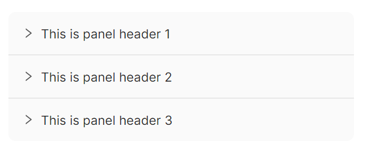
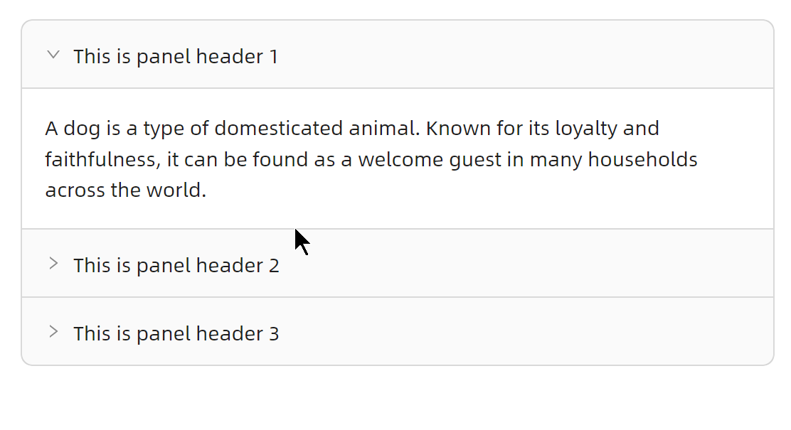
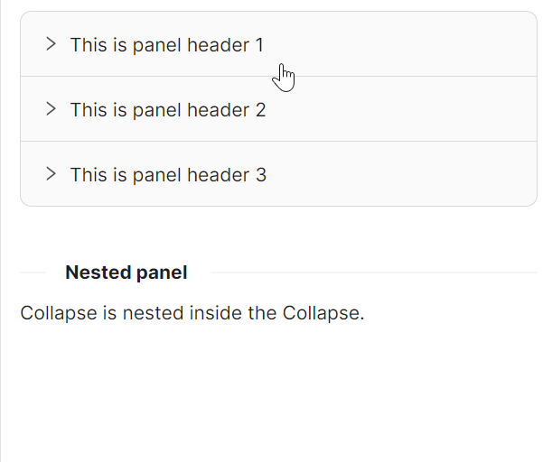
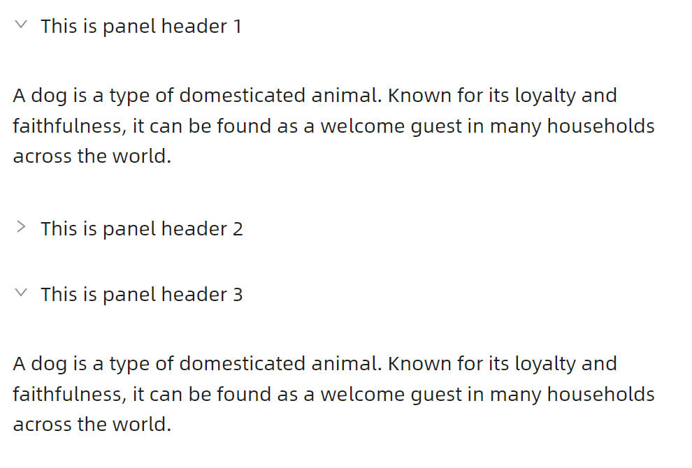
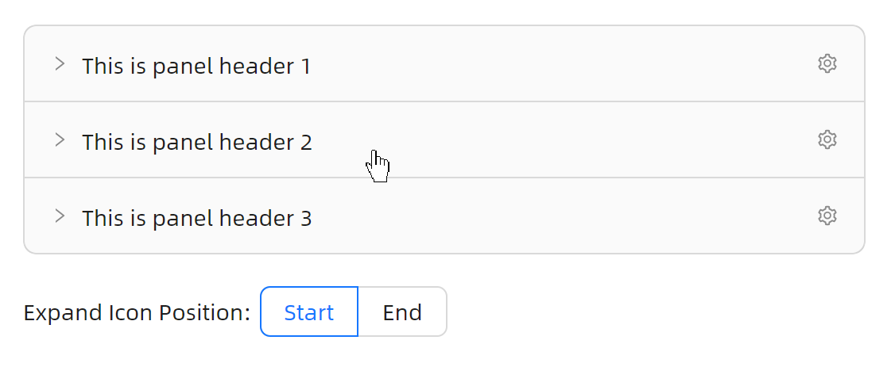
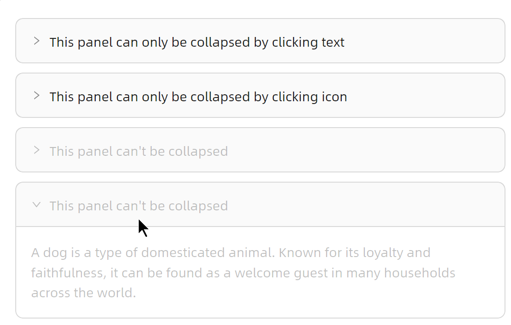
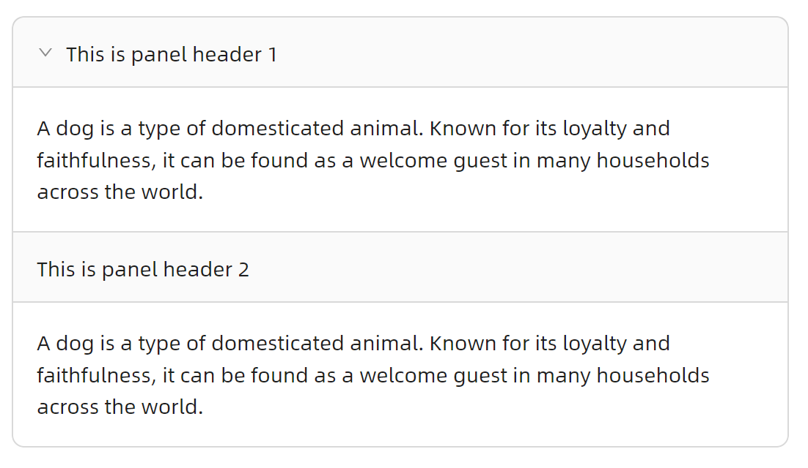

# Collapse 快速入门

### 基础配置条件

* Nuget安装Avalonia
* Nuget安装AtomUI

### 基础用法

最简单的折叠面板用法，可包含多个 `CollapseItem`，每个面板项通过 `Header` 属性设置标题。


```xaml
<atom:Collapse>
    <atom:CollapseItem Header="This is panel header 1">
        <atom:TextBlock TextWrapping="Wrap">
            A dog is a type of domesticated animal. Known for its loyalty and faithfulness, it can be found as a welcome guest in many households across the world.
        </atom:TextBlock>
    </atom:CollapseItem>
    <atom:CollapseItem Header="This is panel header 2">
        <atom:TextBlock TextWrapping="Wrap">
            A dog is a type of domesticated animal. Known for its loyalty and faithfulness, it can be found as a welcome guest in many households across the world.
        </atom:TextBlock>
    </atom:CollapseItem>
    <atom:CollapseItem Header="This is panel header 3">
        <atom:TextBlock TextWrapping="Wrap">
            A dog is a type of domesticated animal. Known for its loyalty and faithfulness, it can be found as a welcome guest in many households across the world.
        </atom:TextBlock>
    </atom:CollapseItem>
</atom:Collapse>
```

### 尺寸大小

通过 `SizeType` 属性可以设置折叠面板的尺寸，支持 `Small`、`Middle`（默认）和 `Large` 三种尺寸。


```xaml
<StackPanel Orientation="Vertical" Spacing="20" >
    <atom:Separator Title="Default Size" TitlePosition="Left" FontWeight="Bold" />
    <atom:Collapse SizeType="Middle">
        <atom:CollapseItem Header="This is default size panel header">
            <atom:TextBlock TextWrapping="Wrap">
                A dog is a type of domesticated animal. Known for its loyalty and faithfulness, it can be found as a welcome guest in many households across the world.
            </atom:TextBlock>
        </atom:CollapseItem>
    </atom:Collapse>
    <atom:Separator Title="Small Size" TitlePosition="Left" FontWeight="Bold" />
    <atom:Collapse SizeType="Small">
        <atom:CollapseItem Header="This is small size panel header">
            <atom:TextBlock TextWrapping="Wrap">
                A dog is a type of domesticated animal. Known for its loyalty and faithfulness, it can be found as a welcome guest in many households across the world.
            </atom:TextBlock>
        </atom:CollapseItem>
    </atom:Collapse>
    <atom:Separator Title="Large Size" TitlePosition="Left" FontWeight="Bold" />
    <atom:Collapse SizeType="Large">
        <atom:CollapseItem Header="This is large size panel header">
            <atom:TextBlock TextWrapping="Wrap">
                A dog is a type of domesticated animal. Known for its loyalty and faithfulness, it can be found as a welcome guest in many households across the world.
            </atom:TextBlock>
        </atom:CollapseItem>
    </atom:Collapse>
</StackPanel>
```

### 无边框

设置 `IsBorderless="True"` 可以使用没有边框的简洁样式。



```xaml
<atom:Collapse IsBorderless="True">
    <atom:CollapseItem Header="This is panel header 1">
        <atom:TextBlock TextWrapping="Wrap">
            A dog is a type of domesticated animal. Known for its loyalty and faithfulness, it can be found as a welcome guest in many households across the world.
        </atom:TextBlock>
    </atom:CollapseItem>
    <atom:CollapseItem Header="This is panel header 2">
        <atom:TextBlock TextWrapping="Wrap">
            A dog is a type of domesticated animal. Known for its loyalty and faithfulness, it can be found as a welcome guest in many households across the world.
        </atom:TextBlock>
    </atom:CollapseItem>
    <atom:CollapseItem Header="This is panel header 3">
        <atom:TextBlock TextWrapping="Wrap">
            A dog is a type of domesticated animal. Known for its loyalty and faithfulness, it can be found as a welcome guest in many households across the world.
        </atom:TextBlock>
    </atom:CollapseItem>
</atom:Collapse>
```

### 手风琴模式

设置 `IsAccordion="True"` 开启手风琴模式，同一时间仅允许一个面板项处于展开状态。



```xaml
<atom:Collapse IsAccordion="True">
    <atom:CollapseItem Header="This is panel header 1">
        <atom:TextBlock TextWrapping="Wrap">
            A dog is a type of domesticated animal. Known for its loyalty and faithfulness, it can be found as a welcome guest in many households across the world.
        </atom:TextBlock>
    </atom:CollapseItem>
    <atom:CollapseItem Header="This is panel header 2">
        <atom:TextBlock TextWrapping="Wrap">
            A dog is a type of domesticated animal. Known for its loyalty and faithfulness, it can be found as a welcome guest in many households across the world.
        </atom:TextBlock>
    </atom:CollapseItem>
    <atom:CollapseItem Header="This is panel header 3">
        <atom:TextBlock TextWrapping="Wrap">
            A dog is a type of domesticated animal. Known for its loyalty and faithfulness, it can be found as a welcome guest in many households across the world.
        </atom:TextBlock>
    </atom:CollapseItem>
</atom:Collapse>
```

### 嵌套折叠面板

折叠面板支持嵌套使用，可在 `CollapseItem` 的内容区域中放置另一个 `Collapse` 组件。



```xaml
<atom:Collapse>
    <atom:CollapseItem Header="This is panel header 1">
        <atom:Collapse>
            <atom:CollapseItem Header="This is panel header 1">
                <atom:TextBlock TextWrapping="Wrap">
                    A dog is a type of domesticated animal. Known for its loyalty and faithfulness, it can be found as a welcome guest in many households across the world.
                </atom:TextBlock>
            </atom:CollapseItem>
        </atom:Collapse>
    </atom:CollapseItem>
    <atom:CollapseItem Header="This is panel header 2">
        <atom:TextBlock TextWrapping="Wrap">
            A dog is a type of domesticated animal. Known for its loyalty and faithfulness, it can be found as a welcome guest in many households across the world.
        </atom:TextBlock>
    </atom:CollapseItem>
    <atom:CollapseItem Header="This is panel header 3">
        <atom:TextBlock TextWrapping="Wrap">
            A dog is a type of domesticated animal. Known for its loyalty and faithfulness, it can be found as a welcome guest in many households across the world.
        </atom:TextBlock>
    </atom:CollapseItem>
</atom:Collapse>
```

### 自定义表头与内容内间距

通过 `ItemHeaderPadding` 和 `ItemContentPadding` 属性可以自定义面板表头和内容区域的内间距。


```xaml
<StackPanel Orientation="Vertical" Spacing="20">
    <atom:Collapse ItemHeaderPadding="5" ItemContentPadding="5">
        <atom:CollapseItem Header="This is panel header 1">
            <atom:TextBlock TextWrapping="Wrap">
                A dog is a type of domesticated animal. Known for its loyalty and faithfulness, it can be found as a welcome guest in many households across the world.
            </atom:TextBlock>
        </atom:CollapseItem>
        <atom:CollapseItem Header="This is panel header 2">
            <atom:TextBlock TextWrapping="Wrap">
                A dog is a type of domesticated animal. Known for its loyalty and faithfulness, it can be found as a welcome guest in many households across the world.
            </atom:TextBlock>
        </atom:CollapseItem>
        <atom:CollapseItem Header="This is panel header 3">
            <atom:TextBlock TextWrapping="Wrap">
                A dog is a type of domesticated animal. Known for its loyalty and faithfulness, it can be found as a welcome guest in many households across the world.
            </atom:TextBlock>
        </atom:CollapseItem>
    </atom:Collapse>

    <atom:Collapse ItemHeaderPadding="0" ItemContentPadding="0" IsGhostStyle="True">
        <atom:CollapseItem Header="This is panel header 1">
            <atom:TextBlock TextWrapping="Wrap">
                A dog is a type of domesticated animal. Known for its loyalty and faithfulness, it can be found as a welcome guest in many households across the world.
            </atom:TextBlock>
        </atom:CollapseItem>
        <atom:CollapseItem Header="This is panel header 2">
            <atom:TextBlock TextWrapping="Wrap">
                A dog is a type of domesticated animal. Known for its loyalty and faithfulness, it can be found as a welcome guest in many households across the world.
            </atom:TextBlock>
        </atom:CollapseItem>
        <atom:CollapseItem Header="This is panel header 3">
            <atom:TextBlock TextWrapping="Wrap">
                A dog is a type of domesticated animal. Known for its loyalty and faithfulness, it can be found as a welcome guest in many households across the world.
            </atom:TextBlock>
        </atom:CollapseItem>
    </atom:Collapse>
</StackPanel>
```

### 幽灵样式

设置 `IsGhostStyle="True"` 使折叠面板呈现透明且无边框的幽灵样式，常用于需要与背景融为一体的场景。



```xaml
<atom:Collapse IsGhostStyle="True">
    <atom:CollapseItem Header="This is panel header 1">
        <atom:TextBlock TextWrapping="Wrap">
            A dog is a type of domesticated animal. Known for its loyalty and faithfulness, it can be found as a welcome guest in many households across the world.
        </atom:TextBlock>
    </atom:CollapseItem>
    <atom:CollapseItem Header="This is panel header 2">
        <atom:TextBlock TextWrapping="Wrap">
            A dog is a type of domesticated animal. Known for its loyalty and faithfulness, it can be found as a welcome guest in many households across the world.
        </atom:TextBlock>
    </atom:CollapseItem>
    <atom:CollapseItem Header="This is panel header 3">
        <atom:TextBlock TextWrapping="Wrap">
            A dog is a type of domesticated animal. Known for its loyalty and faithfulness, it can be found as a welcome guest in many households across the world.
        </atom:TextBlock>
    </atom:CollapseItem>
</atom:Collapse>
```

### 展开图标位置

通过 `ExpandIconPosition` 属性可以设置展开图标的位置，支持 `Start`（默认，在左侧）和 `End`（在右侧）两种。



```xaml
<StackPanel Orientation="Vertical" Spacing="20">
    <atom:Collapse ExpandIconPosition="{Binding CollapseExpandIconPosition}">
        <atom:CollapseItem Header="This is panel header 1"
                           AddOnContent="{antdicons:AntDesignIconProvider Kind=SettingOutlined}">
            <atom:TextBlock TextWrapping="Wrap">
                A dog is a type of domesticated animal. Known for its loyalty and faithfulness, it can be found as a welcome guest in many households across the world.
            </atom:TextBlock>
        </atom:CollapseItem>
        <atom:CollapseItem Header="This is panel header 2"
                           AddOnContent="{antdicons:AntDesignIconProvider Kind=SettingOutlined}">
            <atom:TextBlock TextWrapping="Wrap">
                A dog is a type of domesticated animal. Known for its loyalty and faithfulness, it can be found as a welcome guest in many households across the world.
            </atom:TextBlock>
        </atom:CollapseItem>
        <atom:CollapseItem Header="This is panel header 3"
                           AddOnContent="{antdicons:AntDesignIconProvider Kind=SettingOutlined}">
            <atom:TextBlock TextWrapping="Wrap">
                A dog is a type of domesticated animal. Known for its loyalty and faithfulness, it can be found as a welcome guest in many households across the world.
            </atom:TextBlock>
        </atom:CollapseItem>
    </atom:Collapse>

    <StackPanel Orientation="Horizontal" Spacing="5">
        <atom:TextBlock VerticalAlignment="Center">Expand Icon Position:</atom:TextBlock>
        <atom:OptionButtonGroup ButtonStyle="Outline" Name="ExpandButtonPosGroup">
            <atom:OptionButton IsChecked="True">Start</atom:OptionButton>
            <atom:OptionButton>End</atom:OptionButton>
        </atom:OptionButtonGroup>
    </StackPanel>
</StackPanel>
```

### 触发区域

通过 `TriggerType` 属性可以配置折叠面板的触发区域。默认值为 `Header`，点击整个表头区域即可触发展开/收起；设置为 `Icon` 时，仅点击展开图标才会触发。



```xaml
<StackPanel Orientation="Vertical" Spacing="10">
    <atom:Collapse>
        <atom:CollapseItem Header="This panel can only be collapsed by clicking text">
            <atom:TextBlock TextWrapping="Wrap">
                A dog is a type of domesticated animal. Known for its loyalty and faithfulness, it can be found as a welcome guest in many households across the world.
            </atom:TextBlock>
        </atom:CollapseItem>
    </atom:Collapse>
    <atom:Collapse TriggerType="Icon">
        <atom:CollapseItem Header="This panel can only be collapsed by clicking icon">
            <atom:TextBlock TextWrapping="Wrap">
                A dog is a type of domesticated animal. Known for its loyalty and faithfulness, it can be found as a welcome guest in many households across the world.
            </atom:TextBlock>
        </atom:CollapseItem>
    </atom:Collapse>

    <atom:Collapse IsEnabled="False">
        <atom:CollapseItem Header="This panel can't be collapsed">
            <atom:TextBlock TextWrapping="Wrap">
                A dog is a type of domesticated animal. Known for its loyalty and faithfulness, it can be found as a welcome guest in many households across the world.
            </atom:TextBlock>
        </atom:CollapseItem>
    </atom:Collapse>

    <atom:Collapse IsEnabled="False">
        <atom:CollapseItem Header="This panel can't be collapsed" IsSelected="True">
            <atom:TextBlock TextWrapping="Wrap">
                A dog is a type of domesticated animal. Known for its loyalty and faithfulness, it can be found as a welcome guest in many households across the world.
            </atom:TextBlock>
        </atom:CollapseItem>
    </atom:Collapse>
</StackPanel>
```

### 隐藏展开箭头

通过设置 `CollapseItem` 的 `IsShowExpandIcon="False"` 可以隐藏单个面板项的展开箭头图标。



```xaml
<atom:Collapse>
    <atom:CollapseItem Header="This is panel header 1">
        <atom:TextBlock TextWrapping="Wrap">
            A dog is a type of domesticated animal. Known for its loyalty and faithfulness, it can be found as a welcome guest in many households across the world.
        </atom:TextBlock>
    </atom:CollapseItem>
    <atom:CollapseItem Header="This is panel header 2" IsShowExpandIcon="False">
        <atom:TextBlock TextWrapping="Wrap">
            A dog is a type of domesticated animal. Known for its loyalty and faithfulness, it can be found as a welcome guest in many households across the world.
        </atom:TextBlock>
    </atom:CollapseItem>
</atom:Collapse>
```
