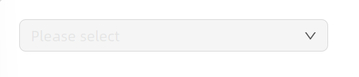
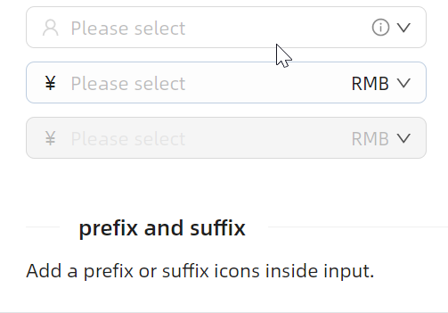

# ComboBox 快速入门

## 前置条件

- NuGet 安装 `Avalonia`
- NuGet 安装 `AtomUI`

## 基础用法

最简单的用法是直接通过 `ComboBoxItem` 声明选项列表。


```xaml
<atom:ComboBox PlaceholderText="Please select" Width="300">
    <atom:ComboBoxItem>床前明月光</atom:ComboBoxItem>
    <atom:ComboBoxItem>疑是地上霜</atom:ComboBoxItem>
    <atom:ComboBoxItem>举头望明月</atom:ComboBoxItem>
    <atom:ComboBoxItem>低头思故乡</atom:ComboBoxItem>
</atom:ComboBox>
```

## ItemsSource 数据绑定

在实际业务中，更常见的做法是通过 `ItemsSource` 绑定数据源，再通过 `ItemTemplate` 定义每个选项的显示方式。这是 Avalonia 中的标准 MVVM 用法。


```xaml
<atom:ComboBox PlaceholderText="Please select" Width="300"
               x:DataType="viewModels:ComboBoxViewModel"
               ItemsSource="{Binding ComboBoxItems}">
    <atom:ComboBox.ItemTemplate>
        <DataTemplate>
            <atom:TextBlock Text="{Binding Text}" VerticalAlignment="Center"/>
        </DataTemplate>
    </atom:ComboBox.ItemTemplate>
</atom:ComboBox>
```

## 禁用状态

通过 `IsEnabled` 属性可以将组件设置为禁用状态，禁用后用户无法与之交互。



```xaml
<atom:ComboBox PlaceholderText="Please select" Width="300" IsEnabled="False">
    <atom:ComboBoxItem>床前明月光</atom:ComboBoxItem>
    <atom:ComboBoxItem>疑是地上霜</atom:ComboBoxItem>
    <atom:ComboBoxItem>举头望明月</atom:ComboBoxItem>
    <atom:ComboBoxItem>低头思故乡</atom:ComboBoxItem>
</atom:ComboBox>
```

## 尺寸

通过 `SizeType` 属性控制组件的大小尺寸，可选值为 `Large`、`Middle`、`Small`。


```xaml
<StackPanel Orientation="Vertical" Spacing="10">
    <atom:ComboBox SizeType="Large" PlaceholderText="Please select">
        <atom:ComboBoxItem>床前明月光</atom:ComboBoxItem>
        <atom:ComboBoxItem>疑是地上霜</atom:ComboBoxItem>
        <atom:ComboBoxItem>举头望明月</atom:ComboBoxItem>
        <atom:ComboBoxItem>低头思故乡</atom:ComboBoxItem>
    </atom:ComboBox>
    <atom:ComboBox SizeType="Middle" PlaceholderText="Please select">
        <atom:ComboBoxItem>床前明月光</atom:ComboBoxItem>
        <atom:ComboBoxItem>疑是地上霜</atom:ComboBoxItem>
        <atom:ComboBoxItem>举头望明月</atom:ComboBoxItem>
        <atom:ComboBoxItem>低头思故乡</atom:ComboBoxItem>
    </atom:ComboBox>
    <atom:ComboBox SizeType="Small" PlaceholderText="Please select">
        <atom:ComboBoxItem>床前明月光</atom:ComboBoxItem>
        <atom:ComboBoxItem>疑是地上霜</atom:ComboBoxItem>
        <atom:ComboBoxItem>举头望明月</atom:ComboBoxItem>
        <atom:ComboBoxItem>低头思故乡</atom:ComboBoxItem>
    </atom:ComboBox>
</StackPanel>
```

## 样式变体

通过 `StyleVariant` 属性切换不同的视觉风格，可选值为 `Outline`（线框，默认）、`Filled`（填充）、`Borderless`（无边框），便于融入不同的 UI 设计场景。


```xaml
<StackPanel Orientation="Vertical" Spacing="10">
    <atom:ComboBox StyleVariant="Outline" PlaceholderText="Please select" Width="300">
        <atom:ComboBoxItem>床前明月光</atom:ComboBoxItem>
        <atom:ComboBoxItem>疑是地上霜</atom:ComboBoxItem>
        <atom:ComboBoxItem>举头望明月</atom:ComboBoxItem>
        <atom:ComboBoxItem>低头思故乡</atom:ComboBoxItem>
    </atom:ComboBox>

    <atom:ComboBox StyleVariant="Filled" PlaceholderText="Please select" Width="300">
        <atom:ComboBoxItem>床前明月光</atom:ComboBoxItem>
        <atom:ComboBoxItem>疑是地上霜</atom:ComboBoxItem>
        <atom:ComboBoxItem>举头望明月</atom:ComboBoxItem>
        <atom:ComboBoxItem>低头思故乡</atom:ComboBoxItem>
    </atom:ComboBox>

    <atom:ComboBox StyleVariant="Borderless" PlaceholderText="Please select" Width="300">
        <atom:ComboBoxItem>床前明月光</atom:ComboBoxItem>
        <atom:ComboBoxItem>疑是地上霜</atom:ComboBoxItem>
        <atom:ComboBoxItem>举头望明月</atom:ComboBoxItem>
        <atom:ComboBoxItem>低头思故乡</atom:ComboBoxItem>
    </atom:ComboBox>
</StackPanel>
```

## 前置/后置标签（Pre/Post Tab）

通过 `LeftAddOn` 和 `RightAddOn` 属性在输入框的外部左侧或右侧添加附加内容，其值可以是字符串，也可以是图标等控件。


```xaml
<StackPanel Orientation="Vertical" Spacing="10">
    <atom:ComboBox PlaceholderText="Please select" Width="300"
                   LeftAddOn="http://"
                   RightAddOn=".com">
        <atom:ComboBoxItem>床前明月光</atom:ComboBoxItem>
        <atom:ComboBoxItem>疑是地上霜</atom:ComboBoxItem>
        <atom:ComboBoxItem>举头望明月</atom:ComboBoxItem>
        <atom:ComboBoxItem>低头思故乡</atom:ComboBoxItem>
    </atom:ComboBox>

    <atom:ComboBox PlaceholderText="Please select" Width="300"
                   RightAddOn="{atom:IconProvider Kind=SettingOutlined}">
        <atom:ComboBoxItem>床前明月光</atom:ComboBoxItem>
        <atom:ComboBoxItem>疑是地上霜</atom:ComboBoxItem>
        <atom:ComboBoxItem>举头望明月</atom:ComboBoxItem>
        <atom:ComboBoxItem>低头思故乡</atom:ComboBoxItem>
    </atom:ComboBox>

    <atom:ComboBox PlaceholderText="Please select" Width="300"
                   LeftAddOn="http://"
                   InnerRightContent=".com">
        <atom:ComboBoxItem>床前明月光</atom:ComboBoxItem>
        <atom:ComboBoxItem>疑是地上霜</atom:ComboBoxItem>
        <atom:ComboBoxItem>举头望明月</atom:ComboBoxItem>
        <atom:ComboBoxItem>低头思故乡</atom:ComboBoxItem>
    </atom:ComboBox>
</StackPanel>
```

## 内部前缀/后缀

通过 `InnerLeftContent` 和 `InnerRightContent` 属性在输入框内部的左侧或右侧添加前缀/后缀内容。与 `LeftAddOn` / `RightAddOn` 不同的是，前后缀位于输入框内部，是输入框的组成部分。



```xaml
<StackPanel Orientation="Vertical" Spacing="10">
    <atom:ComboBox PlaceholderText="Please select" Width="300"
                   InnerLeftContent="{atom:IconProvider Kind=UserOutlined, NormalFilledColor=#D7D7D7}"
                   InnerRightContent="{atom:IconProvider Kind=InfoCircleOutlined, NormalFilledColor=#8C8C8C}">
        <atom:ComboBoxItem>床前明月光</atom:ComboBoxItem>
        <atom:ComboBoxItem>疑是地上霜</atom:ComboBoxItem>
        <atom:ComboBoxItem>举头望明月</atom:ComboBoxItem>
        <atom:ComboBoxItem>低头思故乡</atom:ComboBoxItem>
    </atom:ComboBox>

    <atom:ComboBox PlaceholderText="Please select" Width="300"
                   InnerLeftContent="￥"
                   InnerRightContent="RMB">
        <atom:ComboBoxItem>床前明月光</atom:ComboBoxItem>
        <atom:ComboBoxItem>疑是地上霜</atom:ComboBoxItem>
        <atom:ComboBoxItem>举头望明月</atom:ComboBoxItem>
        <atom:ComboBoxItem>低头思故乡</atom:ComboBoxItem>
    </atom:ComboBox>

    <atom:ComboBox PlaceholderText="Please select" Width="300"
                   InnerLeftContent="￥"
                   InnerRightContent="RMB" IsEnabled="False">
        <atom:ComboBoxItem>床前明月光</atom:ComboBoxItem>
        <atom:ComboBoxItem>疑是地上霜</atom:ComboBoxItem>
        <atom:ComboBoxItem>举头望明月</atom:ComboBoxItem>
        <atom:ComboBoxItem>低头思故乡</atom:ComboBoxItem>
    </atom:ComboBox>
</StackPanel>
```

## 状态色

通过 `Status` 属性设定组件的状态色，用于向用户传达表单校验等信息。可选值为 `Default`、`Error`、`Warning`。状态色在所有样式变体下均生效。


```xaml
<StackPanel Orientation="Vertical" Spacing="10">
    <atom:ComboBox PlaceholderText="Please select" Width="300"
                   Status="Error">
        <atom:ComboBoxItem>床前明月光</atom:ComboBoxItem>
        <atom:ComboBoxItem>疑是地上霜</atom:ComboBoxItem>
        <atom:ComboBoxItem>举头望明月</atom:ComboBoxItem>
        <atom:ComboBoxItem>低头思故乡</atom:ComboBoxItem>
    </atom:ComboBox>

    <atom:ComboBox PlaceholderText="Please select" Width="300"
                   Status="Warning">
        <atom:ComboBoxItem>床前明月光</atom:ComboBoxItem>
        <atom:ComboBoxItem>疑是地上霜</atom:ComboBoxItem>
        <atom:ComboBoxItem>举头望明月</atom:ComboBoxItem>
        <atom:ComboBoxItem>低头思故乡</atom:ComboBoxItem>
    </atom:ComboBox>

    <atom:ComboBox PlaceholderText="Please select" Width="300"
                   Status="Error"
                   InnerLeftContent="{atom:IconProvider Kind=ClockCircleOutlined}">
        <atom:ComboBoxItem>床前明月光</atom:ComboBoxItem>
        <atom:ComboBoxItem>疑是地上霜</atom:ComboBoxItem>
        <atom:ComboBoxItem>举头望明月</atom:ComboBoxItem>
        <atom:ComboBoxItem>低头思故乡</atom:ComboBoxItem>
    </atom:ComboBox>

    <atom:ComboBox PlaceholderText="Please select" Width="300"
                   Status="Warning"
                   InnerLeftContent="{atom:IconProvider Kind=ClockCircleOutlined}">
        <atom:ComboBoxItem>床前明月光</atom:ComboBoxItem>
        <atom:ComboBoxItem>疑是地上霜</atom:ComboBoxItem>
        <atom:ComboBoxItem>举头望明月</atom:ComboBoxItem>
        <atom:ComboBoxItem>低头思故乡</atom:ComboBoxItem>
    </atom:ComboBox>

    <atom:ComboBox PlaceholderText="Please select" Width="300"
                   Status="Error"
                   StyleVariant="Filled"
                   InnerLeftContent="{atom:IconProvider Kind=ClockCircleOutlined}">
        <atom:ComboBoxItem>床前明月光</atom:ComboBoxItem>
        <atom:ComboBoxItem>疑是地上霜</atom:ComboBoxItem>
        <atom:ComboBoxItem>举头望明月</atom:ComboBoxItem>
        <atom:ComboBoxItem>低头思故乡</atom:ComboBoxItem>
    </atom:ComboBox>

    <atom:ComboBox PlaceholderText="Please select" Width="300"
                   Status="Warning"
                   StyleVariant="Filled"
                   InnerLeftContent="{atom:IconProvider Kind=ClockCircleOutlined}">
        <atom:ComboBoxItem>床前明月光</atom:ComboBoxItem>
        <atom:ComboBoxItem>疑是地上霜</atom:ComboBoxItem>
        <atom:ComboBoxItem>举头望明月</atom:ComboBoxItem>
        <atom:ComboBoxItem>低头思故乡</atom:ComboBoxItem>
    </atom:ComboBox>

    <atom:ComboBox PlaceholderText="Please select" Width="300"
                   Status="Error"
                   StyleVariant="Borderless"
                   InnerLeftContent="{atom:IconProvider Kind=ClockCircleOutlined}">
        <atom:ComboBoxItem>床前明月光</atom:ComboBoxItem>
        <atom:ComboBoxItem>疑是地上霜</atom:ComboBoxItem>
        <atom:ComboBoxItem>举头望明月</atom:ComboBoxItem>
        <atom:ComboBoxItem>低头思故乡</atom:ComboBoxItem>
    </atom:ComboBox>

    <atom:ComboBox PlaceholderText="Please select" Width="300"
                   Status="Warning"
                   StyleVariant="Borderless"
                   InnerLeftContent="{atom:IconProvider Kind=ClockCircleOutlined}">
        <atom:ComboBoxItem>床前明月光</atom:ComboBoxItem>
        <atom:ComboBoxItem>疑是地上霜</atom:ComboBoxItem>
        <atom:ComboBoxItem>举头望明月</atom:ComboBoxItem>
        <atom:ComboBoxItem>低头思故乡</atom:ComboBoxItem>
    </atom:ComboBox>
</StackPanel>
```
