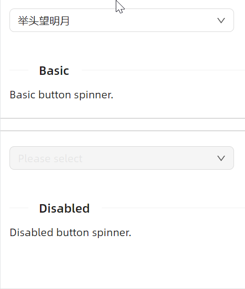

# ComboBox 下拉选择框

## 简介

下拉选择框组件用于在一组预定义选项中选择一个值。AtomUI 的 ComboBox 组件继承自 Avalonia 原生 ComboBox，在此基础上扩展了丰富的样式变体、尺寸规格、前后缀插槽以及状态色等特性，遵循 Ant Design 设计规范，能够满足各类表单交互场景的需求。

## 何时使用

- 需要从一组预定义选项中选择单个值时
- 相比 RadioButton，选项数量较多且不需要同时展示所有选项时
- 需要节省页面空间，将选项收纳在下拉面板中时

## 主要特性

- **多种样式变体** — 支持 Outline（线框）、Filled（填充）、Borderless（无边框）三种视觉风格，适配不同 UI 设计场景
- **三种尺寸** — 提供 Large、Middle、Small 三种尺寸规格，灵活适应不同布局需求
- **前后附加内容** — 通过 LeftAddOn / RightAddOn 在输入框外部添加标签或图标，通过 ContentLeftAddOn / ContentRightAddOn 在输入框内部添加前后缀
- **状态色反馈** — 支持 Default、Error、Warning 三种状态色，直观传达表单校验结果
- **一键清除** — 通过 IsAllowClear 属性开启清除按钮，方便用户快速重置选择
- **数据绑定** — 完整支持 ItemsSource + ItemTemplate 的 MVVM 数据绑定模式
- **过渡动画** — 内置平滑的下拉展开/收起动画效果
