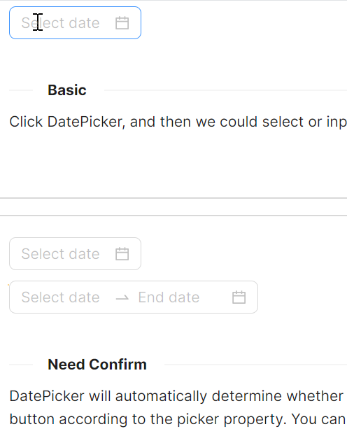

# DatePicker 概述

### 简介

DatePicker 是一个功能丰富的日期选择组件，支持单日期选择与范围日期选择两种模式。可通过配置将时间精度扩展到时分秒，还提供确认按钮、12/24 小时制切换等实用功能，满足各类业务场景下的日期选取需求。

### 主要功能

* 单日期选择（DatePicker）与范围日期选择（RangeDatePicker）
* 支持时间精度扩展，可精确到时分秒（IsShowTime）
* 内置确认按钮模式，适用于需要用户二次确认的场景（IsNeedConfirm）
* 支持 12 小时制与 24 小时制切换（ClockIdentifier）
* 提供多种尺寸（Large / Middle / Small）、状态色（Default / Warning / Error）和样式变体（Outline / Filled / Borderless）
* 可配置弹出位置（TopLeft / TopRight / BottomLeft / BottomRight）
* 支持禁用状态与水印占位文字
