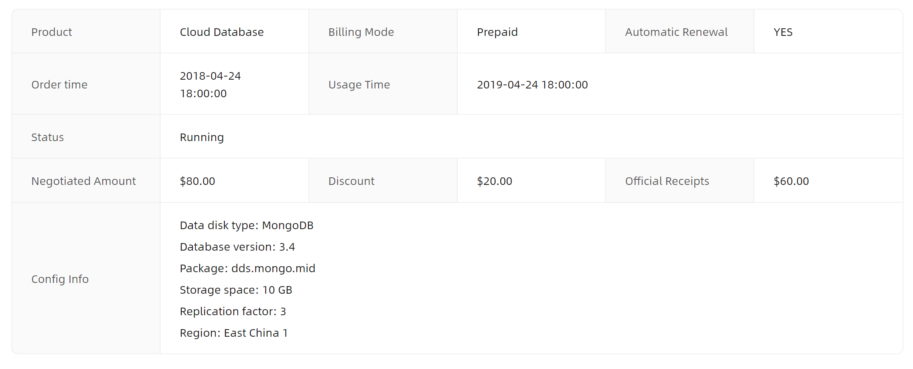
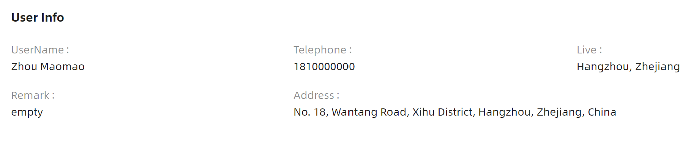
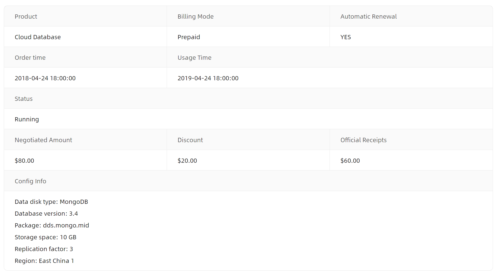

# Descriptions 快速入门

### 基础配置条件

* Nuget安装Avalonia
* Nuget安装AtomUI

### 基础用法

最简单的描述列表用法，通过 `Header` 属性设置标题，在内部添加 `DescriptionItem` 来定义每一项的标签和内容。


```xaml
<atom:Descriptions Header="User Info">
    <atom:DescriptionItem Label="UserName" Content="Zhou Maomao" />
    <atom:DescriptionItem Label="Telephone" Content="1810000000" />
    <atom:DescriptionItem Label="Live" Content="Hangzhou, Zhejiang" />
    <atom:DescriptionItem Label="Remark" Content="empty" />
    <atom:DescriptionItem Label="Address"
                          Content="No. 18, Wantang Road, Xihu District, Hangzhou, Zhejiang, China" />
</atom:Descriptions>
```

### 边框模式

设置 `IsBordered="True"` 可以启用带边框的描述列表样式，使各项内容之间的分隔更加清晰。支持通过 `Span` 属性控制每一项所占的列数，也支持在 `Content` 中放置自定义控件。



```xaml
<atom:Descriptions IsBordered="True">
    <atom:DescriptionItem Label="Product" Content="Cloud Database" />
    <atom:DescriptionItem Label="Billing Mode" Content="Prepaid" />
    <atom:DescriptionItem Label="Automatic Renewal" Content="YES" />
    <atom:DescriptionItem Label="Order time" Content="2018-04-24 18:00:00" />
    <atom:DescriptionItem Label="Usage Time" Content="2019-04-24 18:00:00" Span="2" />
    <atom:DescriptionItem Label="Status" Content="Running" Span="3" />
    <atom:DescriptionItem Label="Negotiated Amount" Content="$80.00" />
    <atom:DescriptionItem Label="Discount" Content="$20.00" />
    <atom:DescriptionItem Label="Official Receipts" Content="$60.00" />
    <atom:DescriptionItem Label="Config Info">
        <atom:DescriptionItem.Content>
            <StackPanel Orientation="Vertical" Spacing="5">
                <TextBlock>Data disk type: MongoDB</TextBlock>
                <TextBlock>Database version: 3.4</TextBlock>
                <TextBlock>Package: dds.mongo.mid</TextBlock>
                <TextBlock>Storage space: 10 GB</TextBlock>
                <TextBlock>Replication factor: 3</TextBlock>
                <TextBlock>Region: East China 1</TextBlock>
            </StackPanel>
        </atom:DescriptionItem.Content>
    </atom:DescriptionItem>
</atom:Descriptions>
```

### 尺寸大小

通过 `SizeType` 属性可以设置描述列表的尺寸，支持 `Small`、`Middle` 和 `Large`（默认）三种尺寸。同时可以通过 `Extra` 属性在标题右侧添加额外的操作按钮。


```xaml
<StackPanel Orientation="Vertical" Spacing="30">
    <StackPanel Orientation="Horizontal" Spacing="10">
        <atom:RadioButton Name="DefaultSizeRadioButton" IsChecked="True">Large</atom:RadioButton>
        <atom:RadioButton Name="MiddleSizeRadioButton">Middle</atom:RadioButton>
        <atom:RadioButton Name="SmallSizeRadioButton">Small</atom:RadioButton>
    </StackPanel>
    <atom:Descriptions IsBordered="True" SizeType="{Binding DescriptionsSizeType}"
                       x:DataType="viewModels:DescriptionsViewModel"
                       Header="Custom Size">
        <atom:Descriptions.Extra>
            <atom:Button ButtonType="Primary">Edit</atom:Button>
        </atom:Descriptions.Extra>
        <atom:DescriptionItem Label="Product" Content="Cloud Database" />
        <atom:DescriptionItem Label="Billing Mode" Content="Prepaid" />
        <atom:DescriptionItem Label="Automatic Renewal" Content="YES" />
        <atom:DescriptionItem Label="Order time" Content="2018-04-24 18:00:00" />
        <atom:DescriptionItem Label="Usage Time" Content="2019-04-24 18:00:00" Span="2" />
        <atom:DescriptionItem Label="Status" Content="Running" Span="3" />
        <atom:DescriptionItem Label="Negotiated Amount" Content="$80.00" />
        <atom:DescriptionItem Label="Discount" Content="$20.00" />
        <atom:DescriptionItem Label="Official Receipts" Content="$60.00" />
        <atom:DescriptionItem Label="Config Info">
            <atom:DescriptionItem.Content>
                <StackPanel Orientation="Vertical" Spacing="5">
                    <TextBlock>Data disk type: MongoDB</TextBlock>
                    <TextBlock>Database version: 3.4</TextBlock>
                    <TextBlock>Package: dds.mongo.mid</TextBlock>
                    <TextBlock>Storage space: 10 GB</TextBlock>
                    <TextBlock>Replication factor: 3</TextBlock>
                    <TextBlock>Region: East China 1</TextBlock>
                </StackPanel>
            </atom:DescriptionItem.Content>
        </atom:DescriptionItem>
    </atom:Descriptions>

    <atom:Descriptions Header="Custom Size"
                       SizeType="{Binding DescriptionsSizeType}"
                       x:DataType="viewModels:DescriptionsViewModel">
        <atom:Descriptions.Extra>
            <atom:Button ButtonType="Primary">Edit</atom:Button>
        </atom:Descriptions.Extra>
        <atom:DescriptionItem Label="UserName" Content="Zhou Maomao" />
        <atom:DescriptionItem Label="Telephone" Content="1810000000" />
        <atom:DescriptionItem Label="Live" Content="Hangzhou, Zhejiang" />
        <atom:DescriptionItem Label="Remark" Content="empty" />
        <atom:DescriptionItem Label="Address"
                              Content="No. 18, Wantang Road, Xihu District, Hangzhou, Zhejiang, China" />
    </atom:Descriptions>
</StackPanel>
```

### 响应式

通过 `ColumnInfo` 属性可以设置响应式断点配置，使描述列表根据屏幕宽度自动调整列数。支持 `xs`、`sm`、`md`、`lg`、`xl`、`xxl` 六个断点。每个 `DescriptionItem` 的 `Span` 属性也支持响应式配置。


```xaml
<atom:Descriptions IsBordered="True" SizeType="{Binding DescriptionsSizeType}"
                   x:DataType="viewModels:DescriptionsViewModel"
                   Header="Responsive Descriptions"
                   ColumnInfo="xs: 1, sm: 2, md: 3, lg: 3, xl: 4, xxl: 4">
    <atom:DescriptionItem Label="Product" Content="Cloud Database" />
    <atom:DescriptionItem Label="Billing" Content="Prepaid" />
    <atom:DescriptionItem Label="Time" Content="18:00:00" />
    <atom:DescriptionItem Label="Amount" Content="$80.00" />
    <atom:DescriptionItem Label="Discount" Content="$20.00" Span="xl: 2, xxl: 2" />
    <atom:DescriptionItem Label="Official" Content="$60.00" Span="xl: 2, xxl: 2" />
    <atom:DescriptionItem Label="Config Info" Span="xs: 1, sm: 2, md: 3, lg: 3, xl: 2, xxl: 2">
        <atom:DescriptionItem.Content>
            <StackPanel Orientation="Vertical">
                <TextBlock>Data disk type: MongoDB</TextBlock>
                <TextBlock>Database version: 3.4</TextBlock>
                <TextBlock>Package: dds.mongo.mid</TextBlock>
            </StackPanel>
        </atom:DescriptionItem.Content>
    </atom:DescriptionItem>
    <atom:DescriptionItem Label="Hardware Info" Span="xs: 1, sm: 2, md: 3, lg: 3, xl: 2, xxl: 2">
        <atom:DescriptionItem.Content>
            <StackPanel Orientation="Vertical">
                <TextBlock>CPU: 6 Core 3.5 GHz</TextBlock>
                <TextBlock>Replication factor: 3</TextBlock>
                <TextBlock>Region: East China 1</TextBlock>
            </StackPanel>
        </atom:DescriptionItem.Content>
    </atom:DescriptionItem>
</atom:Descriptions>
```

### 垂直布局

设置 `Layout="Vertical"` 可以使描述列表以垂直方式展示，标签显示在内容上方。



```xaml
<atom:Descriptions Header="User Info" Layout="Vertical">
    <atom:DescriptionItem Label="UserName" Content="Zhou Maomao" />
    <atom:DescriptionItem Label="Telephone" Content="1810000000" />
    <atom:DescriptionItem Label="Live" Content="Hangzhou, Zhejiang" />
    <atom:DescriptionItem Label="Remark" Content="empty" />
    <atom:DescriptionItem Label="Address"
                          Content="No. 18, Wantang Road, Xihu District, Hangzhou, Zhejiang, China" />
</atom:Descriptions>
```

### 垂直布局带边框

垂直布局同样支持边框模式，组合使用 `Layout="Vertical"` 和 `IsBordered="True"` 即可。



```xaml
<atom:Descriptions IsBordered="True" Layout="Vertical">
    <atom:DescriptionItem Label="Product" Content="Cloud Database" />
    <atom:DescriptionItem Label="Billing Mode" Content="Prepaid" />
    <atom:DescriptionItem Label="Automatic Renewal" Content="YES" />
    <atom:DescriptionItem Label="Order time" Content="2018-04-24 18:00:00" />
    <atom:DescriptionItem Label="Usage Time" Content="2019-04-24 18:00:00" Span="2" />
    <atom:DescriptionItem Label="Status" Content="Running" Span="3" />
    <atom:DescriptionItem Label="Negotiated Amount" Content="$80.00" />
    <atom:DescriptionItem Label="Discount" Content="$20.00" />
    <atom:DescriptionItem Label="Official Receipts" Content="$60.00" />
    <atom:DescriptionItem Label="Config Info">
        <atom:DescriptionItem.Content>
            <StackPanel Orientation="Vertical" Spacing="5">
                <TextBlock>Data disk type: MongoDB</TextBlock>
                <TextBlock>Database version: 3.4</TextBlock>
                <TextBlock>Package: dds.mongo.mid</TextBlock>
                <TextBlock>Storage space: 10 GB</TextBlock>
                <TextBlock>Replication factor: 3</TextBlock>
                <TextBlock>Region: East China 1</TextBlock>
            </StackPanel>
        </atom:DescriptionItem.Content>
    </atom:DescriptionItem>
</atom:Descriptions>
```

### 行填充标记

在边框模式下，通过设置 `DescriptionItem` 的 `IsFilled="True"` 可以为特定项添加填充背景色，用于突出显示。


```xaml
<atom:Descriptions Header="User Info" IsBordered="True">
    <atom:DescriptionItem Label="UserName" Content="Zhou Maomao" />
    <atom:DescriptionItem Label="Live" Content="Hangzhou, Zhejiang" IsFilled="True" />
    <atom:DescriptionItem Label="Remark" Content="empty" IsFilled="True" />
    <atom:DescriptionItem Label="Address"
                          Content="No. 18, Wantang Road, Xihu District, Hangzhou, Zhejiang, China" />
</atom:Descriptions>
```
