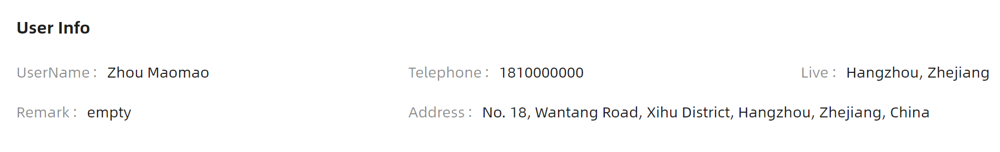

# Descriptions 概述

### 简介

Descriptions 描述列表组件用于以类似表格的形式展示信息或数据。当需要将多组键值对信息进行结构化展示，但又不需要引入完整的表格组件时，描述列表是理想的选择。常见的使用场景包括详情页、配置信息展示、订单信息等。

### 主要功能

* 基础描述列表，支持横向和纵向两种布局方式
* 支持边框模式（IsBordered），提供更清晰的视觉分隔
* 三种尺寸（Small / Middle / Large）适配不同场景
* 响应式列数配置（ColumnInfo），根据屏幕宽度自动调整列数
* 支持自定义标题（Header）和额外操作区域（Extra）
* 支持冒号显示控制（IsShowColon）
* 支持通过 ItemsSource 进行数据绑定
