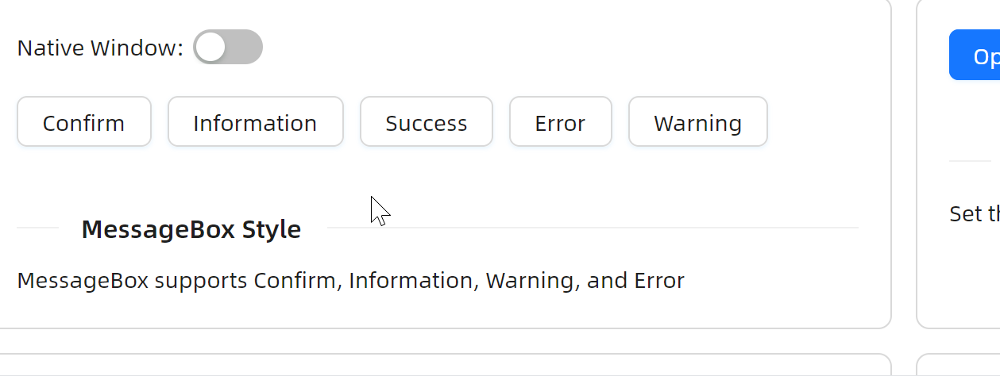
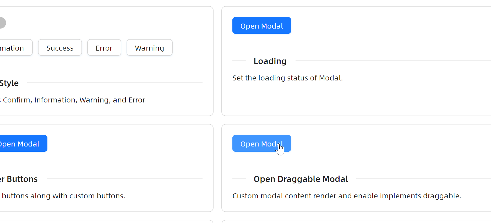

# 快速入门

### 基础配置条件

* Nuget安装Avalonia
* Nuget安装AtomUI

### 基础用法

这个示例中为开发者展示了 `Dialog` 提供的两种不同的模态对话框：
* Overlay Modal
* Window

其中 `Overlay Modal` 属于是模态对话框，它的活动范围仅限于主UI窗口内部，而 `Window` 属于独立窗口，它可以独立于主UI窗口进行显示，是真正意义上的窗口，活动范围是整个桌面。

开发者需要留意如下三个属性：
* `PlacementTarget`：建立按钮与对话框之间的关联关系，对话框会根据目标控件的位置来确定自己的显示位置
* `IsOpen`：这个属性就是控制对话框的显示与隐藏的关键所在
* `DialogHostType`：这个属性用于指定对话框的宿主类型，值为 `Window` 或 `Overlay`


axaml文件：
```axaml
<StackPanel Orientation="Horizontal" Spacing="10">
    <Panel>
        <atom:Button ButtonType="Primary" Name="BasicOpenModalButton">
            Open Modal Overlay
        </atom:Button>
        <atom:Dialog PlacementTarget="BasicOpenModalButton"
                     IsOpen="{Binding IsBasicModalOpened, Mode=TwoWay}"
                     IsLightDismissEnabled="False"
                     Title="Basic Modal"
                     IsModal="True"
                     IsResizable="False"
                     IsDragMovable="True"
                     IsMaximizable="False"
                     StandardButtons="Cancel,Ok"
                     DefaultStandardButton="Ok"
                     HorizontalStartupLocation="Center"
                     VerticalOffset="30%"
                     MinWidth="300">
            <StackPanel Orientation="Vertical">
                <TextBlock>Some contents...</TextBlock>
                <TextBlock>Some contents...</TextBlock>
                <TextBlock>Some contents...</TextBlock>
            </StackPanel>
        </atom:Dialog>
    </Panel>
    <Panel>
        <atom:Button ButtonType="Primary" Name="BasicWindowOpenModalButton">
            Open Modal Window
        </atom:Button>
        <atom:Dialog PlacementTarget="BasicWindowOpenModalButton"
                     IsOpen="{Binding IsBasicWindowModalOpened, Mode=TwoWay}"
                     IsLightDismissEnabled="False"
                     Title="Basic Window Modal"
                     IsModal="True"
                     IsResizable="False"
                     IsClosable="True"
                     IsDragMovable="True"
                     IsMaximizable="False"
                     DialogHostType="Window"
                     HorizontalStartupLocation="Center"
                     VerticalOffset="30%"
                     StandardButtons="Yes"
                     DefaultStandardButton="Yes"
                     MinWidth="300">
            <StackPanel Orientation="Vertical">
                <TextBlock>Some contents...</TextBlock>
                <TextBlock>Some contents...</TextBlock>
                <TextBlock>Some contents...</TextBlock>
            </StackPanel>
        </atom:Dialog>
    </Panel>
</StackPanel>
```

code-behind文件：
```csharp
using System.Reactive.Disposables;
using AtomUI.Controls;
using AtomUIGallery.ShowCases.ViewModels;
using Avalonia.Interactivity;
using Avalonia.ReactiveUI;
using Avalonia.Threading;
using ReactiveUI;

namespace AtomUIGallery.ShowCases.Views;

public partial class ModalShowCase : ReactiveUserControl<ModalViewModel>
{
    public ModalShowCase()
    {
        this.WhenActivated(disposables =>
        {
            BasicOpenModalButton.Click       += HandleBasicModalButtonClick;
            BasicWindowOpenModalButton.Click += HandleBasicWindowModalButtonClick;

            ConfirmMsgBoxBtn.Click                   += HandleConfirmMsgBoxBtnClick;
            InformationMsgBoxBtn.Click               += HandleInformationMsgBoxBtnClick;
            SuccessMsgBoxBtn.Click                   += HandleSuccessMsgBoxBtnClick;
            ErrorMsgBoxBtn.Click                     += HandleErrorMsgBoxBtnClick;
            WarningMsgBoxBtn.Click                   += HandleWarningMsgBoxBtnClick;
            StyleCaseHostTypeSwitch.IsCheckedChanged += HandleStyleCaseHostTypeSwitchChanged;
            LoadingDialogOpenModalButton.Click       += HandleLoadingDialogOpenModalButtonClick;
            AsyncDialogOpenModalButton.Click         += HandleAsyncDialogOpenModalButtonClick;
            CustomFooterDialogOpenButton.Click       += HandleCustomFooterDialogOpenButtonClick;
            CustomFooterMsgBoxOpenButton.Click       += HandleCustomFooterMsgBoxOpenButtonClick;
            DraggableDialogOpenButton.Click          += HandleDraggableMsgBoxOpenButtonClick;
            DelayedCloseMsgBoxOpenButton.Click       += HandleDelayedCloseMsgBoxOpenButtonClick;
            ConfigureButtonsDialogOpenButton.Click   += HandleConfigureButtonsDialogButtonClick;
            
            disposables.Add(Disposable.Create(() => BasicOpenModalButton.Click       -= HandleBasicModalButtonClick));
            disposables.Add(Disposable.Create(() => BasicWindowOpenModalButton.Click -= HandleBasicWindowModalButtonClick));
            disposables.Add(Disposable.Create(() => ConfirmMsgBoxBtn.Click -= HandleConfirmMsgBoxBtnClick));
            disposables.Add(Disposable.Create(() => InformationMsgBoxBtn.Click -= HandleInformationMsgBoxBtnClick));
            disposables.Add(Disposable.Create(() => SuccessMsgBoxBtn.Click -= HandleSuccessMsgBoxBtnClick));
            disposables.Add(Disposable.Create(() => ErrorMsgBoxBtn.Click -= HandleErrorMsgBoxBtnClick));
            disposables.Add(Disposable.Create(() => WarningMsgBoxBtn.Click -= HandleWarningMsgBoxBtnClick));
            disposables.Add(Disposable.Create(() => StyleCaseHostTypeSwitch.IsCheckedChanged -= HandleStyleCaseHostTypeSwitchChanged));
            disposables.Add(Disposable.Create(() => LoadingDialogOpenModalButton.Click -= HandleLoadingDialogOpenModalButtonClick));
            disposables.Add(Disposable.Create(() => CustomFooterDialogOpenButton.Click -= HandleCustomFooterDialogOpenButtonClick));
            disposables.Add(Disposable.Create(() => CustomFooterMsgBoxOpenButton.Click -= HandleCustomFooterMsgBoxOpenButtonClick));
            disposables.Add(Disposable.Create(() => DraggableDialogOpenButton.Click -= HandleDraggableMsgBoxOpenButtonClick));
            disposables.Add(Disposable.Create(() => DelayedCloseMsgBoxOpenButton.Click -= HandleDelayedCloseMsgBoxOpenButtonClick));
            disposables.Add(Disposable.Create(() => ConfigureButtonsDialogOpenButton.Click -= HandleConfigureButtonsDialogButtonClick));

            ConfigureButtonPropertiesDialog.ButtonsConfigure = ConfigureButtonProperties;
            
            if (DataContext is ModalViewModel viewModel)
            {
                viewModel.MessageBoxStyleCaseHostType = DialogHostType.Overlay;
                viewModel.CountdownSeconds            = 5;
            }
        });
        InitializeComponent();
    }

    private void HandleBasicModalButtonClick(object? sender, RoutedEventArgs e)
    {
        if (DataContext is ModalViewModel viewModel)
        {
            viewModel.IsBasicModalOpened = true;
        }
    }
    
    private void HandleBasicWindowModalButtonClick(object? sender, RoutedEventArgs e)
    {
        if (DataContext is ModalViewModel viewModel)
        {
            viewModel.IsBasicWindowModalOpened = true;
        }
    }
    
    private void HandleConfirmMsgBoxBtnClick(object? sender, RoutedEventArgs e)
    {
        if (DataContext is ModalViewModel viewModel)
        {
            viewModel.IsConfirmMsgBoxOpened = true;
        }
    }
    
    private void HandleInformationMsgBoxBtnClick(object? sender, RoutedEventArgs e)
    {
        if (DataContext is ModalViewModel viewModel)
        {
            viewModel.IsInformationMsgBoxOpened = true;
        }
    }
    
    private void HandleSuccessMsgBoxBtnClick(object? sender, RoutedEventArgs e)
    {
        if (DataContext is ModalViewModel viewModel)
        {
            viewModel.IsSuccessMsgBoxOpened = true;
        }
    }
    
    private void HandleErrorMsgBoxBtnClick(object? sender, RoutedEventArgs e)
    {
        if (DataContext is ModalViewModel viewModel)
        {
            viewModel.IsErrorMsgBoxOpened = true;
        }
    }
    
    private void HandleWarningMsgBoxBtnClick(object? sender, RoutedEventArgs e)
    {
        if (DataContext is ModalViewModel viewModel)
        {
            viewModel.IsWarningMsgBoxOpened = true;
        }
    }

    private void HandleStyleCaseHostTypeSwitchChanged(object? sender, RoutedEventArgs e)
    {
        if (sender is ToggleSwitch toggleSwitch)
        {
            if (DataContext is ModalViewModel viewModel)
            {
                viewModel.MessageBoxStyleCaseHostType = toggleSwitch.IsChecked == true ? DialogHostType.Window : DialogHostType.Overlay;
            }
        }
    }
    
    private void HandleLoadingDialogOpenModalButtonClick(object? sender, RoutedEventArgs e)
    {
        if (DataContext is ModalViewModel viewModel)
        {
            viewModel.IsLoadingMsgBoxOpened = true;
        }
    }

    private void HandleLoadingDialogOpened(object? sender, EventArgs e)
    {
        if (sender is Dialog dialog)
        {
            DispatcherTimer.RunOnce(() =>
            {
                dialog.IsLoading = false;
            }, TimeSpan.FromMilliseconds(3000));
        }
    }

    private void HandleLoadingDialogButtonClicked(object? sender, DialogButtonClickedEventArgs e)
    {
        if (sender is Dialog dialog)
        {
            dialog.IsLoading = true;
            DispatcherTimer.RunOnce(() =>
            {
                dialog.IsLoading = false;
            }, TimeSpan.FromMilliseconds(3000));
        }
    }
    
    private void HandleAsyncDialogOpenModalButtonClick(object? sender, RoutedEventArgs e)
    {
        if (DataContext is ModalViewModel viewModel)
        {
            viewModel.IsAsyncDialogOpened = true;
        }
    }
    
    private void HandleAsyncDialogButtonClicked(object? sender, DialogButtonClickedEventArgs e)
    {
        if (sender is Dialog dialog && e.SourceButton.Role == DialogButtonRole.AcceptRole)
        {
            dialog.IsConfirmLoading = true;
            e.Handled               = true;
            DispatcherTimer.RunOnce(() =>
            {
                dialog.IsConfirmLoading = false;
                dialog.Done();
            }, TimeSpan.FromMilliseconds(3000));
        }
    }

    private void HandleCustomFooterDialogOpenButtonClick(object? sender, EventArgs e)
    {
        if (DataContext is ModalViewModel viewModel)
        {
            viewModel.IsCustomFooterDialogOpened = true;
        }
    }

    private void HandleCustomFooterMsgBoxOpenButtonClick(object? sender, EventArgs e)
    {
        if (DataContext is ModalViewModel viewModel)
        {
            viewModel.IsCustomFooterMsgBoxOpened = true;
        }
    }
    
    private void HandleDraggableMsgBoxOpenButtonClick(object? sender, EventArgs e)
    {
        if (DataContext is ModalViewModel viewModel)
        {
            viewModel.IsDraggableMsgBoxOpened = true;
        }
    }
    
    private void HandleDelayedCloseMsgBoxOpenButtonClick(object? sender, EventArgs e)
    {
        if (DataContext is ModalViewModel viewModel)
        {
            viewModel.IsDelayedCloseMsgBoxOpened = true;
        }
    }

    private IDisposable? _delayedCloseDialogDisposal;
    
    private void HandleDelayedCloseMsgBoxOpened(object? sender, EventArgs e)
    {
        if (sender is MessageBox messageBox)
        {
            if (DataContext is ModalViewModel viewModel)
            {
                viewModel.CountdownSeconds = 5;
                _delayedCloseDialogDisposal?.Dispose();
                _delayedCloseDialogDisposal = DispatcherTimer.Run(() =>
                {
                    if (viewModel.CountdownSeconds == 0)
                    {
                        messageBox.Confirm();
                        return false;
                    }
                    viewModel.CountdownSeconds--;
                    return true;
                }, TimeSpan.FromMilliseconds(1000));
            }
        }
    }
    
    private void HandleConfigureButtonsDialogButtonClick(object? sender, EventArgs e)
    {
        if (DataContext is ModalViewModel viewModel)
        {
            viewModel.IsConfigureButtonsDialogOpened = true;
        }
    }

    private void ConfigureButtonProperties(IReadOnlyList<DialogButton> buttons)
    {
        foreach (var button in buttons)
        {
            button.IsEnabled = false;
        }
    }
}
```

view-model文件：
```csharp
using AtomUI.Controls;
using ReactiveUI;

namespace AtomUIGallery.ShowCases.ViewModels;

public class ModalViewModel : ReactiveObject, IRoutableViewModel
{
    public const string ID = "Modal";
    
    public IScreen HostScreen { get; }
    
    public string UrlPathSegment { get; } = ID;
    
    private bool _isBasicModalOpened;

    public bool IsBasicModalOpened
    {
        get => _isBasicModalOpened;
        set => this.RaiseAndSetIfChanged(ref _isBasicModalOpened, value);
    }

    private bool _isBasicWindowModalOpened;

    public bool IsBasicWindowModalOpened
    {
        get => _isBasicWindowModalOpened;
        set => this.RaiseAndSetIfChanged(ref _isBasicWindowModalOpened, value);
    }
    
    private DialogHostType _messageBoxStyleCaseHostType;

    public DialogHostType MessageBoxStyleCaseHostType
    {
        get => _messageBoxStyleCaseHostType;
        set => this.RaiseAndSetIfChanged(ref _messageBoxStyleCaseHostType, value);
    }
   
    private bool _isConfirmMsgBoxOpened;

    public bool IsConfirmMsgBoxOpened
    {
        get => _isConfirmMsgBoxOpened;
        set => this.RaiseAndSetIfChanged(ref _isConfirmMsgBoxOpened, value);
    }
    
    private bool _isInformationMsgBoxOpened;

    public bool IsInformationMsgBoxOpened
    {
        get => _isInformationMsgBoxOpened;
        set => this.RaiseAndSetIfChanged(ref _isInformationMsgBoxOpened, value);
    }
    
    private bool _isSuccessMsgBoxOpened;

    public bool IsSuccessMsgBoxOpened
    {
        get => _isSuccessMsgBoxOpened;
        set => this.RaiseAndSetIfChanged(ref _isSuccessMsgBoxOpened, value);
    }
        
    private bool _isErrorMsgBoxOpened;

    public bool IsErrorMsgBoxOpened
    {
        get => _isErrorMsgBoxOpened;
        set => this.RaiseAndSetIfChanged(ref _isErrorMsgBoxOpened, value);
    }
    
    private bool _isWarningMsgBoxOpened;

    public bool IsWarningMsgBoxOpened
    {
        get => _isWarningMsgBoxOpened;
        set => this.RaiseAndSetIfChanged(ref _isWarningMsgBoxOpened, value);
    }
    
    private bool _isLoadingMsgBoxOpened;

    public bool IsLoadingMsgBoxOpened
    {
        get => _isLoadingMsgBoxOpened;
        set => this.RaiseAndSetIfChanged(ref _isLoadingMsgBoxOpened, value);
    }
    
    private bool _isAsyncDialogOpened;

    public bool IsAsyncDialogOpened
    {
        get => _isAsyncDialogOpened;
        set => this.RaiseAndSetIfChanged(ref _isAsyncDialogOpened, value);
    }
    
    private bool _isCustomFooterDialogOpened;

    public bool IsCustomFooterDialogOpened
    {
        get => _isCustomFooterDialogOpened;
        set => this.RaiseAndSetIfChanged(ref _isCustomFooterDialogOpened, value);
    }
    
    private bool _isCustomFooterMsgBoxOpened;

    public bool IsCustomFooterMsgBoxOpened
    {
        get => _isCustomFooterMsgBoxOpened;
        set => this.RaiseAndSetIfChanged(ref _isCustomFooterMsgBoxOpened, value);
    }
    
    private bool _isDraggableMsgBoxOpened;

    public bool IsDraggableMsgBoxOpened
    {
        get => _isDraggableMsgBoxOpened;
        set => this.RaiseAndSetIfChanged(ref _isDraggableMsgBoxOpened, value);
    }
    
    private bool _isDelayedCloseMsgBoxOpened;

    public bool IsDelayedCloseMsgBoxOpened
    {
        get => _isDelayedCloseMsgBoxOpened;
        set => this.RaiseAndSetIfChanged(ref _isDelayedCloseMsgBoxOpened, value);
    }
    
    private int _countdownSeconds;

    public int CountdownSeconds
    {
        get => _countdownSeconds;
        set => this.RaiseAndSetIfChanged(ref _countdownSeconds, value);
    }
    
    private bool _isConfigureButtonsDialogOpened;

    public bool IsConfigureButtonsDialogOpened
    {
        get => _isConfigureButtonsDialogOpened;
        set => this.RaiseAndSetIfChanged(ref _isConfigureButtonsDialogOpened, value);
    }
    
    public ModalViewModel(IScreen screen)
    {
        HostScreen = screen;
    }
}
```

### 多种样式

下面这个示例，`AtomUI` 引入了一个新的组件叫做 `MessageBox`，为什么把 `MessageBox` 放在 `Dialog` 组件文档中呢？

因为 `MessageBox` 组件组合使用了 `Dialog` 组件，简单说就是 `MessageBox` 将属性绑定到了一个叫做 `MessageBoxDialog` 的内部类上，而 `MessageBoxDialog` 继承了 `Dialog`。所以 `MessageBox` 是组合使用了 `Dialog` 组件的很多特性，它是一个特殊定制版本的 `Dialog`。

那么 `MessageBox` 与 `Dialog` 主要应用场景分别是什么呢？
* `Dialog` 组件适合业务复杂、需要高度定制的场景，业务流程较为复杂，它给予了开发者最大范围的开发自由度
* `MessageBox`组件：用于较为简单的通知提示等场景

设定 `MessageBox` 的样式则直接使用 `Style` 属性即可，可选值有Normal、Confirm、Information、Success、Warning、Error。



```axaml
<StackPanel Orientation="Vertical" Spacing="20">
    <StackPanel Orientation="Horizontal" Spacing="5">
        <TextBlock VerticalAlignment="Center">Native Window:</TextBlock>
        <atom:ToggleSwitch Name="StyleCaseHostTypeSwitch" />
    </StackPanel>
    <StackPanel Orientation="Horizontal" Spacing="10">
        <Panel>
            <atom:MessageBox PlacementTarget="ConfirmMsgBoxBtn"
                             Title="Do you want to delete these items?"
                             IsOpen="{Binding IsConfirmMsgBoxOpened, Mode=TwoWay}"
                             Style="Confirm"
                             HostType="{Binding MessageBoxStyleCaseHostType}">
                <StackPanel Orientation="Vertical" Spacing="10">
                    <TextBlock>Some descriptions</TextBlock>
                </StackPanel>
            </atom:MessageBox>
            <atom:Button Name="ConfirmMsgBoxBtn">Confirm</atom:Button>
        </Panel>
        <Panel>
            <atom:MessageBox PlacementTarget="InformationMsgBoxBtn"
                             Title="This is a notification message"
                             IsOpen="{Binding IsInformationMsgBoxOpened, Mode=TwoWay}"
                             Style="Information"
                             HostType="{Binding MessageBoxStyleCaseHostType}">
                <StackPanel Orientation="Vertical" Spacing="10">
                    <TextBlock>some messages...some messages...</TextBlock>
                    <TextBlock>some messages...some messages...</TextBlock>
                </StackPanel>
            </atom:MessageBox>
            <atom:Button Name="InformationMsgBoxBtn">Information</atom:Button>
        </Panel>
        <Panel>
            <atom:MessageBox PlacementTarget="SuccessMsgBoxBtn"
                             Title="Operation successful"
                             Style="Success"
                             HostType="{Binding MessageBoxStyleCaseHostType}"
                             IsOpen="{Binding IsSuccessMsgBoxOpened, Mode=TwoWay}">
                <StackPanel Orientation="Vertical" Spacing="10">
                    <TextBlock>some messages...some messages...</TextBlock>
                    <TextBlock>some messages...some messages...</TextBlock>
                </StackPanel>
            </atom:MessageBox>
            <atom:Button Name="SuccessMsgBoxBtn">Success</atom:Button>
        </Panel>
        <Panel>
            <atom:MessageBox PlacementTarget="ErrorMsgBoxBtn"
                             Title="This is an error message"
                             Style="Error"
                             HostType="{Binding MessageBoxStyleCaseHostType}"
                             IsOpen="{Binding IsErrorMsgBoxOpened, Mode=TwoWay}">
                <StackPanel Orientation="Vertical" Spacing="10">
                    <TextBlock>some messages...some messages...</TextBlock>
                    <TextBlock>some messages...some messages...</TextBlock>
                </StackPanel>
            </atom:MessageBox>
            <atom:Button Name="ErrorMsgBoxBtn">Error</atom:Button>
        </Panel>
        <Panel>
            <atom:MessageBox PlacementTarget="WarningMsgBoxBtn"
                             Title="This is a warning message"
                             Style="Warning"
                             HostType="{Binding MessageBoxStyleCaseHostType}"
                             IsOpen="{Binding IsWarningMsgBoxOpened, Mode=TwoWay}">
                <StackPanel Orientation="Vertical" Spacing="10">
                    <TextBlock>some messages...some messages...</TextBlock>
                    <TextBlock>some messages...some messages...</TextBlock>
                </StackPanel>
            </atom:MessageBox>
            <atom:Button Name="WarningMsgBoxBtn">Warning</atom:Button>
        </Panel>
    </StackPanel>
</StackPanel>
```

# 拖拽特性

本示例较为简单，主要是为了给开发者演示拖拽特性，同时在简单说明下 `IsModal` 属性。

`IsDragMovable` 属性为True即表示可以拖动；`IsModal` 属性为True表示会形成一个遮罩，这个遮罩会阻止鼠标点击遮罩下的区域。



axaml文件：
```axaml
<StackPanel Orientation="Horizontal" Spacing="10">
    <Panel>
        <atom:Button ButtonType="Primary" Name="DraggableDialogOpenButton">
            Open Modal
        </atom:Button>
        <atom:Dialog PlacementTarget="DraggableDialogOpenButton"
                     IsOpen="{Binding IsDraggableMsgBoxOpened, Mode=TwoWay}"
                     Title="Draggable Modal"
                     IsModal="True"
                     IsDragMovable="True"
                     IsLightDismissEnabled="True"
                     StandardButtons="Ok, Cancel"
                     HorizontalStartupLocation="Center"
                     VerticalStartupLocation="Center"
                     DefaultStandardButton="Ok"
                     Width="400">
            <StackPanel Spacing="10">
                <TextBlock TextWrapping="Wrap">Just don't learn physics at school and your life will be full of magic and miracles.</TextBlock>
                <TextBlock TextWrapping="Wrap">Day before yesterday I saw a rabbit, and yesterday a deer, and today, you.</TextBlock>
            </StackPanel>
        </atom:Dialog>
    </Panel>
</StackPanel>
```