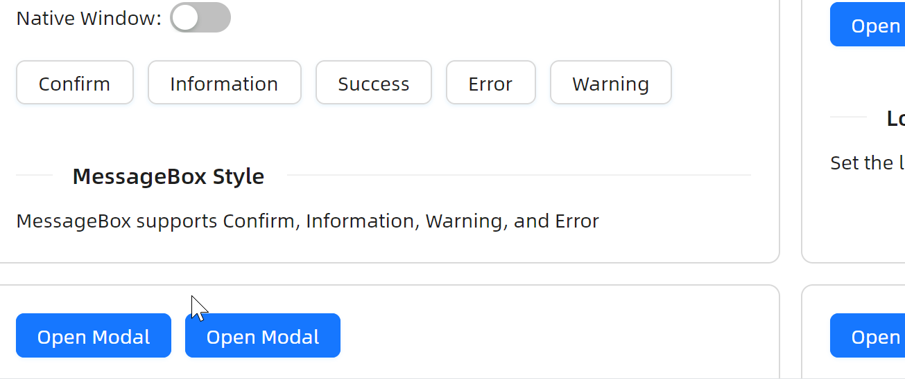
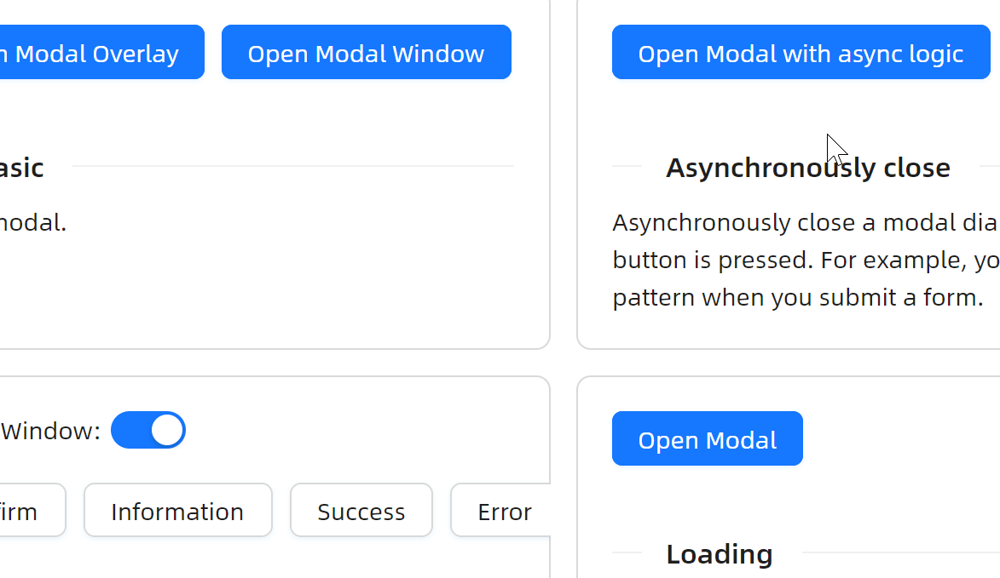
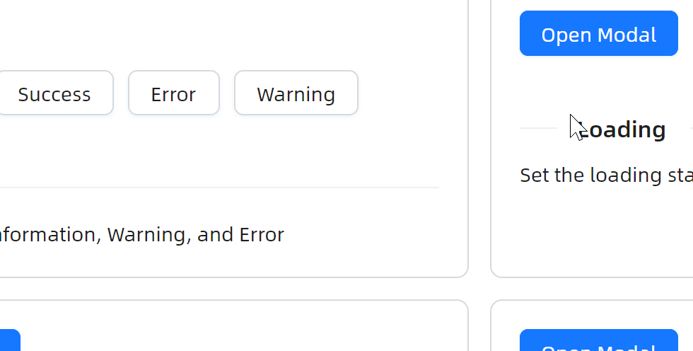
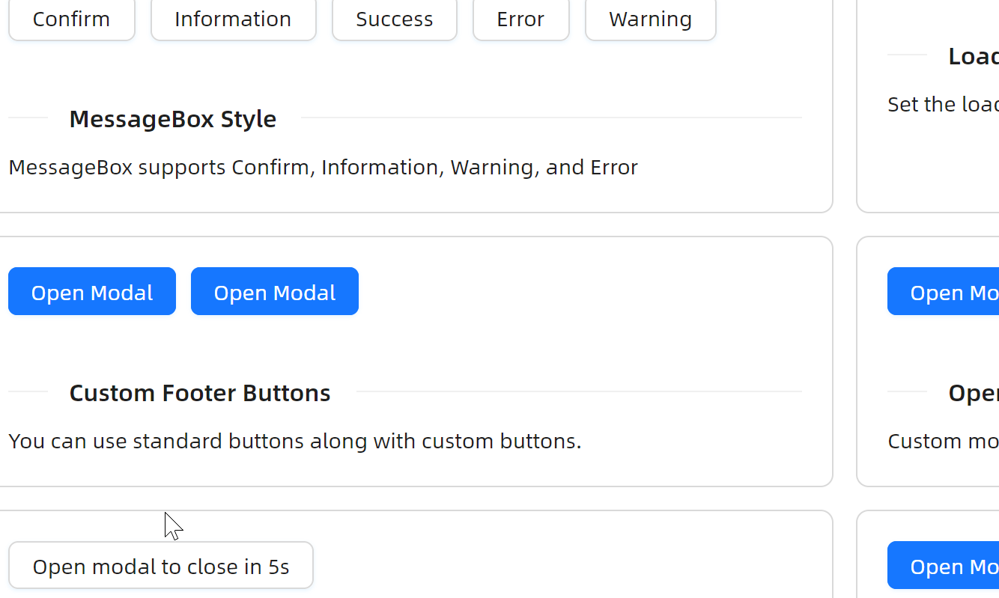
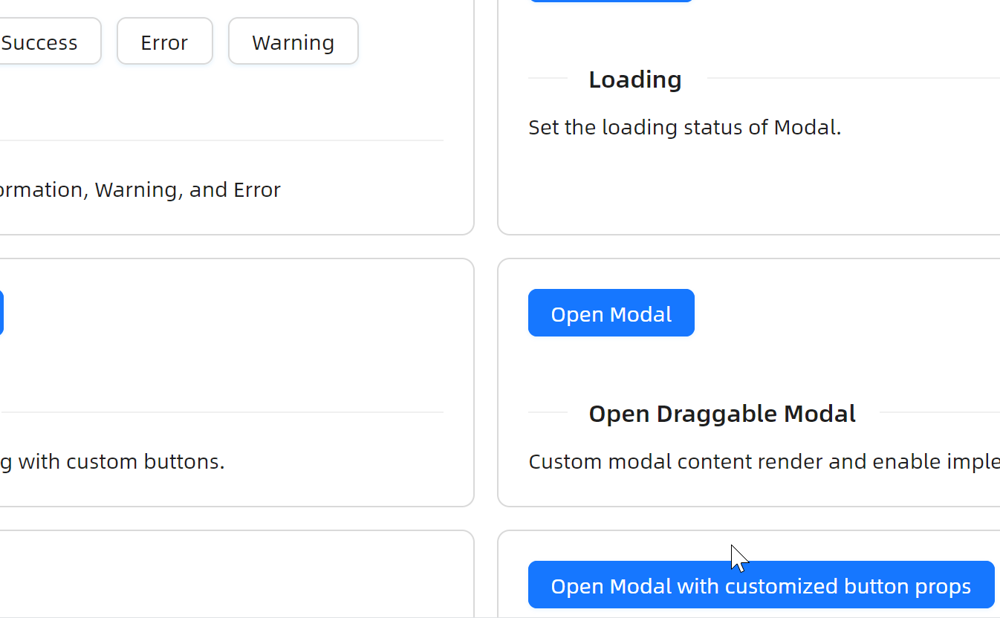

# 快速入门

### 基础配置条件

* Nuget 安装 Avalonia
* Nuget 安装 AtomUI

### 基础用法

以下示例展示了 `Dialog` 的两种宿主模式：Overlay 模态和 Window 模态。

* **Overlay Modal**：模态对话框，活动范围限于主 UI 窗口内部
* **Window Modal**：独立原生窗口，可以在整个桌面范围内自由移动

开发者需要关注以下关键属性：

| 属性 | 说明 |
|------|------|
| `PlacementTarget` | 建立按钮与对话框之间的关联关系，对话框根据目标控件的位置来确定显示位置 |
| `IsOpen` | 控制对话框的显示与隐藏 |
| `DialogHostType` | 指定对话框的宿主类型，可选值为 `Window` 或 `Overlay` |
| `StandardButtons` | 设定对话框底部的标准按钮，如 `Ok`、`Cancel`、`Yes`、`No` 等 |
| `IsModal` | 是否为模态对话框，为 `True` 时会产生遮罩阻止点击下方区域 |


axaml 文件：
```xaml
<StackPanel Orientation="Horizontal" Spacing="10">
    <Panel>
        <atom:Button ButtonType="Primary" Name="BasicOpenModalButton">
            Open Modal Overlay
        </atom:Button>
        <atom:Dialog PlacementTarget="BasicOpenModalButton"
                     IsOpen="{Binding IsBasicModalOpened, Mode=TwoWay}"
                     IsLightDismissEnabled="False"
                     Title="Basic Modal"
                     IsModal="True"
                     IsResizable="False"
                     IsDragMovable="True"
                     IsMaximizable="False"
                     StandardButtons="Cancel,Ok"
                     DefaultStandardButton="Ok"
                     HorizontalStartupLocation="Center"
                     VerticalOffset="30%"
                     MinWidth="300">
            <StackPanel Orientation="Vertical">
                <TextBlock>Some contents...</TextBlock>
                <TextBlock>Some contents...</TextBlock>
                <TextBlock>Some contents...</TextBlock>
            </StackPanel>
        </atom:Dialog>
    </Panel>
    <Panel>
        <atom:Button ButtonType="Primary" Name="BasicWindowOpenModalButton">
            Open Modal Window
        </atom:Button>
        <atom:Dialog PlacementTarget="BasicWindowOpenModalButton"
                     IsOpen="{Binding IsBasicWindowModalOpened, Mode=TwoWay}"
                     IsLightDismissEnabled="False"
                     Title="Basic Window Modal"
                     IsModal="True"
                     IsResizable="False"
                     IsClosable="True"
                     IsDragMovable="True"
                     IsMaximizable="False"
                     DialogHostType="Window"
                     HorizontalStartupLocation="Center"
                     VerticalOffset="30%"
                     StandardButtons="Yes"
                     DefaultStandardButton="Yes"
                     MinWidth="300">
            <StackPanel Orientation="Vertical">
                <TextBlock>Some contents...</TextBlock>
                <TextBlock>Some contents...</TextBlock>
                <TextBlock>Some contents...</TextBlock>
            </StackPanel>
        </atom:Dialog>
    </Panel>
</StackPanel>
```

### 多种样式

`MessageBox` 组件支持通过 `Style` 属性设定不同的样式，可选值有 Normal、Confirm、Information、Success、Warning、Error。


```xaml
<StackPanel Orientation="Vertical" Spacing="20">
    <StackPanel Orientation="Horizontal" Spacing="5">
        <TextBlock VerticalAlignment="Center">Native Window:</TextBlock>
        <atom:ToggleSwitch Name="StyleCaseHostTypeSwitch" />
    </StackPanel>
    <StackPanel Orientation="Horizontal" Spacing="10">
        <Panel>
            <atom:MessageBox PlacementTarget="ConfirmMsgBoxBtn"
                             Title="Do you want to delete these items?"
                             IsOpen="{Binding IsConfirmMsgBoxOpened, Mode=TwoWay}"
                             Style="Confirm"
                             HostType="{Binding MessageBoxStyleCaseHostType}">
                <TextBlock>Some descriptions</TextBlock>
            </atom:MessageBox>
            <atom:Button Name="ConfirmMsgBoxBtn">Confirm</atom:Button>
        </Panel>
        <Panel>
            <atom:MessageBox PlacementTarget="SuccessMsgBoxBtn"
                             Title="Operation successful"
                             Style="Success"
                             HostType="{Binding MessageBoxStyleCaseHostType}"
                             IsOpen="{Binding IsSuccessMsgBoxOpened, Mode=TwoWay}">
                <TextBlock>some messages...</TextBlock>
            </atom:MessageBox>
            <atom:Button Name="SuccessMsgBoxBtn">Success</atom:Button>
        </Panel>
        <Panel>
            <atom:MessageBox PlacementTarget="ErrorMsgBoxBtn"
                             Title="This is an error message"
                             Style="Error"
                             HostType="{Binding MessageBoxStyleCaseHostType}"
                             IsOpen="{Binding IsErrorMsgBoxOpened, Mode=TwoWay}">
                <TextBlock>some messages...</TextBlock>
            </atom:MessageBox>
            <atom:Button Name="ErrorMsgBoxBtn">Error</atom:Button>
        </Panel>
    </StackPanel>
</StackPanel>
```

### 拖拽移动

通过设置 `IsDragMovable="True"` 可以使对话框支持鼠标拖拽移动。配合 `IsModal="True"` 会产生遮罩层，阻止用户与遮罩下方的区域进行交互。


```xaml
<Panel>
    <atom:Button ButtonType="Primary" Name="DraggableDialogOpenButton">
        Open Modal
    </atom:Button>
    <atom:Dialog PlacementTarget="DraggableDialogOpenButton"
                 IsOpen="{Binding IsDraggableMsgBoxOpened, Mode=TwoWay}"
                 Title="Draggable Modal"
                 IsModal="True"
                 IsDragMovable="True"
                 IsLightDismissEnabled="True"
                 StandardButtons="Ok, Cancel"
                 HorizontalStartupLocation="Center"
                 VerticalStartupLocation="Center"
                 DefaultStandardButton="Ok"
                 Width="400">
        <StackPanel Spacing="10">
            <TextBlock TextWrapping="Wrap">Just don't learn physics at school and your life will be full of magic and miracles.</TextBlock>
            <TextBlock TextWrapping="Wrap">Day before yesterday I saw a rabbit, and yesterday a deer, and today, you.</TextBlock>
        </StackPanel>
    </atom:Dialog>
</Panel>
```

### 自定义页脚按钮

除了内置的标准按钮外，还可以通过 `CustomButtons` 添加自定义按钮。每个按钮都有一个 `Role` 属性，可选值包括 AcceptRole、RejectRole、DestructiveRole、ActionRole、HelpRole、YesRole、NoRole、ApplyRole、ResetRole、CustomRole。



```xaml
<Panel>
    <atom:Button ButtonType="Primary" Name="CustomFooterDialogOpenButton">
        Open Modal
    </atom:Button>
    <atom:Dialog PlacementTarget="CustomFooterDialogOpenButton"
                 IsOpen="{Binding IsCustomFooterDialogOpened, Mode=TwoWay}"
                 Title="Title"
                 IsModal="True"
                 IsLightDismissEnabled="True"
                 StandardButtons="Ok, Cancel"
                 HorizontalStartupLocation="Center"
                 VerticalStartupLocation="Center"
                 DefaultStandardButton="Ok"
                 MinWidth="400">
        <atom:Dialog.CustomButtons>
            <atom:DialogButton Role="ActionRole">Custom Button</atom:DialogButton>
        </atom:Dialog.CustomButtons>
        <StackPanel Spacing="5">
            <TextBlock>Some contents...</TextBlock>
            <TextBlock>Some contents...</TextBlock>
            <TextBlock>Some contents...</TextBlock>
        </StackPanel>
    </atom:Dialog>
</Panel>
```

### 异步业务逻辑

通过 `ButtonClicked` 事件可以在按钮点击后执行异步业务逻辑。设置 `e.Handled = true` 阻止对话框自动关闭，待异步操作完成后手动调用 `dialog.Done()` 关闭。`IsConfirmLoading` 属性可以在确认按钮上显示加载状态。



```xaml
<Panel>
    <atom:Button ButtonType="Primary" Name="AsyncDialogOpenModalButton">
        Open Modal with async logic
    </atom:Button>
    <atom:Dialog PlacementTarget="AsyncDialogOpenModalButton"
                 IsOpen="{Binding IsAsyncDialogOpened, Mode=TwoWay}"
                 Title="Asynchronously close Modal"
                 IsModal="True"
                 IsDragMovable="True"
                 IsLightDismissEnabled="True"
                 StandardButtons="Ok, Cancel"
                 HorizontalStartupLocation="Center"
                 VerticalStartupLocation="Center"
                 DefaultStandardButton="Ok"
                 ButtonClicked="HandleAsyncDialogButtonClicked"
                 MinWidth="400">
        <TextBlock>Content of the modal</TextBlock>
    </atom:Dialog>
</Panel>
```

code-behind 关键代码：
```csharp
private void HandleAsyncDialogButtonClicked(object? sender, DialogButtonClickedEventArgs e)
{
    if (sender is Dialog dialog && e.SourceButton.Role == DialogButtonRole.AcceptRole)
    {
        dialog.IsConfirmLoading = true;
        e.Handled               = true;
        DispatcherTimer.RunOnce(() =>
        {
            dialog.IsConfirmLoading = false;
            dialog.Done();
        }, TimeSpan.FromMilliseconds(3000));
    }
}
```

### 加载状态

通过 `IsLoading` 属性可以使对话框在打开时或按钮点击后显示整体加载状态。配合 `Opened` 事件和 `ButtonClicked` 事件，可以实现打开时自动加载、按钮触发重新加载等效果。



```xaml
<Panel>
    <atom:Button ButtonType="Primary" Name="LoadingDialogOpenModalButton">
        Open Modal
    </atom:Button>
    <atom:Dialog PlacementTarget="LoadingDialogOpenModalButton"
                 IsOpen="{Binding IsLoadingMsgBoxOpened, Mode=TwoWay}"
                 Title="Loading Modal"
                 IsModal="True"
                 IsLoading="True"
                 IsDragMovable="True"
                 IsLightDismissEnabled="True"
                 StandardButtons="Reload"
                 HorizontalStartupLocation="Center"
                 VerticalStartupLocation="Center"
                 DefaultStandardButton="Reload"
                 Opened="HandleLoadingDialogOpened"
                 ButtonClicked="HandleLoadingDialogButtonClicked"
                 MinWidth="400">
        <StackPanel>
            <TextBlock>Some contents...</TextBlock>
            <TextBlock>Some contents...</TextBlock>
            <TextBlock>Some contents...</TextBlock>
        </StackPanel>
    </atom:Dialog>
</Panel>
```

### 倒计时自动关闭

通过 `Opened` 事件配合定时器，可以实现倒计时自动关闭的效果。



```xaml
<Panel>
    <atom:Button Name="DelayedCloseMsgBoxOpenButton">
        Open modal to close in 5s
    </atom:Button>
    <atom:MessageBox PlacementTarget="DelayedCloseMsgBoxOpenButton"
                 IsOpen="{Binding IsDelayedCloseMsgBoxOpened, Mode=TwoWay}"
                 Title="This is a notification message"
                 IsModal="True"
                 Style="Success"
                 Opened="HandleDelayedCloseMsgBoxOpened"
                 Width="400">
        <TextBlock TextWrapping="Wrap">
            This modal will be destroyed after <Run Text="{Binding CountdownSeconds}"/> second.
        </TextBlock>
    </atom:MessageBox>
</Panel>
```

### 按钮属性配置

通过 `ButtonsConfigure` 回调可以在对话框打开前对按钮进行批量属性配置，例如禁用按钮等。



```xaml
<Panel>
    <atom:Button ButtonType="Primary" Name="ConfigureButtonsDialogOpenButton">
        Open Modal with customized button props
    </atom:Button>
    <atom:Dialog Name="ConfigureButtonPropertiesDialog"
                 PlacementTarget="ConfigureButtonsDialogOpenButton"
                 IsOpen="{Binding IsConfigureButtonsDialogOpened, Mode=TwoWay}"
                 Title="Basic Modal"
                 IsModal="True"
                 IsDragMovable="True"
                 StandardButtons="Ok, Cancel"
                 HorizontalStartupLocation="Center"
                 VerticalStartupLocation="Center"
                 DefaultStandardButton="Ok"
                 Width="400">
        <StackPanel Orientation="Vertical">
            <TextBlock>Some contents...</TextBlock>
            <TextBlock>Some contents...</TextBlock>
            <TextBlock>Some contents...</TextBlock>
        </StackPanel>
    </atom:Dialog>
</Panel>
```

code-behind 关键代码：
```csharp
ConfigureButtonPropertiesDialog.ButtonsConfigure = ConfigureButtonProperties;

private void ConfigureButtonProperties(IReadOnlyList<DialogButton> buttons)
{
    foreach (var button in buttons)
    {
        button.IsEnabled = false;
    }
}
```
