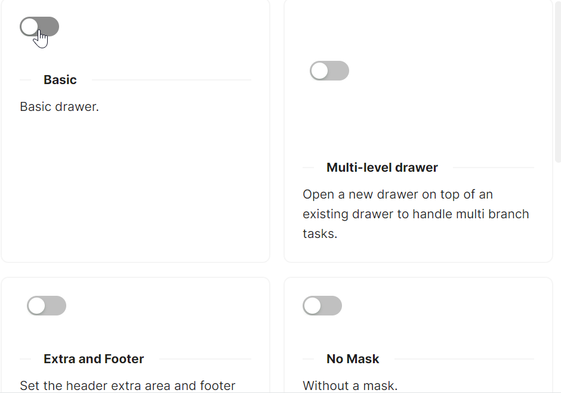
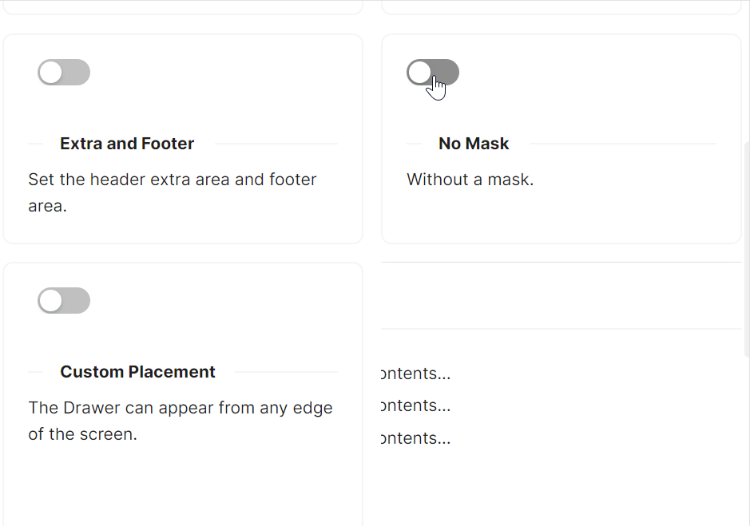

# AtomUI Drawer快速入门

### 基础配置条件

* Nuget安装Avalonia
* Nuget安装AtomUI

### 基础用法

`atom:ToggleSwitch` 组件可以控制 `IsOpen` 属性所绑定的值，具体参考code-behind文件中的代码。



axaml文件：
```axaml
<Panel>
    <atom:ToggleSwitch />
    <atom:Drawer IsOpen="{Binding $parent[Panel].((atom:ToggleSwitch)Children[0]).IsChecked}"
                  Title="Basic Drawer">
        <StackPanel Orientation="Vertical" Spacing="5">
            <atom:TextBlock Text="Some contents..." />
            <atom:TextBlock Text="Some contents..." />
            <atom:TextBlock Text="Some contents..." />
        </StackPanel>
    </atom:Drawer>
</Panel>
```

code-behind文件：
```csharp
using AtomUI;
using AtomUI.Controls;
using AtomUIGallery.ShowCases.ViewModels;
using Avalonia.Data.Converters;
using Avalonia.Interactivity;
using Avalonia.ReactiveUI;
using ReactiveUI;

public partial class DrawerShowCase : ReactiveUserControl<DrawerViewModel>
{
    public static readonly IValueConverter PlacementTextConverter =
        new FuncValueConverter<object?, object?>(x =>
        {
            if (x is int intValue)
            {
                var placement = (DrawerPlacement)intValue;
                return placement.ToString();
            }

            return x;
        });

    public DrawerShowCase()
    {
        this.WhenActivated(disposables =>
        {
            if (DataContext is DrawerViewModel viewModel)
            {
            }
        });
        InitializeComponent();
    }

    private void HandleOpenLargeSizeDrawer(object sender, RoutedEventArgs e)
    {
        PresetSizeDrawer.SizeType = SizeType.Large;
        PresetSizeDrawer.IsOpen   = true;
    }

    private void HandleOpenDefaultSizeDrawer(object sender, RoutedEventArgs e)
    {
        PresetSizeDrawer.SizeType = SizeType.Small;
        PresetSizeDrawer.IsOpen   = true;
    }

    private void HandleOpenMultilevelLevelTwoDrawer(object sender, RoutedEventArgs e)
    {
        MultiLevelDrawerLevelTwo.IsOpen = true;
    }
}
```

### 无遮罩

`IsShowMask` 属性可以控制遮罩显示。



```axaml
<Panel>
    <atom:ToggleSwitch Content="Open" />
    <atom:Drawer IsOpen="{Binding $parent[Panel].((atom:ToggleSwitch)Children[0]).IsChecked}"
                  Title="Basic Drawer"
                  IsShowMask="False">
        <StackPanel Orientation="Vertical" Spacing="5">
            <atom:TextBlock Text="Some contents..." />
            <atom:TextBlock Text="Some contents..." />
            <atom:TextBlock Text="Some contents..." />
        </StackPanel>
    </atom:Drawer>
</Panel>
```