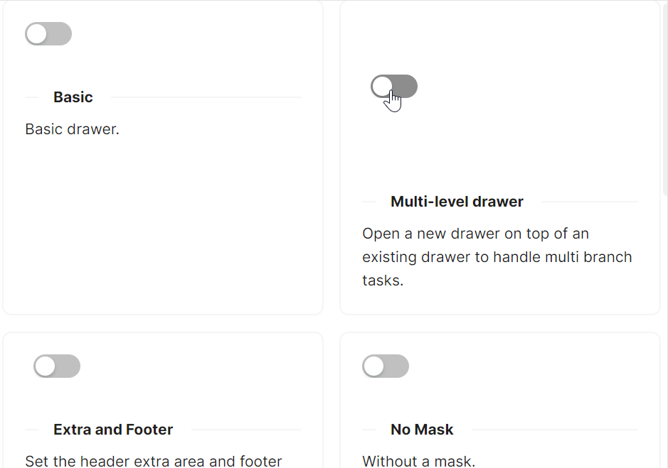

# Drawer 快速入门

### 基础配置条件

* Nuget安装Avalonia
* Nuget安装AtomUI

### 基础用法

通过 `IsOpen` 属性控制抽屉的开关状态，可使用 `ToggleSwitch` 等控件进行双向绑定。抽屉内容直接作为 `Drawer` 的子元素传入。


axaml文件：
```xaml
<Panel>
    <atom:ToggleSwitch />
    <atom:Drawer IsOpen="{Binding $parent[Panel].((atom:ToggleSwitch)Children[0]).IsChecked}"
                  Title="Basic Drawer">
        <StackPanel Orientation="Vertical" Spacing="5">
            <atom:TextBlock Text="Some contents..." />
            <atom:TextBlock Text="Some contents..." />
            <atom:TextBlock Text="Some contents..." />
        </StackPanel>
    </atom:Drawer>
</Panel>
```

code-behind文件：
```csharp
using AtomUI;
using AtomUI.Controls;
using AtomUIGallery.ShowCases.ViewModels;
using Avalonia.Data.Converters;
using Avalonia.Interactivity;
using Avalonia.ReactiveUI;
using ReactiveUI;

public partial class DrawerShowCase : ReactiveUserControl<DrawerViewModel>
{
    public static readonly IValueConverter PlacementTextConverter =
        new FuncValueConverter<object?, object?>(x =>
        {
            if (x is int intValue)
            {
                var placement = (DrawerPlacement)intValue;
                return placement.ToString();
            }

            return x;
        });

    public DrawerShowCase()
    {
        this.WhenActivated(disposables =>
        {
            if (DataContext is DrawerViewModel viewModel)
            {
            }
        });
        InitializeComponent();
    }

    private void HandleOpenLargeSizeDrawer(object sender, RoutedEventArgs e)
    {
        PresetSizeDrawer.SizeType = SizeType.Large;
        PresetSizeDrawer.IsOpen   = true;
    }

    private void HandleOpenDefaultSizeDrawer(object sender, RoutedEventArgs e)
    {
        PresetSizeDrawer.SizeType = SizeType.Small;
        PresetSizeDrawer.IsOpen   = true;
    }

    private void HandleOpenMultilevelLevelTwoDrawer(object sender, RoutedEventArgs e)
    {
        MultiLevelDrawerLevelTwo.IsOpen = true;
    }
}
```

### 无遮罩

设置 `IsShowMask="False"` 可以隐藏抽屉的遮罩层，适用于不需要阻断用户操作主内容的场景。


```xaml
<Panel>
    <atom:ToggleSwitch Content="Open" />
    <atom:Drawer IsOpen="{Binding $parent[Panel].((atom:ToggleSwitch)Children[0]).IsChecked}"
                  Title="Basic Drawer"
                  IsShowMask="False">
        <StackPanel Orientation="Vertical" Spacing="5">
            <atom:TextBlock Text="Some contents..." />
            <atom:TextBlock Text="Some contents..." />
            <atom:TextBlock Text="Some contents..." />
        </StackPanel>
    </atom:Drawer>
</Panel>
```

### 弹出方向

通过 `Placement` 属性设置抽屉的弹出方向，支持 `Left`、`Top`、`Right`（默认）、`Bottom` 四个方向。可以配合 `ListBox` 动态切换方向。


```xaml
<Panel>
    <StackPanel Classes="ControllerPanel">
        <ListBox Classes="PlacementList"
                 Name="CustomPlacement"
                 ItemsSource="{utils:Enum atom:DrawerPlacement}"
                 SelectedIndex="2" />
        <atom:ToggleSwitch Content="Open" />
    </StackPanel>

    <atom:Drawer
        IsOpen="{Binding $parent[Panel].((Panel)Children[0]).((atom:ToggleSwitch)Children[1]).IsChecked}"
        Title="Basic Drawer"
        Placement="{Binding $parent[Panel].((Panel)Children[0]).((ListBox)Children[0]).SelectedItem}">
        <StackPanel Orientation="Vertical" Spacing="5">
            <atom:TextBlock Text="Some contents..." />
            <atom:TextBlock Text="Some contents..." />
            <atom:TextBlock Text="Some contents..." />
        </StackPanel>
    </atom:Drawer>
</Panel>
```

### 自定义头部 Extra 和 Footer

使用 `Drawer.Extra` 属性在抽屉头部右侧定义额外操作区域，使用 `Drawer.Footer` 属性在抽屉底部定义操作区域。两者均支持通过 `ExtraTemplate` 和 `FooterTemplate` 进行模板自定义。


```xaml
<Panel>
    <StackPanel Classes="ControllerPanel">
        <ListBox Classes="PlacementList"
                 Name="ExtraAndFooter"
                 ItemsSource="{utils:Enum atom:DrawerPlacement}"
                 SelectedIndex="2" />
        <atom:ToggleSwitch Content="Open" />
    </StackPanel>
    <atom:Drawer
        IsOpen="{Binding $parent[Panel].((Panel)Children[0]).((atom:ToggleSwitch)Children[1]).IsChecked}"
        Title="Basic Drawer"
        Placement="{Binding $parent[Panel].((Panel)Children[0]).((ListBox)Children[0]).SelectedItem}">
        <atom:Drawer.Extra>
            <StackPanel Orientation="Horizontal" Spacing="10">
                <atom:Button>Cancel</atom:Button>
                <atom:Button ButtonType="Primary">Ok</atom:Button>
            </StackPanel>
        </atom:Drawer.Extra>
        <atom:Drawer.Footer>
            <StackPanel Orientation="Horizontal" Spacing="10">
                <atom:Button>Edit</atom:Button>
                <atom:Button ButtonType="Primary">Upload</atom:Button>
                <atom:Button ButtonType="Primary" IsDanger="True">Delete</atom:Button>
            </StackPanel>
        </atom:Drawer.Footer>
        <StackPanel Orientation="Vertical" Spacing="5">
            <atom:TextBlock Text="Some contents..." />
            <atom:TextBlock Text="Some contents..." />
            <atom:TextBlock Text="Some contents..." />
        </StackPanel>
    </atom:Drawer>
</Panel>
```

### 容器内渲染

默认情况下抽屉渲染在屏幕根级。通过 `OpenOn` 属性可以指定抽屉渲染的目标容器，实现局部渲染模式，使抽屉仅在指定容器范围内展示。


```xaml
<Panel>
    <StackPanel Orientation="Vertical" Spacing="10">
        <atom:TextBlock>Render in this</atom:TextBlock>
        <atom:ToggleSwitch/>
    </StackPanel>

    <atom:Drawer IsOpen="{Binding $parent[Panel].((Panel)Children[0]).((atom:ToggleSwitch)Children[1]).IsChecked}"
                  Title="Basic Drawer"
                  OpenOn="{Binding $parent[gallerycontrols:ShowCaseItem]}">
        <StackPanel Orientation="Vertical" Spacing="5">
            <atom:TextBlock Text="Some contents..." />
            <atom:TextBlock Text="Some contents..." />
            <atom:TextBlock Text="Some contents..." />
        </StackPanel>
    </atom:Drawer>
</Panel>
```

### 多层级嵌套抽屉

在一级 `Drawer` 内部嵌套另一个 `Drawer` 可以实现多层级抽屉效果。二级抽屉初始处于关闭状态，通过按钮点击事件触发显示。事件处理方法参考上方 code-behind 代码中的 `HandleOpenMultilevelLevelTwoDrawer`。



```xaml
<Panel>
    <StackPanel Height="120" Classes="ControllerPanel">
        <ListBox Classes="PlacementList"
                 ItemsSource="{utils:Enum atom:DrawerPlacement}"
                 SelectedIndex="2" />
        <atom:ToggleSwitch />
    </StackPanel>

    <atom:Drawer Title="First-level Drawer"
                  IsOpen="{Binding $parent[Panel].((Panel)Children[0]).((atom:ToggleSwitch)Children[1]).IsChecked}"
                  Placement="{Binding $parent[Panel].((Panel)Children[0]).((ListBox)Children[0]).SelectedItem}">
        <StackPanel Orientation="Vertical" Spacing="5">
            <atom:TextBlock Text="Some contents..." />
            <atom:TextBlock Text="Some contents..." />
            <atom:TextBlock Text="Some contents..." />
            <atom:Button ButtonType="Primary"
                         Click="HandleOpenMultilevelLevelTwoDrawer">
                Two-level drawer
            </atom:Button>
            <atom:Drawer Title="Two-level Drawer"
                          Name="MultiLevelDrawerLevelTwo">
                <StackPanel Orientation="Vertical" Spacing="5">
                    <atom:TextBlock Text="Some contents..." />
                    <atom:TextBlock Text="Some contents..." />
                    <atom:TextBlock Text="Some contents..." />
                </StackPanel>
            </atom:Drawer>
        </StackPanel>
    </atom:Drawer>
</Panel>
```

### 预设尺寸

`Drawer` 组件提供两种预设尺寸：默认尺寸（378px，`SizeType="Small"`）和大尺寸（736px，`SizeType="Large"`）。通过按钮点击事件在 code-behind 中设置不同的 `SizeType` 并打开抽屉。事件处理方法参考上方 code-behind 代码。


```xaml
<Panel>
    <WrapPanel>
        <WrapPanel.Styles>
            <Style Selector="atom|Button">
                <Setter Property="Margin" Value="5"></Setter>
            </Style>
        </WrapPanel.Styles>
        <atom:Button ButtonType="Primary"
                     Click="HandleOpenDefaultSizeDrawer">
            Open Default Size (378px)
        </atom:Button>
        <atom:Button ButtonType="Primary"
                     Click="HandleOpenLargeSizeDrawer">
            Open Large Size (736px)
        </atom:Button>
    </WrapPanel>

    <atom:Drawer Title="Basic Drawer"
                  Name="PresetSizeDrawer">
        <StackPanel Orientation="Vertical" Spacing="5">
            <atom:TextBlock Text="Some contents..." />
            <atom:TextBlock Text="Some contents..." />
            <atom:TextBlock Text="Some contents..." />
        </StackPanel>
    </atom:Drawer>
</Panel>
```
