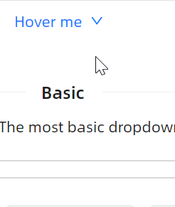
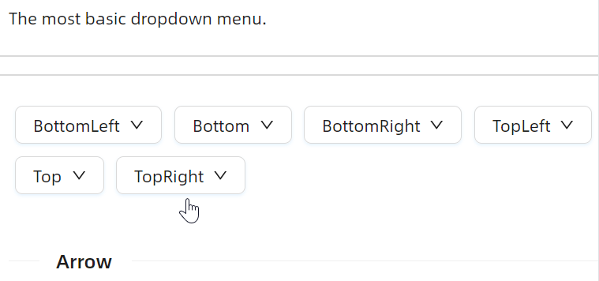
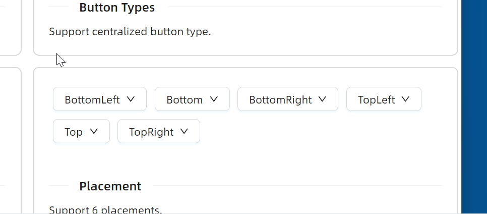

# 快速入门

### 基础配置条件

* Nuget安装Avalonia
* Nuget安装AtomUI

### 基础用法

`ButtonType` 表示按钮类型，提供了Default、Dashed、Primary、Link、Text五个可选值，`TriggerType` 表示菜单的触发方式，可选值有Click、Hover。

除此之外，要留意 `atom:MenuItem` 的 `InputGesture` 属性本质上是文案性质的，并没有实现真正的快捷键功能。



```axaml
<atom:DropdownButton ButtonType="Link" TriggerType="Hover" x:Name="Test">
    Hover me
    <atom:DropdownButton.DropdownFlyout>
        <atom:MenuFlyout>
            <atom:MenuItem Header="Cut" InputGesture="Ctrl+X"
                           Icon="{atom:IconProvider Kind=ScissorOutlined}" />
            <atom:MenuItem Header="Copy" InputGesture="Ctrl+C" Icon="{atom:IconProvider Kind=CopyOutlined}" />
            <atom:MenuItem Header="Delete" InputGesture="Ctrl+D"
                           Icon="{atom:IconProvider Kind=DeleteOutlined}" />
            <atom:MenuItem Header="Paste">
                <atom:MenuItem Header="Paste" InputGesture="Ctrl+P"
                               Icon="{atom:IconProvider Kind=FileDoneOutlined}" />
                <atom:MenuItem Header="Paste from History" InputGesture="Ctrl+Shift+V" />
            </atom:MenuItem>
        </atom:MenuFlyout>
    </atom:DropdownButton.DropdownFlyout>
</atom:DropdownButton>
```

### 按钮类型

`ButtonType` 表示按钮类型，提供了Default、Dashed、Primary、Link、Text五个可选值；`Shape` 属性则确定了按钮形状，可选值有Default、Circle、Round。


```axaml
<StackPanel Orientation="Horizontal" Spacing="10">
    <atom:DropdownButton ButtonType="Primary" TriggerType="Click">
        Edit File
        <atom:DropdownButton.DropdownFlyout>
            <atom:MenuFlyout>
                <atom:MenuItem Header="Cut" InputGesture="Ctrl+X"
                               Icon="{atom:IconProvider Kind=ScissorOutlined}" />
                <atom:MenuItem Header="Copy" InputGesture="Ctrl+C"
                               Icon="{atom:IconProvider Kind=CopyOutlined}" />
                <atom:MenuItem Header="Delete" InputGesture="Ctrl+D"
                               Icon="{atom:IconProvider Kind=DeleteOutlined}" />
                <atom:MenuItem Header="Paste">
                    <atom:MenuItem Header="Paste" InputGesture="Ctrl+P"
                                   Icon="{atom:IconProvider Kind=FileDoneOutlined}" />
                    <atom:MenuItem Header="Paste from History" InputGesture="Ctrl+Shift+V" />
                </atom:MenuItem>
            </atom:MenuFlyout>
        </atom:DropdownButton.DropdownFlyout>
    </atom:DropdownButton>

    <atom:DropdownButton ButtonType="Primary" Shape="Round" TriggerType="Click">
        Edit File
        <atom:DropdownButton.DropdownFlyout>
            <atom:MenuFlyout>
                <atom:MenuItem Header="Cut" InputGesture="Ctrl+X"
                               Icon="{atom:IconProvider Kind=ScissorOutlined}" />
                <atom:MenuItem Header="Copy" InputGesture="Ctrl+C"
                               Icon="{atom:IconProvider Kind=CopyOutlined}" />
                <atom:MenuItem Header="Delete" InputGesture="Ctrl+D"
                               Icon="{atom:IconProvider Kind=DeleteOutlined}" />
            </atom:MenuFlyout>
        </atom:DropdownButton.DropdownFlyout>
    </atom:DropdownButton>

    <atom:DropdownButton ButtonType="Default" TriggerType="Click">
        Edit File
        <atom:DropdownButton.DropdownFlyout>
            <atom:MenuFlyout>
                <atom:MenuItem Header="Cut" InputGesture="Ctrl+X"
                               Icon="{atom:IconProvider Kind=ScissorOutlined}" />
                <atom:MenuItem Header="Copy" InputGesture="Ctrl+C"
                               Icon="{atom:IconProvider Kind=CopyOutlined}" />
                <atom:MenuItem Header="Delete" InputGesture="Ctrl+D"
                               Icon="{atom:IconProvider Kind=DeleteOutlined}" />
            </atom:MenuFlyout>
        </atom:DropdownButton.DropdownFlyout>
    </atom:DropdownButton>

    <atom:DropdownButton ButtonType="Text" TriggerType="Click">
        Edit File
        <atom:DropdownButton.DropdownFlyout>
            <atom:MenuFlyout>
                <atom:MenuItem Header="Cut" InputGesture="Ctrl+X"
                               Icon="{atom:IconProvider Kind=ScissorOutlined}" />
                <atom:MenuItem Header="Copy" InputGesture="Ctrl+C"
                               Icon="{atom:IconProvider Kind=CopyOutlined}" />
                <atom:MenuItem Header="Delete" InputGesture="Ctrl+D"
                               Icon="{atom:IconProvider Kind=DeleteOutlined}" />
            </atom:MenuFlyout>
        </atom:DropdownButton.DropdownFlyout>
    </atom:DropdownButton>
</StackPanel>
```

### 箭头设定

如果开发者预期在下拉菜单上显示一个小箭头，则可以通过 `IsShowArrow` 属性来控制。



```axaml
<gallerycontrols:ShowCaseItem.Styles>
        <Style Selector="atom|DropdownButton">
            <Setter Property="Margin" Value="5" />
        </Style>
    </gallerycontrols:ShowCaseItem.Styles>
    <WrapPanel>
        <atom:DropdownButton ButtonType="Default" TriggerType="Hover" IsShowArrow="True"
                             Placement="BottomEdgeAlignedLeft">
            BottomLeft
            <atom:DropdownButton.DropdownFlyout>
                <atom:MenuFlyout>
                    <atom:MenuItem Header="Cut" InputGesture="Ctrl+X"
                                   Icon="{atom:IconProvider Kind=ScissorOutlined}" />
                    <atom:MenuItem Header="Copy" InputGesture="Ctrl+C"
                                   Icon="{atom:IconProvider Kind=CopyOutlined}" />
                    <atom:MenuItem Header="Delete" InputGesture="Ctrl+D"
                                   Icon="{atom:IconProvider Kind=DeleteOutlined}" />
                </atom:MenuFlyout>
            </atom:DropdownButton.DropdownFlyout>
        </atom:DropdownButton>

        <atom:DropdownButton ButtonType="Default" TriggerType="Hover" IsShowArrow="True"
                             Placement="Bottom">
            Bottom
            <atom:DropdownButton.DropdownFlyout>
                <atom:MenuFlyout>
                    <atom:MenuItem Header="Cut" InputGesture="Ctrl+X"
                                   Icon="{atom:IconProvider Kind=ScissorOutlined}" />
                    <atom:MenuItem Header="Copy" InputGesture="Ctrl+C"
                                   Icon="{atom:IconProvider Kind=CopyOutlined}" />
                    <atom:MenuItem Header="Delete" InputGesture="Ctrl+D"
                                   Icon="{atom:IconProvider Kind=DeleteOutlined}" />
                </atom:MenuFlyout>
            </atom:DropdownButton.DropdownFlyout>
        </atom:DropdownButton>

        <atom:DropdownButton ButtonType="Default" TriggerType="Hover" IsShowArrow="True"
                             Placement="BottomEdgeAlignedRight">
            BottomRight
            <atom:DropdownButton.DropdownFlyout>
                <atom:MenuFlyout>
                    <atom:MenuItem Header="Cut" InputGesture="Ctrl+X"
                                   Icon="{atom:IconProvider Kind=ScissorOutlined}" />
                    <atom:MenuItem Header="Copy" InputGesture="Ctrl+C"
                                   Icon="{atom:IconProvider Kind=CopyOutlined}" />
                    <atom:MenuItem Header="Delete" InputGesture="Ctrl+D"
                                   Icon="{atom:IconProvider Kind=DeleteOutlined}" />
                </atom:MenuFlyout>
            </atom:DropdownButton.DropdownFlyout>
        </atom:DropdownButton>

        <atom:DropdownButton ButtonType="Default" TriggerType="Hover" IsShowArrow="True"
                             Placement="TopEdgeAlignedLeft">
            TopLeft
            <atom:DropdownButton.DropdownFlyout>
                <atom:MenuFlyout>
                    <atom:MenuItem Header="Cut" InputGesture="Ctrl+X"
                                   Icon="{atom:IconProvider Kind=ScissorOutlined}" />
                    <atom:MenuItem Header="Copy" InputGesture="Ctrl+C"
                                   Icon="{atom:IconProvider Kind=CopyOutlined}" />
                    <atom:MenuItem Header="Delete" InputGesture="Ctrl+D"
                                   Icon="{atom:IconProvider Kind=DeleteOutlined}" />
                </atom:MenuFlyout>
            </atom:DropdownButton.DropdownFlyout>
        </atom:DropdownButton>

        <atom:DropdownButton ButtonType="Default" TriggerType="Hover" IsShowArrow="True"
                             Placement="Top">
            Top
            <atom:DropdownButton.DropdownFlyout>
                <atom:MenuFlyout>
                    <atom:MenuItem Header="Cut" InputGesture="Ctrl+X"
                                   Icon="{atom:IconProvider Kind=ScissorOutlined}" />
                    <atom:MenuItem Header="Copy" InputGesture="Ctrl+C"
                                   Icon="{atom:IconProvider Kind=CopyOutlined}" />
                    <atom:MenuItem Header="Delete" InputGesture="Ctrl+D"
                                   Icon="{atom:IconProvider Kind=DeleteOutlined}" />
                </atom:MenuFlyout>
            </atom:DropdownButton.DropdownFlyout>
        </atom:DropdownButton>

        <atom:DropdownButton ButtonType="Default" TriggerType="Hover" IsShowArrow="True"
                             Placement="TopEdgeAlignedRight">
            TopRight
            <atom:DropdownButton.DropdownFlyout>
                <atom:MenuFlyout>
                    <atom:MenuItem Header="Cut" InputGesture="Ctrl+X"
                                   Icon="{atom:IconProvider Kind=ScissorOutlined}" />
                    <atom:MenuItem Header="Copy" InputGesture="Ctrl+C"
                                   Icon="{atom:IconProvider Kind=CopyOutlined}" />
                    <atom:MenuItem Header="Delete" InputGesture="Ctrl+D"
                                   Icon="{atom:IconProvider Kind=DeleteOutlined}" />
                </atom:MenuFlyout>
            </atom:DropdownButton.DropdownFlyout>
        </atom:DropdownButton>
    </WrapPanel>
```

### 触发位置

`Placement` 属性用于设置下拉菜单的触发位置，可选值有BottomEdgeAlignedLeft、Bottom、BottomEdgeAlignedRight、TopEdgeAlignedLeft、Top、TopEdgeAlignedRight。



```axaml
<gallerycontrols:ShowCaseItem.Styles>
        <Style Selector="atom|DropdownButton">
            <Setter Property="Margin" Value="5" />
        </Style>
    </gallerycontrols:ShowCaseItem.Styles>
    <WrapPanel>
        <atom:DropdownButton ButtonType="Default" TriggerType="Hover"
                             Placement="BottomEdgeAlignedLeft">
            BottomLeft
            <atom:DropdownButton.DropdownFlyout>
                <atom:MenuFlyout>
                    <atom:MenuItem Header="Cut" InputGesture="Ctrl+X"
                                   Icon="{atom:IconProvider Kind=ScissorOutlined}" />
                    <atom:MenuItem Header="Copy" InputGesture="Ctrl+C"
                                   Icon="{atom:IconProvider Kind=CopyOutlined}" />
                    <atom:MenuItem Header="Delete" InputGesture="Ctrl+D"
                                   Icon="{atom:IconProvider Kind=DeleteOutlined}" />
                </atom:MenuFlyout>
            </atom:DropdownButton.DropdownFlyout>
        </atom:DropdownButton>

        <atom:DropdownButton ButtonType="Default" TriggerType="Hover"
                             Placement="Bottom">
            Bottom
            <atom:DropdownButton.DropdownFlyout>
                <atom:MenuFlyout>
                    <atom:MenuItem Header="Cut" InputGesture="Ctrl+X"
                                   Icon="{atom:IconProvider Kind=ScissorOutlined}" />
                    <atom:MenuItem Header="Copy" InputGesture="Ctrl+C"
                                   Icon="{atom:IconProvider Kind=CopyOutlined}" />
                    <atom:MenuItem Header="Delete" InputGesture="Ctrl+D"
                                   Icon="{atom:IconProvider Kind=DeleteOutlined}" />
                </atom:MenuFlyout>
            </atom:DropdownButton.DropdownFlyout>
        </atom:DropdownButton>

        <atom:DropdownButton ButtonType="Default" TriggerType="Hover"
                             Placement="BottomEdgeAlignedRight">
            BottomRight
            <atom:DropdownButton.DropdownFlyout>
                <atom:MenuFlyout>
                    <atom:MenuItem Header="Cut" InputGesture="Ctrl+X"
                                   Icon="{atom:IconProvider Kind=ScissorOutlined}" />
                    <atom:MenuItem Header="Copy" InputGesture="Ctrl+C"
                                   Icon="{atom:IconProvider Kind=CopyOutlined}" />
                    <atom:MenuItem Header="Delete" InputGesture="Ctrl+D"
                                   Icon="{atom:IconProvider Kind=DeleteOutlined}" />
                </atom:MenuFlyout>
            </atom:DropdownButton.DropdownFlyout>
        </atom:DropdownButton>

        <atom:DropdownButton ButtonType="Default" TriggerType="Hover"
                             Placement="TopEdgeAlignedLeft">
            TopLeft
            <atom:DropdownButton.DropdownFlyout>
                <atom:MenuFlyout>
                    <atom:MenuItem Header="Cut" InputGesture="Ctrl+X"
                                   Icon="{atom:IconProvider Kind=ScissorOutlined}" />
                    <atom:MenuItem Header="Copy" InputGesture="Ctrl+C"
                                   Icon="{atom:IconProvider Kind=CopyOutlined}" />
                    <atom:MenuItem Header="Delete" InputGesture="Ctrl+D"
                                   Icon="{atom:IconProvider Kind=DeleteOutlined}" />
                </atom:MenuFlyout>
            </atom:DropdownButton.DropdownFlyout>
        </atom:DropdownButton>

        <atom:DropdownButton ButtonType="Default" TriggerType="Hover"
                             Placement="Top">
            Top
            <atom:DropdownButton.DropdownFlyout>
                <atom:MenuFlyout>
                    <atom:MenuItem Header="Cut" InputGesture="Ctrl+X"
                                   Icon="{atom:IconProvider Kind=ScissorOutlined}" />
                    <atom:MenuItem Header="Copy" InputGesture="Ctrl+C"
                                   Icon="{atom:IconProvider Kind=CopyOutlined}" />
                    <atom:MenuItem Header="Delete" InputGesture="Ctrl+D"
                                   Icon="{atom:IconProvider Kind=DeleteOutlined}" />
                </atom:MenuFlyout>
            </atom:DropdownButton.DropdownFlyout>
        </atom:DropdownButton>

        <atom:DropdownButton ButtonType="Default" TriggerType="Hover"
                             Placement="TopEdgeAlignedRight">
            TopRight
            <atom:DropdownButton.DropdownFlyout>
                <atom:MenuFlyout>
                    <atom:MenuItem Header="Cut" InputGesture="Ctrl+X"
                                   Icon="{atom:IconProvider Kind=ScissorOutlined}" />
                    <atom:MenuItem Header="Copy" InputGesture="Ctrl+C"
                                   Icon="{atom:IconProvider Kind=CopyOutlined}" />
                    <atom:MenuItem Header="Delete" InputGesture="Ctrl+D"
                                   Icon="{atom:IconProvider Kind=DeleteOutlined}" />
                </atom:MenuFlyout>
            </atom:DropdownButton.DropdownFlyout>
        </atom:DropdownButton>
    </WrapPanel>
```