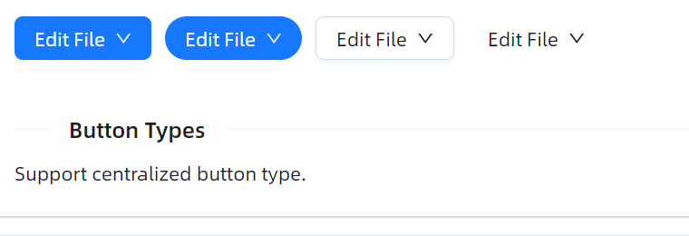

# DropdownButton 概述

### 简介

`DropdownButton` 是一个带下拉菜单的按钮组件，继承自 `Button`。用户点击或悬停按钮时，会弹出一个下拉菜单供选择操作。它将按钮的触发能力与菜单的多选项展示结合在一起，适用于需要在一个按钮上聚合多个操作的场景。

### 主要功能

* 支持多种按钮类型（Default、Primary、Dashed、Text、Link）和形状（Default、Circle、Round）
* 支持点击（Click）和悬停（Hover）两种触发方式
* 支持下拉菜单箭头显示，并可设置箭头是否指向中心
* 支持多种弹出位置，包括上方、下方及其对齐方式
* 支持自定义展开指示器图标
* 支持鼠标进入/离开延迟控制

### 何时使用

- 当一个按钮需要关联多个操作选项时
- 当页面空间有限，需要将多个操作收纳到一个入口中时
- 当需要为用户提供一组上下文相关的菜单操作时
