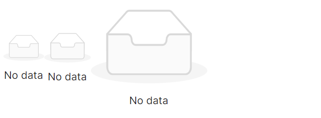
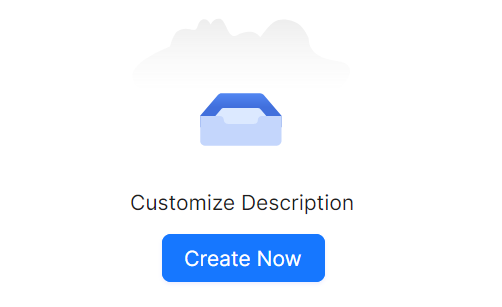
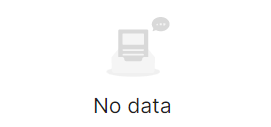

# Empty 快速入门

### 基础配置条件

* Nuget安装Avalonia
* Nuget安装AtomUI

### 基础用法

`PresetImage` 属性表示使用预设图片，内置Default、Simple两种图片。


```axaml
<atom:EmptyIndicator PresetImage="Default" />
```

### 大小尺寸

`SizeType` 属性内置了Small、Middle、Large三种尺寸。



```axaml
<StackPanel Orientation="Vertical">
    <StackPanel Orientation="Horizontal">
        <atom:EmptyIndicator PresetImage="Simple" SizeType="Small" />
        <atom:EmptyIndicator PresetImage="Simple" SizeType="Middle" />
        <atom:EmptyIndicator PresetImage="Simple" SizeType="Large" />
    </StackPanel>
</StackPanel>
```

### 自定义化

`Description` 属性表示交给用户自定义的描述信息，ImagePath属性表示用户自定义的图片路径。



```axaml
<StackPanel Orientation="Vertical" Spacing="10">
    <atom:EmptyIndicator ImagePath="avares://AtomUIGallery/Assets/EmptyShowCase/empty.svg"
                         SizeType="Large"
                         Description="Customize Description" />
    <atom:Button HorizontalAlignment="Center" ButtonType="Primary">Create Now</atom:Button>
</StackPanel>
```

### 图标设定

`IsShowDescription` 属性用来控制描述文本的显示/隐藏。



```axaml
<atom:EmptyIndicator PresetImage="Default" IsShowDescription="False" />
```