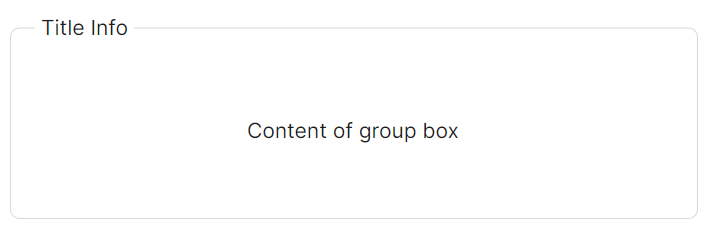
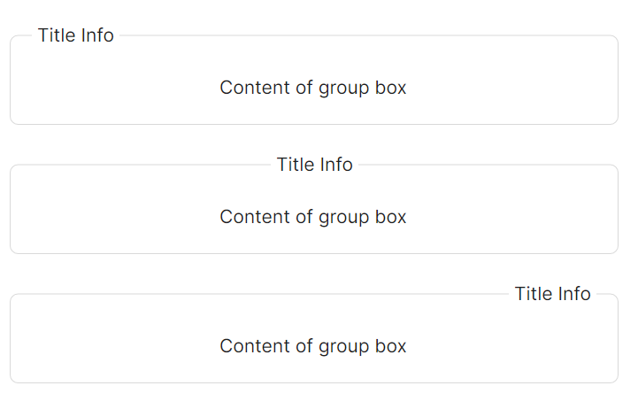
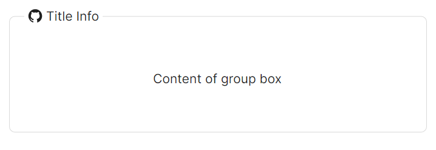

# GroupBox 快速入门

### 基础配置条件

* Nuget安装Avalonia
* Nuget安装AtomUI

### 基础用法

`HeaderTitle` 属性设定组件标题。



```axaml
<atom:GroupBox HeaderTitle="Title Info">
    <Panel Height="100">
        <atom:TextBlock HorizontalAlignment="Center" VerticalAlignment="Center">
            Content of group box
        </atom:TextBlock>
    </Panel>
</atom:GroupBox>
```

### 标题位置

`HeaderTitlePosition` 属性设定组件标题的位置，可选值有`Left`、`Center`、`Right`。



```axaml
<StackPanel Orientation="Vertical" Spacing="10">
    <atom:GroupBox HeaderTitle="Title Info">
        <Panel Height="40">
            <atom:TextBlock HorizontalAlignment="Center" VerticalAlignment="Center">
                Content of group box
            </atom:TextBlock>
        </Panel>
    </atom:GroupBox>
    <atom:GroupBox HeaderTitle="Title Info" HeaderTitlePosition="Center">
        <Panel Height="40">
            <atom:TextBlock HorizontalAlignment="Center" VerticalAlignment="Center">
                Content of group box
            </atom:TextBlock>
        </Panel>
    </atom:GroupBox>
    <atom:GroupBox HeaderTitle="Title Info" HeaderTitlePosition="Right">
        <Panel Height="40">
            <atom:TextBlock HorizontalAlignment="Center" VerticalAlignment="Center">
                Content of group box
            </atom:TextBlock>
        </Panel>
    </atom:GroupBox>
</StackPanel>
```

### 标题样式

`HeaderFontStyle` 属性来设定字体样式，通过 `HeaderFontWeight` 属性来设定字体的粗细，通过 `HeaderTitleColor` 属性来设定标题颜色。    


```axaml
<StackPanel Orientation="Vertical" Spacing="10">
    <atom:GroupBox HeaderTitle="Title Info" HeaderFontStyle="Italic">
        <Panel Height="40">
            <atom:TextBlock HorizontalAlignment="Center" VerticalAlignment="Center">
                Content of group box
            </atom:TextBlock>
        </Panel>
    </atom:GroupBox>
    <atom:GroupBox HeaderTitle="Title Info" HeaderTitlePosition="Center" HeaderFontWeight="Bold">
        <Panel Height="40">
            <atom:TextBlock HorizontalAlignment="Center" VerticalAlignment="Center">
                Content of group box
            </atom:TextBlock>
        </Panel>
    </atom:GroupBox>
    <atom:GroupBox HeaderTitle="Title Info" HeaderTitlePosition="Right" HeaderFontStyle="Oblique">
        <Panel Height="40">
            <atom:TextBlock HorizontalAlignment="Center" VerticalAlignment="Center">
                Content of group box
            </atom:TextBlock>
        </Panel>
    </atom:GroupBox>
    <atom:GroupBox HeaderTitle="Title Info" HeaderTitlePosition="Center" HeaderFontStyle="Oblique"
                   HeaderTitleColor="Coral" HeaderFontWeight="Medium">
        <Panel Height="40">
            <atom:TextBlock HorizontalAlignment="Center" VerticalAlignment="Center">
                Content of group box
            </atom:TextBlock>
        </Panel>
    </atom:GroupBox>
</StackPanel>
```

### 图标设定

`HeaderIcon` 属性来设定图标。



```axaml
<atom:GroupBox HeaderTitle="Title Info" HeaderIcon="{atom:IconProvider Kind=GithubOutlined}">
    <Panel Height="100">
        <TextBlock HorizontalAlignment="Center" VerticalAlignment="Center">
            Content of group box
        </TextBlock>
    </Panel>
</atom:GroupBox>
```