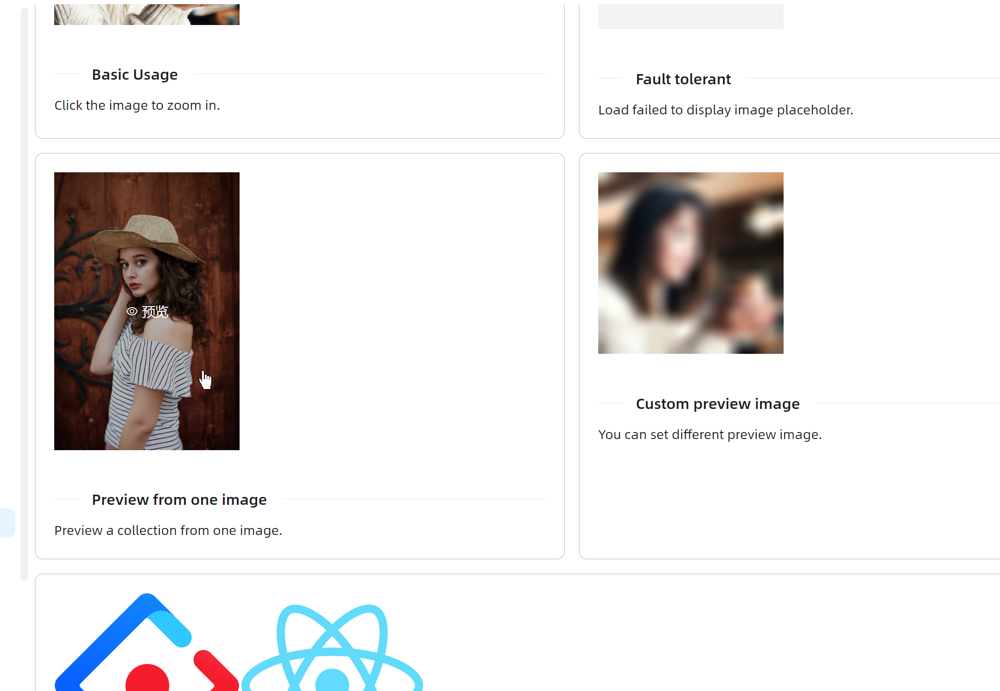
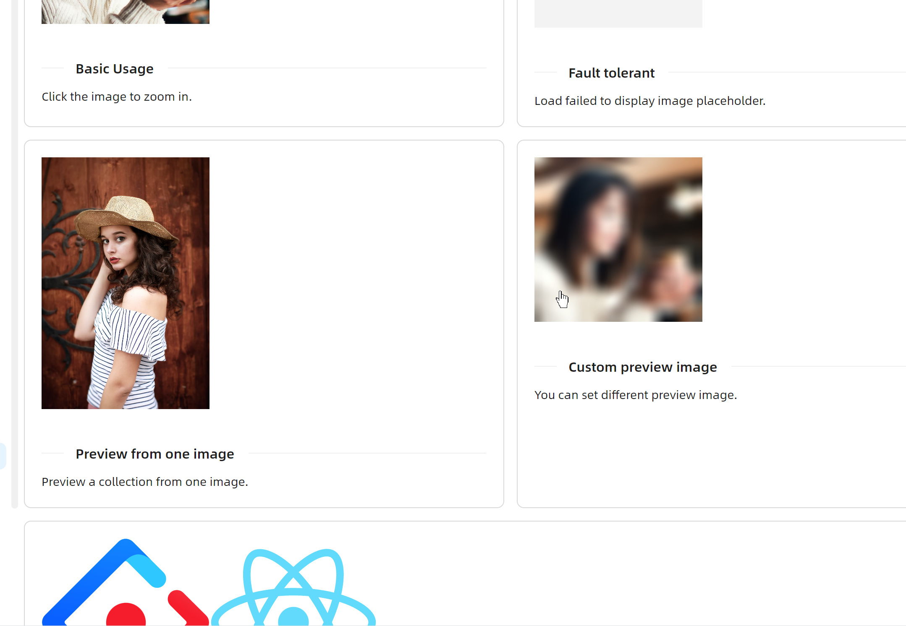
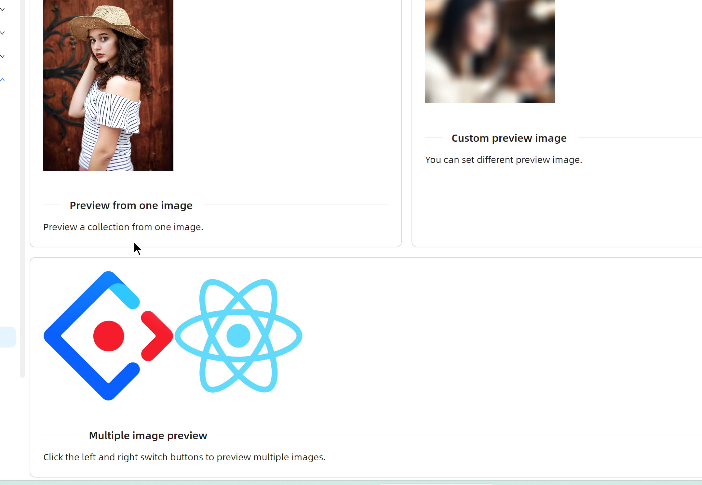

# ImagePreviewer 快速入门

### 基础配置条件

* Nuget安装Avalonia
* Nuget安装AtomUI
* 本页文档末尾有公用的code-behind源码

### 基础用法

使用 `Sources` 属性绑定图片源，组件会将第一张图片作为封面展示。点击封面即可打开预览对话框。


```xaml
<atom:ImagePreviewer Width="200" Sources="{Binding DefaultImages}" />
```

### 兜底图片

当图片加载失败时，可通过 `FallbackImageSrc` 属性指定一张兜底图片，避免界面出现空白或异常。


```xaml
<atom:ImagePreviewer Width="200" FallbackImageSrc="{Binding FallbackImage}"/>
```

### 画廊模式

当 `Sources` 属性绑定多张图片时，组件会自动进入画廊模式，预览时可在多张图片之间左右切换。



```xaml
<atom:ImagePreviewer Width="200" Sources="{Binding ThreeImages}"/>
```

### 自定义预览图

默认情况下 `ImagePreviewer` 会将实际要加载的图片作为封面。开发者可以通过 `CoverImageSrc` 属性设置自定义的封面图片，例如使用模糊缩略图来提升加载体验。



```xaml
<atom:ImagePreviewer Width="200" Sources="{Binding DefaultImages}" CoverImageSrc="{Binding BlurImage}"/>
```

### 多图浏览

`ImageGroupPreviewer` 组件支持同时展示多张图片的封面缩略图，点击任意一张即可打开画廊预览。



```xaml
<atom:ImageGroupPreviewer Sources="{Binding TwoImages}" CoverWidth="200" CoverHeight="200"/>
```

### 公共文件

code-behind文件：
```csharp
using AtomUIGallery.ShowCases.ViewModels;
using ReactiveUI;
using ReactiveUI.Avalonia;

namespace AtomUIGallery.ShowCases.Views;

public partial class ImagePreviewerShowCase : ReactiveUserControl<ImagePreviewerViewModel>
{
    public ImagePreviewerShowCase()
    {
        this.WhenActivated(disposables =>
        {
            if (DataContext is ImagePreviewerViewModel viewModel)
            {
                viewModel.DefaultImages = [
                    "avares://AtomUIGallery/Assets/ImagePreviewerShowCase/1.png"
                ];
                viewModel.ThreeImages = [
                    "avares://AtomUIGallery/Assets/ImagePreviewerShowCase/4.webp",
                    "avares://AtomUIGallery/Assets/ImagePreviewerShowCase/5.webp",
                    "avares://AtomUIGallery/Assets/ImagePreviewerShowCase/6.webp"
                ];
                viewModel.TwoImages = [
                    "avares://AtomUIGallery/Assets/ImagePreviewerShowCase/2.svg",
                    "avares://AtomUIGallery/Assets/ImagePreviewerShowCase/3.svg",
                ];
                viewModel.FallbackImage = "avares://AtomUIGallery/Assets/ImagePreviewerShowCase/Fallback.png";
                viewModel.BlurImage = "avares://AtomUIGallery/Assets/ImagePreviewerShowCase/Blur.png";
            }
        });
        InitializeComponent();
    }
}
```
