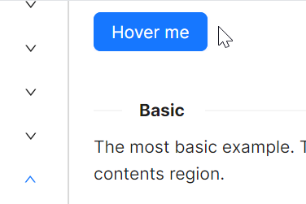

# Flyout 快速入门

### 基础配置条件

* Nuget 安装 Avalonia
* Nuget 安装 AtomUI

### 基础用法

使用 `FlyoutHost` 作为宿主容器，将触发元素作为其子内容，并通过 `FlyoutHost.Flyout` 附加属性定义飞出层。设置 `Trigger="Hover"` 即可实现悬停触发。



```xaml
<StackPanel Orientation="Vertical" Spacing="10">
    <atom:FlyoutHost Trigger="Hover">
        <atom:FlyoutHost.Flyout>
            <atom:Flyout>
                <TextBlock Width="200" Height="100" Padding="20">The most basic example.</TextBlock>
            </atom:Flyout>
        </atom:FlyoutHost.Flyout>
        <atom:Button ButtonType="Primary">Hover me</atom:Button>
    </atom:FlyoutHost>
</StackPanel>
```

### 触发方式

`FlyoutHost` 的 `Trigger` 属性支持 `Hover` 和 `Click` 两种触发模式。`Hover` 模式下鼠标悬停即可弹出浮层，`Click` 模式下需要点击触发元素。


```xaml
<StackPanel Orientation="Horizontal" Spacing="10">
    <atom:FlyoutHost Trigger="Hover">
        <atom:FlyoutHost.Flyout>
            <atom:Flyout>
                <TextBlock Width="200" Height="100" Padding="20">The most basic example.</TextBlock>
            </atom:Flyout>
        </atom:FlyoutHost.Flyout>
        <atom:Button>Hover me</atom:Button>
    </atom:FlyoutHost>
    <atom:FlyoutHost Trigger="Click">
        <atom:FlyoutHost.Flyout>
            <atom:Flyout>
                <TextBlock Width="200" Height="100" Padding="20">The most basic example.</TextBlock>
            </atom:Flyout>
        </atom:FlyoutHost.Flyout>
        <atom:Button>Click me</atom:Button>
    </atom:FlyoutHost>
</StackPanel>
```

### 弹出方向

通过 `Placement` 属性可设置浮层相对于触发元素的弹出位置，共支持 12 种方向：

| 方位 | 对齐方式 |
|------|---------|
| 上方 | `TopEdgeAlignedLeft`、`Top`、`TopEdgeAlignedRight` |
| 下方 | `BottomEdgeAlignedLeft`、`Bottom`、`BottomEdgeAlignedRight` |
| 左侧 | `LeftEdgeAlignedTop`、`Left`、`LeftEdgeAlignedBottom` |
| 右侧 | `RightEdgeAlignedTop`、`Right`、`RightEdgeAlignedBottom` |


```xaml
<Grid>
    <Grid.Styles>
        <Style Selector="atom|Button">
            <Setter Property="Margin" Value="5" />
            <Setter Property="Width" Value="80" />
        </Style>
    </Grid.Styles>
    <Grid.RowDefinitions>
        <RowDefinition Height="Auto" />
        <RowDefinition Height="Auto" />
        <RowDefinition Height="Auto" />
        <RowDefinition Height="Auto" />
        <RowDefinition Height="Auto" />
    </Grid.RowDefinitions>
    <Grid.ColumnDefinitions>
        <ColumnDefinition Width="Auto" />
        <ColumnDefinition Width="Auto" />
        <ColumnDefinition Width="Auto" />
        <ColumnDefinition Width="Auto" />
        <ColumnDefinition Width="Auto" />
    </Grid.ColumnDefinitions>

    <atom:FlyoutHost Grid.Row="1" Grid.Column="0" Trigger="Hover" Placement="LeftEdgeAlignedTop">
        <atom:FlyoutHost.Flyout>
            <atom:Flyout>
                <TextBlock Width="200" Height="100" Padding="20">The most basic example.</TextBlock>
            </atom:Flyout>
        </atom:FlyoutHost.Flyout>
        <atom:Button Content="LT" />
    </atom:FlyoutHost>

    <atom:FlyoutHost Grid.Row="2" Grid.Column="0" Trigger="Hover" Placement="Left">
        <atom:FlyoutHost.Flyout>
            <atom:Flyout>
                <TextBlock Width="200" Height="100" Padding="20">The most basic example.</TextBlock>
            </atom:Flyout>
        </atom:FlyoutHost.Flyout>
        <atom:Button Content="Left" />
    </atom:FlyoutHost>

    <atom:FlyoutHost Grid.Row="3" Grid.Column="0" Trigger="Hover" Placement="LeftEdgeAlignedBottom">
        <atom:FlyoutHost.Flyout>
            <atom:Flyout>
                <TextBlock Width="200" Height="100" Padding="20">The most basic example.</TextBlock>
            </atom:Flyout>
        </atom:FlyoutHost.Flyout>
        <atom:Button Content="LB" />
    </atom:FlyoutHost>

    <atom:FlyoutHost Grid.Row="0" Grid.Column="1" Trigger="Hover" Placement="TopEdgeAlignedLeft">
        <atom:FlyoutHost.Flyout>
            <atom:Flyout>
                <TextBlock Width="200" Height="100" Padding="20">The most basic example.</TextBlock>
            </atom:Flyout>
        </atom:FlyoutHost.Flyout>
        <atom:Button Content="TL" />
    </atom:FlyoutHost>

    <atom:FlyoutHost Grid.Row="0" Grid.Column="2" Trigger="Hover" Placement="Top">
        <atom:FlyoutHost.Flyout>
            <atom:Flyout>
                <TextBlock Width="200" Height="100" Padding="20">The most basic example.</TextBlock>
            </atom:Flyout>
        </atom:FlyoutHost.Flyout>
        <atom:Button Content="Top" />
    </atom:FlyoutHost>

    <atom:FlyoutHost Grid.Row="0" Grid.Column="3" Trigger="Hover" Placement="TopEdgeAlignedRight">
        <atom:FlyoutHost.Flyout>
            <atom:Flyout>
                <TextBlock Width="200" Height="100" Padding="20">The most basic example.</TextBlock>
            </atom:Flyout>
        </atom:FlyoutHost.Flyout>
        <atom:Button Content="TR" />
    </atom:FlyoutHost>

    <atom:FlyoutHost Grid.Row="1" Grid.Column="4" Trigger="Hover" Placement="RightEdgeAlignedTop">
        <atom:FlyoutHost.Flyout>
            <atom:Flyout>
                <TextBlock Width="200" Height="100" Padding="20">The most basic example.</TextBlock>
            </atom:Flyout>
        </atom:FlyoutHost.Flyout>
        <atom:Button Content="RT" />
    </atom:FlyoutHost>

    <atom:FlyoutHost Grid.Row="2" Grid.Column="4" Trigger="Hover" Placement="Right">
        <atom:FlyoutHost.Flyout>
            <atom:Flyout>
                <TextBlock Width="200" Height="100" Padding="20">The most basic example.</TextBlock>
            </atom:Flyout>
        </atom:FlyoutHost.Flyout>
        <atom:Button Content="Right" />
    </atom:FlyoutHost>

    <atom:FlyoutHost Grid.Row="3" Grid.Column="4" Trigger="Hover" Placement="RightEdgeAlignedBottom">
        <atom:FlyoutHost.Flyout>
            <atom:Flyout>
                <TextBlock Width="200" Height="100" Padding="20">The most basic example.</TextBlock>
            </atom:Flyout>
        </atom:FlyoutHost.Flyout>
        <atom:Button Content="RB" />
    </atom:FlyoutHost>

    <atom:FlyoutHost Grid.Row="4" Grid.Column="1" Trigger="Hover" Placement="BottomEdgeAlignedLeft">
        <atom:FlyoutHost.Flyout>
            <atom:Flyout>
                <TextBlock Width="200" Height="100" Padding="20">The most basic example.</TextBlock>
            </atom:Flyout>
        </atom:FlyoutHost.Flyout>
        <atom:Button Content="BL" />
    </atom:FlyoutHost>

    <atom:FlyoutHost Grid.Row="4" Grid.Column="2" Trigger="Hover" Placement="Bottom">
        <atom:FlyoutHost.Flyout>
            <atom:Flyout>
                <TextBlock Width="200" Height="100" Padding="20">The most basic example.</TextBlock>
            </atom:Flyout>
        </atom:FlyoutHost.Flyout>
        <atom:Button Content="Bottom" />
    </atom:FlyoutHost>

    <atom:FlyoutHost Grid.Row="4" Grid.Column="3" Trigger="Hover" Placement="BottomEdgeAlignedRight">
        <atom:FlyoutHost.Flyout>
            <atom:Flyout>
                <TextBlock Width="200" Height="100" Padding="20">The most basic example.</TextBlock>
            </atom:Flyout>
        </atom:FlyoutHost.Flyout>
        <atom:Button Content="BR" />
    </atom:FlyoutHost>

</Grid>
```

### 箭头选项

通过 `IsShowArrow` 属性控制是否显示箭头指示器，通过 `IsPointAtCenter` 属性控制箭头是否指向目标元素的中心位置。


```xaml
<StackPanel Orientation="Vertical" Spacing="10">
    <atom:Segmented x:Name="ArrowSegmented">
        <atom:SegmentedItem>Show</atom:SegmentedItem>
        <atom:SegmentedItem>Hide</atom:SegmentedItem>
        <atom:SegmentedItem>Center</atom:SegmentedItem>
    </atom:Segmented>
    <Grid>
        <Grid.Styles>
            <Style Selector="atom|Button">
                <Setter Property="Margin" Value="5" />
                <Setter Property="Width" Value="80" />
            </Style>
        </Grid.Styles>
        <Grid.RowDefinitions>
            <RowDefinition Height="Auto" />
            <RowDefinition Height="Auto" />
            <RowDefinition Height="Auto" />
            <RowDefinition Height="Auto" />
            <RowDefinition Height="Auto" />
        </Grid.RowDefinitions>
        <Grid.ColumnDefinitions>
            <ColumnDefinition Width="Auto" />
            <ColumnDefinition Width="Auto" />
            <ColumnDefinition Width="Auto" />
            <ColumnDefinition Width="Auto" />
            <ColumnDefinition Width="Auto" />
        </Grid.ColumnDefinitions>

        <atom:FlyoutHost Grid.Row="0" Grid.Column="2"
                         Trigger="Hover"
                         Placement="Top"
                         IsShowArrow="{Binding ShowArrow}"
                         IsPointAtCenter="{Binding IsPointAtCenter}">
            <atom:FlyoutHost.Flyout>
                <atom:Flyout>
                    <TextBlock Width="200" Height="100" Padding="20">The most basic example.</TextBlock>
                </atom:Flyout>
            </atom:FlyoutHost.Flyout>
            <atom:Button Content="Top" />
        </atom:FlyoutHost>

        <atom:FlyoutHost Grid.Row="2" Grid.Column="0"
                         Trigger="Hover"
                         Placement="Left"
                         IsShowArrow="{Binding ShowArrow}"
                         IsPointAtCenter="{Binding IsPointAtCenter}">
            <atom:FlyoutHost.Flyout>
                <atom:Flyout>
                    <TextBlock Width="200" Height="100" Padding="20">The most basic example.</TextBlock>
                </atom:Flyout>
            </atom:FlyoutHost.Flyout>
            <atom:Button Content="Left" />
        </atom:FlyoutHost>

        <atom:FlyoutHost Grid.Row="2" Grid.Column="4"
                         Trigger="Hover"
                         Placement="Right"
                         IsShowArrow="{Binding ShowArrow}"
                         IsPointAtCenter="{Binding IsPointAtCenter}">
            <atom:FlyoutHost.Flyout>
                <atom:Flyout>
                    <TextBlock Width="200" Height="100" Padding="20">The most basic example.</TextBlock>
                </atom:Flyout>
            </atom:FlyoutHost.Flyout>
            <atom:Button Content="Right" />
        </atom:FlyoutHost>

        <atom:FlyoutHost Grid.Row="4" Grid.Column="2"
                         Trigger="Hover"
                         Placement="Bottom"
                         IsShowArrow="{Binding ShowArrow}"
                         IsPointAtCenter="{Binding IsPointAtCenter}">
            <atom:FlyoutHost.Flyout>
                <atom:Flyout>
                    <TextBlock Width="200" Height="100" Padding="20">The most basic example.</TextBlock>
                </atom:Flyout>
            </atom:FlyoutHost.Flyout>
            <atom:Button Content="Bottom" />
        </atom:FlyoutHost>

    </Grid>
</StackPanel>
```
