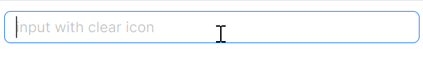

# 一键清理

一键清理掉输入框中的内容是常见的业务需求，`LineEdit` 提供了 `IsEnableClearButton` 属性，可以一键清理输入框中的内容。



axaml文件：
```axaml
<atom:LineEdit Watermark="input with clear icon" 
               Width="400" 
               HorizontalAlignment="Left"
               IsEnableClearButton="True" />
```