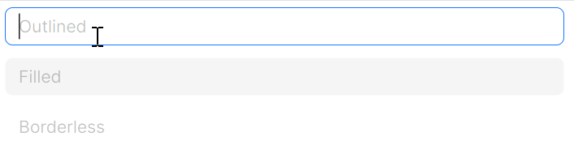
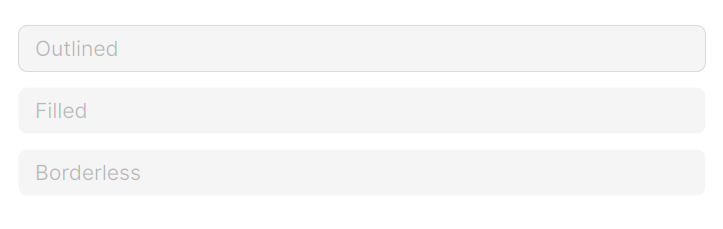
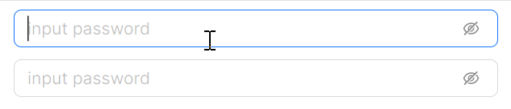

# LineEdit 快速入门

## 前置条件

- NuGet 安装 `Avalonia`
- NuGet 安装 `AtomUI`

## 基础用法

最简单的用法，通过 `Watermark` 属性设置占位提示文字，当输入框为空时会显示该提示。


```xaml
<atom:LineEdit Watermark="Basic usage" />
```

## 大小尺寸

通过 `SizeType` 属性控制输入框大小，可选值为 `Large`、`Middle`（默认）、`Small`。


```xaml
<StackPanel Orientation="Vertical" Spacing="10" Margin="0, 0, 20, 0">
    <atom:LineEdit Watermark="Large" SizeType="Large"
                   InnerLeftContent="{atom:IconProvider Kind=UserOutlined}" />
    <atom:LineEdit Watermark="Middle" SizeType="Middle"
                   InnerLeftContent="{atom:IconProvider Kind=UserOutlined}" />
    <atom:LineEdit Watermark="Small" SizeType="Small"
                   InnerLeftContent="{atom:IconProvider Kind=UserOutlined}" />
</StackPanel>
```

## 样式变体

通过 `StyleVariant` 属性切换输入框的视觉风格，内置三种变体：Outline（描边，默认）、Filled（填充背景）、Borderless（无边框）。



```xaml
<StackPanel Orientation="Vertical" Spacing="10">
    <atom:LineEdit Watermark="Outlined" StyleVariant="Outline" />
    <atom:LineEdit Watermark="Filled" StyleVariant="Filled" />
    <atom:LineEdit Watermark="Borderless" StyleVariant="Borderless" />
</StackPanel>
```

## 禁用状态

设置 `IsEnabled="False"` 禁用输入框，所有样式变体均支持禁用态。



```xaml
<StackPanel Orientation="Vertical" Spacing="10">
    <atom:LineEdit Watermark="Outlined" StyleVariant="Outline" IsEnabled="False" />
    <atom:LineEdit Watermark="Filled" StyleVariant="Filled" IsEnabled="False" />
    <atom:LineEdit Watermark="Borderless" StyleVariant="Borderless" IsEnabled="False" />
</StackPanel>
```

## 状态色

通过 `Status` 属性设置输入框的校验状态色，内置三种状态：Default（默认）、Error（错误，红色系）、Warning（警告，橙色系）。可与不同变体组合使用。


```xaml
<StackPanel Orientation="Vertical" Spacing="10" Margin="0, 0, 20, 0">
    <atom:LineEdit Watermark="Error" Status="Error" />
    <atom:LineEdit Watermark="Warning" Status="Warning" />
    <atom:LineEdit Watermark="Error with prefix"
                   InnerLeftContent="{atom:IconProvider Kind=ClockCircleOutlined}" Status="Error" />
    <atom:LineEdit Watermark="Warning with prefix"
                   InnerLeftContent="{atom:IconProvider Kind=ClockCircleOutlined}" Status="Warning" />

    <atom:LineEdit Watermark="Error" Status="Error"
                   InnerLeftContent="{atom:IconProvider Kind=ClockCircleOutlined}" StyleVariant="Filled" />
    <atom:LineEdit Watermark="Warning" Status="Warning"
                   InnerLeftContent="{atom:IconProvider Kind=ClockCircleOutlined}" StyleVariant="Filled" />

    <atom:LineEdit Watermark="Error" Status="Error"
                   InnerLeftContent="{atom:IconProvider Kind=ClockCircleOutlined}"
                   StyleVariant="Borderless" />
    <atom:LineEdit Watermark="Warning" Status="Warning"
                   InnerLeftContent="{atom:IconProvider Kind=ClockCircleOutlined}"
                   StyleVariant="Borderless" />
</StackPanel>
```

## 一键清除

设置 `IsEnableClearButton="True"` 启用清除按钮，当输入框有内容时，右侧会出现清除图标，点击即可清空输入内容。


```xaml
<atom:LineEdit Watermark="input with clear icon"
               Width="400"
               HorizontalAlignment="Left"
               IsEnableClearButton="True" />
```

## 密码输入

LineEdit 内置密码输入模式，适用于登录、注册等需要密码输入的场景。相关属性：

- `PasswordChar` — 用于遮蔽密码的替换字符
- `RevealPassword` — 控制密码是否明文显示，`True` 为明文，`False` 为密文
- `IsEnableRevealButton` — 是否启用密码显示/隐藏切换按钮（小眼睛图标）



```xaml
<StackPanel Orientation="Vertical" Spacing="10">
    <atom:LineEdit Watermark="input password"
                   Width="400"
                   RevealPassword="False"
                   PasswordChar="&#x2022;"
                   HorizontalAlignment="Left"
                   IsEnableRevealButton="True" />
    <atom:LineEdit Watermark="input password"
                   Width="400"
                   RevealPassword="False"
                   HorizontalAlignment="Left"
                   PasswordChar="&#x2022;"
                   IsEnableRevealButton="True"
                   IsEnableClearButton="True" />
</StackPanel>
```

## 前后标签（AddOn）

通过 `LeftAddOn` 和 `RightAddOn` 在输入框外部左右两侧附加标签内容，值可以是字符串或图标。适用于 URL 输入、协议选择等场景。

`InnerRightContent` 与 `RightAddOn` 的区别在于：前者位于输入框内部，作为输入内容的补充说明；后者位于输入框外部，作为独立的装饰区域。


```xaml
<StackPanel Orientation="Vertical" Spacing="10">
    <atom:LineEdit LeftAddOn="http://" RightAddOn=".com" Width="400" HorizontalAlignment="Left"
                   Text="mysite" />
    <atom:LineEdit RightAddOn="{atom:IconProvider Kind=SettingOutlined}" Width="400"
                   HorizontalAlignment="Left"
                   Text="mysite" />
    <atom:LineEdit LeftAddOn="http://" InnerRightContent=".com" Width="400" HorizontalAlignment="Left"
                   Text="mysite" />
</StackPanel>
```

## 前后缀（Prefix / Suffix）

通过 `InnerLeftContent` 和 `InnerRightContent` 在输入框内部嵌入图标或文字，常用于展示货币符号、单位或辅助图标。


```xaml
<StackPanel Orientation="Vertical" Spacing="10">
    <atom:LineEdit Watermark="Enter your username"
                   InnerLeftContent="{atom:IconProvider Kind=UserOutlined, NormalFilledColor=#D7D7D7}"
                   InnerRightContent="{atom:IconProvider Kind=InfoCircleOutlined, NormalFilledColor=#8C8C8C}" />
    <atom:LineEdit InnerLeftContent="&#xFFE5;" InnerRightContent="RMB" />
    <atom:LineEdit InnerLeftContent="&#xFFE5;" InnerRightContent="RMB" IsEnabled="False" />
</StackPanel>
```

## 搜索输入框

AtomUI 提供了专用的 `SearchEdit` 组件，内置搜索按钮，适用于搜索场景。相关属性：

- `SizeType` — 尺寸大小，可选 Small、Medium、Large
- `SearchButtonStyle` — 搜索按钮样式，可选 Primary、Default
- `SearchButtonText` — 搜索按钮的文字

`SearchEdit` 继承自 `LineEdit`，因此 LineEdit 的所有属性均可在 SearchEdit 上使用。


```xaml
<StackPanel Orientation="Vertical" Spacing="10" Margin="0, 0, 20, 0">
    <atom:SearchEdit Watermark="input search text" Width="400" HorizontalAlignment="Left" SizeType="Large" />
    <atom:SearchEdit Watermark="input search text" Width="400" HorizontalAlignment="Left"
                     SearchButtonText="Search" />

    <atom:SearchEdit Watermark="input search text" Width="400" HorizontalAlignment="Left"
                     SearchButtonStyle="Primary" SearchButtonText="Search" />

    <atom:SearchEdit Watermark="input search text"
                     Width="400"
                     HorizontalAlignment="Left"
                     SearchButtonStyle="Primary"
                     SearchButtonText="Search"
                     IsEnableClearButton="True" />
    <atom:SearchEdit Watermark="input search text"
                     Width="400"
                     HorizontalAlignment="Left"
                     SearchButtonStyle="Primary"
                     SearchButtonText="搜索一下"
                     InnerRightContent="{atom:IconProvider Kind=AudioOutlined, NormalFilledColor=#1677ff, Width=16, Height=16}"
                     IsEnableClearButton="True"
                     SizeType="Large" />
</StackPanel>
```

### 搜索框禁用


```xaml
<StackPanel Orientation="Vertical" Spacing="10" Margin="0, 0, 20, 0">
    <atom:SearchEdit Watermark="input search text" Width="400" HorizontalAlignment="Left" SizeType="Large"
                     IsEnabled="False" />
    <atom:SearchEdit Watermark="input search text" Width="400" HorizontalAlignment="Left"
                     SearchButtonText="Search" IsEnabled="False" />

    <atom:SearchEdit Watermark="input search text" Width="400" HorizontalAlignment="Left"
                     SearchButtonStyle="Primary" SearchButtonText="Search" IsEnabled="False" />

    <atom:SearchEdit Watermark="input search text"
                     Width="400"
                     HorizontalAlignment="Left"
                     SearchButtonStyle="Primary"
                     SearchButtonText="Search"
                     IsEnableClearButton="True" IsEnabled="False" />
    <atom:SearchEdit Watermark="input search text"
                     Width="400"
                     HorizontalAlignment="Left"
                     SearchButtonStyle="Primary"
                     SearchButtonText="搜索一下"
                     IsEnableClearButton="True"
                     SizeType="Large" IsEnabled="False">
        <atom:SearchEdit.InnerRightContent>
            <atom:Icon IconInfo="{atom:IconInfoProvider Kind=AudioOutlined}"
                       Width="16"
                       Height="16"
                       NormalFilledBrush="{DynamicResource {x:Static atom:SharedTokenKey.ColorPrimary}}"
                       DisabledFilledBrush="{DynamicResource {x:Static atom:SharedTokenKey.ColorTextDisabled}}" />
        </atom:SearchEdit.InnerRightContent>
    </atom:SearchEdit>
</StackPanel>
```
