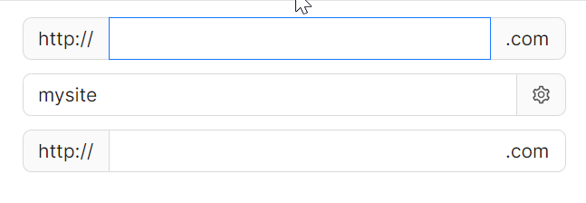
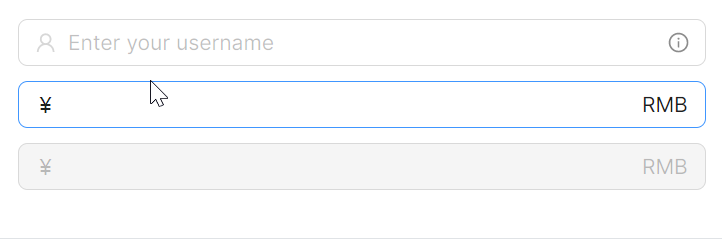

# 前后缀特性

### Pre/Post Tab

这个示例中，为开发者演示组件的预置和后置内容，请重点关注如下属性：

* `LeftAddOn` 表示输入框左侧位置的Pre Tab，其值可以是一个图标，也可以是字符串。
* `RightAddOn` 表示输入框右侧位置的Pre Tab，其值可以是一个图标，也可以是字符串。
* `InnerRightContent` 则作为内部内容，位于输入框内部的右侧，是输入框的一部分。

`InnerRightContent` 与 `RightAddOn` 区别是：前者更趋向于为输入框内部的补充，而后者更趋向于为输入框外部的装饰。



axaml文件：
```axaml
<StackPanel Orientation="Vertical" Spacing="10">
    <atom:LineEdit LeftAddOn="http://" RightAddOn=".com" Width="400" HorizontalAlignment="Left"
                   Text="myFsite" />
    <atom:LineEdit RightAddOn="{atom:IconProvider Kind=SettingOutlined}" Width="400"
                   HorizontalAlignment="Left"
                   Text="mysite" />
    <atom:LineEdit LeftAddOn="http://" InnerRightContent=".com" Width="400" HorizontalAlignment="Left"
                   Text="mysite" />
</StackPanel>
```

### Prefix/Suffix

这个示例是纯介绍 `InnerRightContent` 与 `InnerLeftContent` 的用法。



axaml文件：
```axaml
<StackPanel Orientation="Vertical" Spacing="10">
    <atom:LineEdit Watermark="Enter your username"
                   InnerLeftContent="{atom:IconProvider Kind=UserOutlined, NormalFilledColor=#D7D7D7}"
                   InnerRightContent="{atom:IconProvider Kind=InfoCircleOutlined, NormalFilledColor=#8C8C8C}" />
    <atom:LineEdit InnerLeftContent="￥" InnerRightContent="RMB" />
    <atom:LineEdit InnerLeftContent="￥" InnerRightContent="RMB" IsEnabled="False" />
</StackPanel>
```