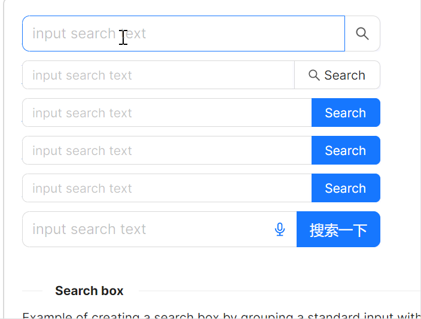
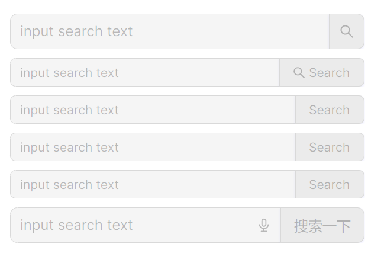

# 搜索框

### 基础用法

`AtomUI` 通过 `atom:SearchEdit` 为开发者提供了一个特性丰富的搜索框组件。

关注如下属性：
* `SizeType` 属性用于设定尺寸，可选项有Small、Medium、Large。
* `SearchButtonStyle` 样式属性用于设定按钮的样式，可选项有Primary、Default。
* `SearchButtonText` 属性用于设定按钮的文字。

同样，`atom:LineEdit` 中的属性也完全可以用在 `atom:SearchEdit` 组件中。



axaml文件：
```axaml
<StackPanel Orientation="Vertical" Spacing="10" Margin="0, 0, 20, 0">
    <atom:SearchEdit Watermark="input search text" Width="400" HorizontalAlignment="Left" SizeType="Large" />
    <atom:SearchEdit Watermark="input search text" Width="400" HorizontalAlignment="Left"
                     SearchButtonText="Search" />

    <atom:SearchEdit Watermark="input search text" Width="400" HorizontalAlignment="Left"
                     SearchButtonStyle="Primary" SearchButtonText="Search" />
    <atom:SearchEdit Watermark="input search text" Width="400" HorizontalAlignment="Left"
                     SearchButtonStyle="Primary" SearchButtonText="Search" />

    <atom:SearchEdit Watermark="input search text"
                     Width="400"
                     HorizontalAlignment="Left"
                     SearchButtonStyle="Primary"
                     SearchButtonText="Search"
                     IsEnableClearButton="True" />
    <atom:SearchEdit Watermark="input search text"
                     Width="400"
                     HorizontalAlignment="Left"
                     SearchButtonStyle="Primary"
                     SearchButtonText="搜索一下"
                     InnerRightContent="{atom:IconProvider Kind=AudioOutlined, NormalFilledColor=#1677ff, Width=16, Height=16}"
                     IsEnableClearButton="True"
                     SizeType="Large" />
</StackPanel>
```

### 禁用



axaml文件：
```axaml
<StackPanel Orientation="Vertical" Spacing="10" Margin="0, 0, 20, 0">
    <atom:SearchEdit Watermark="input search text" Width="400" HorizontalAlignment="Left" SizeType="Large"
                     IsEnabled="False" />
    <atom:SearchEdit Watermark="input search text" Width="400" HorizontalAlignment="Left"
                     SearchButtonText="Search" IsEnabled="False" />

    <atom:SearchEdit Watermark="input search text" Width="400" HorizontalAlignment="Left"
                     SearchButtonStyle="Primary" SearchButtonText="Search" IsEnabled="False" />
    <atom:SearchEdit Watermark="input search text" Width="400" HorizontalAlignment="Left"
                     SearchButtonStyle="Primary" SearchButtonText="Search" IsEnabled="False" />

    <atom:SearchEdit Watermark="input search text"
                     Width="400"
                     HorizontalAlignment="Left"
                     SearchButtonStyle="Primary"
                     SearchButtonText="Search"
                     IsEnableClearButton="True" IsEnabled="False" />
    <atom:SearchEdit Watermark="input search text"
                     Width="400"
                     HorizontalAlignment="Left"
                     SearchButtonStyle="Primary"
                     SearchButtonText="搜索一下"
                     IsEnableClearButton="True"
                     SizeType="Large" IsEnabled="False">
        <atom:SearchEdit.InnerRightContent>
            <atom:Icon IconInfo="{atom:IconInfoProvider Kind=AudioOutlined}"
                       Width="16"
                       Height="16"
                       NormalFilledBrush="{DynamicResource {x:Static atom:SharedTokenKey.ColorPrimary}}"
                       DisabledFilledBrush="{DynamicResource {x:Static atom:SharedTokenKey.ColorTextDisabled}}" />
        </atom:SearchEdit.InnerRightContent>
    </atom:SearchEdit>
</StackPanel>
```