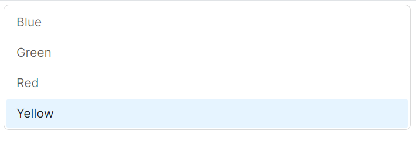
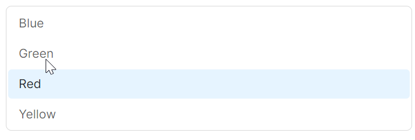
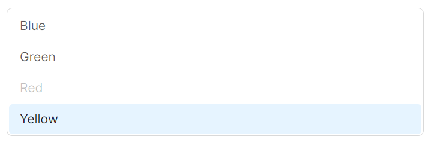

# ListBox 快速入门

## 前置条件

- NuGet 安装 `Avalonia`
- NuGet 安装 `AtomUI`

## 基础用法

最简单的用法是直接通过 `ListBoxItem` 声明选项列表。



```xaml
<atom:ListBox>
    <atom:ListBoxItem>Blue</atom:ListBoxItem>
    <atom:ListBoxItem>Green</atom:ListBoxItem>
    <atom:ListBoxItem>Red</atom:ListBoxItem>
    <atom:ListBoxItem>Yellow</atom:ListBoxItem>
</atom:ListBox>
```

## 禁用Hover样式

通过设置 `ItemHoverBg` 为透明或使用相关属性，可以禁用条目的悬停效果。



```xaml
<atom:ListBox DisabledItemHoverEffect="True">
    <atom:ListBoxItem>Blue</atom:ListBoxItem>
    <atom:ListBoxItem>Green</atom:ListBoxItem>
    <atom:ListBoxItem>Red</atom:ListBoxItem>
    <atom:ListBoxItem>Yellow</atom:ListBoxItem>
</atom:ListBox>
```

## 禁用条目

通过 `IsEnabled` 属性可以将单个条目设置为禁用状态，禁用后用户无法与之交互。也可以通过 `IsItemSelectable` 属性控制条目是否可被选中。



```xaml
<atom:ListBox>
    <atom:ListBoxItem>Blue</atom:ListBoxItem>
    <atom:ListBoxItem>Green</atom:ListBoxItem>
    <atom:ListBoxItem IsEnabled="False">Red</atom:ListBoxItem>
    <atom:ListBoxItem>Yellow</atom:ListBoxItem>
</atom:ListBox>
```
