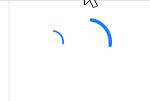

# 自定义图标

`SizeType` 设置组件尺寸， `CustomIndicatorIcon` 使用 `atom:IconProvider` 扩展提供自定义图标（详情参考AtomUI Icons图标组件）。



axaml文件：
```axaml
<StackPanel Orientation="Horizontal">
    <atom:LoadingIndicator SizeType="Small"
                           VerticalAlignment="Center"
                           CustomIndicatorIcon="{atom:IconProvider Kind=LoadingOutlined,NormalFilledColor=#1677ff}" />
    <atom:LoadingIndicator SizeType="Middle"
                           VerticalAlignment="Center"
                           CustomIndicatorIcon="{atom:IconProvider Kind=LoadingOutlined,NormalFilledColor=#1677ff}" />
    <atom:LoadingIndicator SizeType="Large"
                           VerticalAlignment="Center"
                           CustomIndicatorIcon="{atom:IconProvider Kind=LoadingOutlined,NormalFilledColor=#1677ff}" />
</StackPanel>
```
