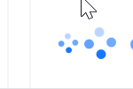
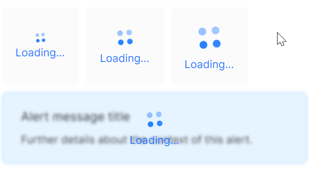
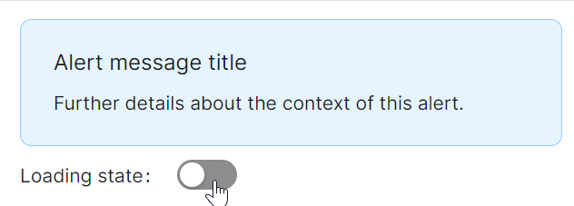

# Spin 快速入门

## 前置条件

- NuGet 安装 `Avalonia`
- NuGet 安装 `AtomUI`

## 基础用法

最简单的用法，直接使用默认配置即可显示加载指示器。


```xaml
<atom:Spin IsSpinning="True" />
```

## 大小尺寸

通过 `SizeType` 属性设定指示器的大小，提供三种尺寸：`Small`、`Middle`、`Large`。



```xaml
<StackPanel Orientation="Horizontal" Spacing="20">
    <atom:Spin IsSpinning="True" SizeType="Small" VerticalAlignment="Center" />
    <atom:Spin IsSpinning="True" SizeType="Middle" VerticalAlignment="Center" />
    <atom:Spin IsSpinning="True" SizeType="Large" VerticalAlignment="Center" />
</StackPanel>
```

## 自定义描述文案

设置 `Tip` 属性并将 `IsShowTip` 设为 `True`，在加载图标下方显示自定义提示文案。



```xaml
<atom:Spin IsSpinning="True" Tip="Loading..." IsShowTip="True" />
```

## 自定义图标

通过 `CustomIndicator` 属性替换默认的旋转指示器为自定义图标。


```xaml
<StackPanel Orientation="Horizontal" Spacing="20">
    <atom:Spin IsSpinning="True"
               SizeType="Small"
               VerticalAlignment="Center"
               CustomIndicator="{atom:IconProvider Kind=LoadingOutlined,NormalFilledColor=#1677ff}" />
    <atom:Spin IsSpinning="True"
               SizeType="Middle"
               VerticalAlignment="Center"
               CustomIndicator="{atom:IconProvider Kind=LoadingOutlined,NormalFilledColor=#1677ff}" />
    <atom:Spin IsSpinning="True"
               SizeType="Large"
               VerticalAlignment="Center"
               CustomIndicator="{atom:IconProvider Kind=LoadingOutlined,NormalFilledColor=#1677ff}" />
</StackPanel>
```

## 遮罩加载

Spin 继承自 `ContentControl`，可包裹任意内容。当 `IsSpinning` 为 `True` 时，内容区域会显示遮罩和加载指示器。通过 `IsMaskBlurEnabled` 和 `IsMaskBackgroundEnabled` 控制遮罩效果。



```xaml
<StackPanel Orientation="Vertical" Spacing="10">
    <atom:Spin IsSpinning="True" Tip="Loading..." IsShowTip="True">
        <atom:Alert Message="Alert message title"
                    Description="Further details about the context of this alert."
                    Type="Info" />
    </atom:Spin>
</StackPanel>
```

通过绑定 `IsSpinning` 属性，可以动态控制加载状态的显示与隐藏。

```xaml
<StackPanel Orientation="Vertical" Spacing="10">
    <atom:Spin IsSpinning="{Binding IsLoadingSwitchChecked}"
               Tip="Loading..." IsShowTip="True">
        <atom:Alert Message="Alert message title"
                    Description="Further details about the context of this alert."
                    Type="Info" />
    </atom:Spin>
    <StackPanel Orientation="Horizontal" Spacing="10">
        <atom:TextBlock>Loading state:</atom:TextBlock>
        <atom:ToggleSwitch IsChecked="{Binding IsLoadingSwitchChecked}" />
    </StackPanel>
</StackPanel>
```

code-behind 文件：
```csharp
public partial class SpinShowCase : ReactiveUserControl<SpinViewModel>
{
    public SpinShowCase()
    {
        this.WhenActivated(disposables => { });
        InitializeComponent();
    }
}
```

view-model 文件：
```csharp
using ReactiveUI;

public class SpinViewModel : ReactiveObject, IRoutableViewModel
{
    public IScreen HostScreen { get; }
    public string UrlPathSegment { get; } = "Spin";

    private bool _isLoadingSwitchChecked;

    public bool IsLoadingSwitchChecked
    {
        get => _isLoadingSwitchChecked;
        set => this.RaiseAndSetIfChanged(ref _isLoadingSwitchChecked, value);
    }

    public SpinViewModel(IScreen screen)
    {
        HostScreen = screen;
    }
}
```
