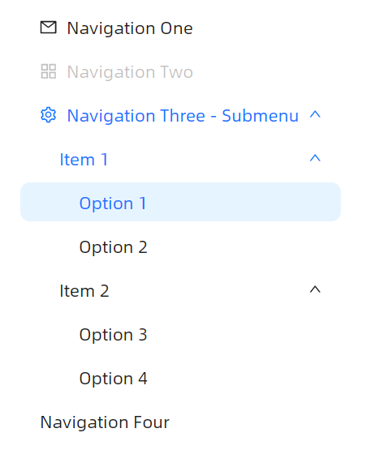

# 默认展开



axaml文件：
```axaml
<atom:NavMenu Mode="Inline" Margin="0, 0, 0, 20"
              DefaultOpenPaths="{Binding DefaultOpenPaths}"
              DefaultSelectedPath="{Binding DefaultSelectedPath}">
    <atom:NavMenuItem Header="Navigation One" Icon="{atom:IconProvider Kind=MailOutlined}" ItemKey="1" />
    <atom:NavMenuItem Header="Navigation Two" Icon="{atom:IconProvider Kind=AppstoreOutlined}"
                      IsEnabled="False"
                      ItemKey="2" />
    <atom:NavMenuItem Header="Navigation Three - Submenu" Icon="{atom:IconProvider Kind=SettingOutlined}"
                      ItemKey="3">
        <atom:NavMenuItem Header="Item 1" ItemKey="SubGroup1">
            <atom:NavMenuItem Header="Option 1" ItemKey="Option1" />
            <atom:NavMenuItem Header="Option 2" ItemKey="Option2" />
        </atom:NavMenuItem>

        <atom:NavMenuItem Header="Item 2" ItemKey="SubGroup2">
            <atom:NavMenuItem Header="Option 3" ItemKey="Option3" />
            <atom:NavMenuItem Header="Option 4" ItemKey="Option4" />
        </atom:NavMenuItem>
    </atom:NavMenuItem>
    <atom:NavMenuItem Header="Navigation Four" ItemKey="4" />
</atom:NavMenu>
```
