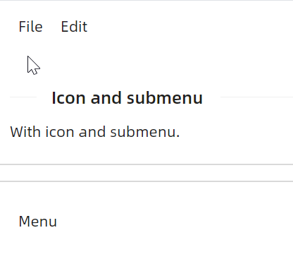
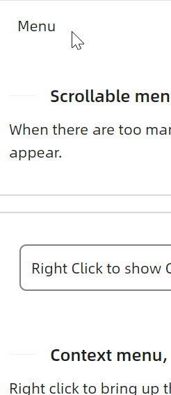
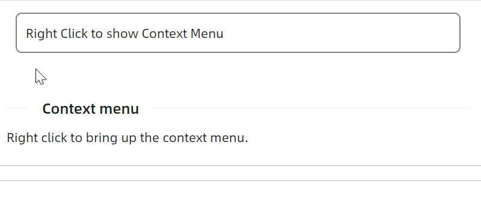
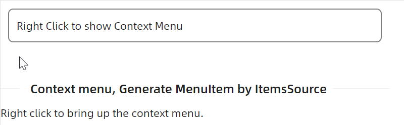
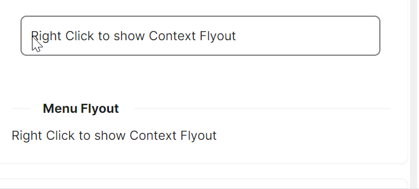
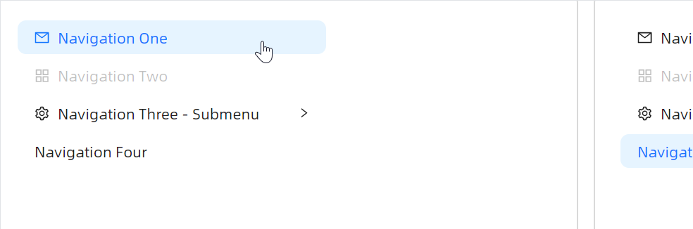
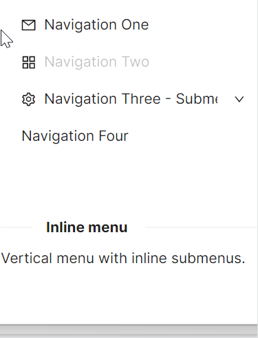
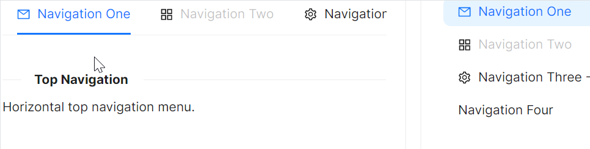
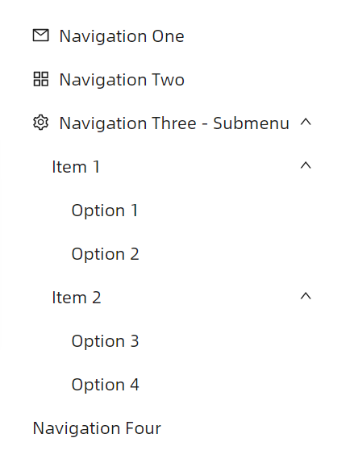
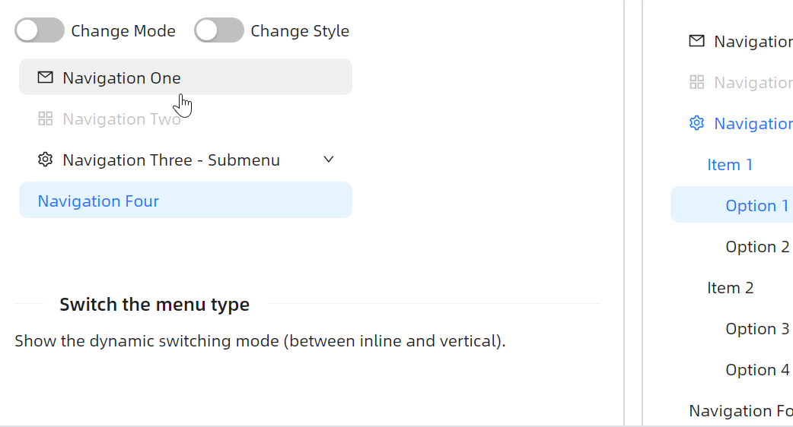

# 快速入门

### 基础配置条件

* Nuget安装Avalonia
* Nuget安装AtomUI

---

## 水平菜单

最基础的水平菜单用法，适用于顶部导航栏。


axaml文件：
```xaml
<atom:Menu>
    <atom:MenuItem Header="_File">
        <atom:MenuItem Header="New Text File" InputGesture="Ctrl+N" />
        <atom:MenuItem Header="New File" InputGesture="Ctrl+Alt+N" />
        <atom:MenuItem Header="New Window" InputGesture="Ctrl+Shift+N" />
    </atom:MenuItem>
    <atom:MenuItem Header="_Edit">
        <atom:MenuItem Header="Undo" InputGesture="Ctrl+Shift+Z" />
        <atom:MenuSeparator />
        <atom:MenuItem Header="Cut" InputGesture="Ctrl+X" />
    </atom:MenuItem>
    <atom:MenuItem Header="Disabled Item" IsEnabled="False" />
</atom:Menu>
```

---

## 图标与多级子菜单

通过 `Icon` 属性为菜单项设置图标，子菜单支持任意层级嵌套。



axaml文件：
```xaml
<atom:Menu>
    <atom:MenuItem Header="_File">
        <atom:MenuItem Header="New Text File" InputGesture="Ctrl+N" />
        <atom:MenuItem Header="New File" InputGesture="Ctrl+Alt+N" />
        <atom:MenuItem Header="New Window" InputGesture="Ctrl+Shift+N" />
        <atom:MenuSeparator />
        <atom:MenuItem Header="Save" InputGesture="Ctrl+S" />
        <atom:MenuItem Header="Save As..." InputGesture="Ctrl+Shift+S" />
        <atom:MenuItem Header="Save All" InputGesture="Ctrl+K" />
        <atom:MenuSeparator />
        <atom:MenuItem Header="Exit" />
    </atom:MenuItem>
    <atom:MenuItem Header="_Edit">
        <atom:MenuItem Header="Undo" InputGesture="Ctrl+Shift+Z" />
        <atom:MenuSeparator />
        <atom:MenuItem Header="Cut" InputGesture="Ctrl+X" Icon="{atom:IconProvider Kind=ScissorOutlined}" />
        <atom:MenuItem Header="Copy" InputGesture="Ctrl+C" Icon="{atom:IconProvider Kind=CopyOutlined}" />
        <atom:MenuItem Header="Delete" InputGesture="Ctrl+D" Icon="{atom:IconProvider Kind=DeleteOutlined}" />
        <atom:MenuItem Header="Paste">
            <atom:MenuItem Header="Paste" InputGesture="Ctrl+P"
                           Icon="{atom:IconProvider Kind=FileDoneOutlined}" />
            <atom:MenuItem Header="Paste from History" InputGesture="Ctrl+Shift+V" />
        </atom:MenuItem>
    </atom:MenuItem>
</atom:Menu>
```

---

## Radio / CheckBox 菜单项

通过 `ToggleType` 属性可以将菜单项设置为单选（Radio）或多选（CheckBox）模式。Radio 模式需要配合 `GroupName` 使用。


axaml文件：
```xaml
<atom:Menu>
    <atom:MenuItem Header="_Menu A">
        <atom:MenuItem Header="New Text File" InputGesture="Ctrl+N" ToggleType="Radio" GroupName="Group1" />
        <atom:MenuItem Header="New File" InputGesture="Ctrl+Alt+N" ToggleType="Radio" GroupName="Group1" />
        <atom:MenuItem Header="New Window" InputGesture="Ctrl+Shift+N" ToggleType="Radio"
                       GroupName="Group1" />
        <atom:MenuSeparator />
        <atom:MenuItem Header="Save" InputGesture="Ctrl+S" ToggleType="CheckBox" />
        <atom:MenuItem Header="Save As..." InputGesture="Ctrl+Shift+S" ToggleType="CheckBox"
                       Icon="{atom:IconProvider Kind=GithubOutlined}" />
        <atom:MenuItem Header="Save All" InputGesture="Ctrl+K" ToggleType="CheckBox"
                       Icon="{atom:IconProvider Kind=CheckOutlined}" />
        <atom:MenuSeparator />
        <atom:MenuItem Header="Exit" />
        <atom:MenuItem Header="Disabled" IsEnabled="False" Icon="{atom:IconProvider Kind=DeleteOutlined}"/>
    </atom:MenuItem>
</atom:Menu>
```

---

## 可滚动菜单

当菜单项数量较多时，弹出菜单自动支持滚动显示。



axaml文件：
```xaml
<atom:Menu>
    <atom:MenuItem Header="_Menu">
        <atom:MenuItem Header="Menu Item" />
        <atom:MenuItem Header="Menu Item" />
        <atom:MenuItem Header="Menu Item" />
        <atom:MenuItem Header="Menu Item" />
        <atom:MenuItem Header="Menu Item" />
        <atom:MenuItem Header="Menu Item" />
        <atom:MenuItem Header="Menu Item" />
        <atom:MenuItem Header="Menu Item" />
        <atom:MenuItem Header="Menu Item" />
        <atom:MenuItem Header="Menu Item" />
        <atom:MenuItem Header="Menu Item" />
        <atom:MenuItem Header="Menu Item" />
        <atom:MenuItem Header="Menu Item" />
        <atom:MenuItem Header="Menu Item" />
        <atom:MenuItem Header="Menu Item" />
        <atom:MenuItem Header="Menu Item" />
        <atom:MenuItem Header="Menu Item" />
        <atom:MenuItem Header="Menu Item" />
    </atom:MenuItem>
</atom:Menu>
```

---

## 通过 ItemsSource 动态生成菜单

使用 `ItemsSource` 绑定数据源，配合 `TreeDataTemplate` 模板动态生成菜单项，适合菜单结构由数据驱动的场景。


axaml文件：
```xaml
<atom:Menu ItemsSource="{Binding MenuItems}"
           x:DataType="viewModels:MenuViewModel">
    <atom:Menu.ItemTemplate>
        <TreeDataTemplate ItemsSource="{Binding Children}">
            <atom:TextBlock Text="{Binding Header}" />
        </TreeDataTemplate>
    </atom:Menu.ItemTemplate>
</atom:Menu>
```

---

## 右键菜单（ContextMenu）

通过 `ContextMenu` 实现右键弹出菜单。



axaml文件：
```xaml
<Border Name="ContextMenuContainer">
    <Border.ContextMenu>
        <atom:ContextMenu>
            <atom:MenuItem Header="Cut" InputGesture="Ctrl+X"
                           Icon="{atom:IconProvider Kind=ScissorOutlined}" />
            <atom:MenuItem Header="Copy" InputGesture="Ctrl+C" Icon="{atom:IconProvider Kind=CopyOutlined}" />
            <atom:MenuItem Header="Delete" InputGesture="Ctrl+D"
                           Icon="{atom:IconProvider Kind=DeleteOutlined}" />
            <atom:MenuItem Header="Paste">
                <atom:MenuItem Header="Paste" InputGesture="Ctrl+P"
                               Icon="{atom:IconProvider Kind=FileDoneOutlined}" />
                <atom:MenuItem Header="Paste from History" InputGesture="Ctrl+Shift+V" />
            </atom:MenuItem>
        </atom:ContextMenu>
    </Border.ContextMenu>
    <atom:TextBlock Text="Right Click to show Context Menu" />
</Border>
```

ContextMenu 同样支持通过 ItemsSource 动态生成：



axaml文件：
```xaml
<Border Name="ItemSourcesContextMenuContainer">
    <Border.ContextMenu>
        <atom:ContextMenu ItemsSource="{Binding MenuItems}"
                          x:DataType="viewModels:MenuViewModel">
            <atom:ContextMenu.ItemTemplate>
                <TreeDataTemplate ItemsSource="{Binding Children}">
                    <atom:TextBlock Text="{Binding Header}" />
                </TreeDataTemplate>
            </atom:ContextMenu.ItemTemplate>
        </atom:ContextMenu>
    </Border.ContextMenu>
    <atom:TextBlock Text="Right Click to show Context Menu" />
</Border>
```

---

## 右键菜单（MenuFlyout）

通过 `ContextFlyout` 配合 `MenuFlyout` 实现浮出式右键菜单。



axaml文件：
```xaml
<Border>
    <Border.ContextFlyout>
        <atom:MenuFlyout IsMotionEnabled="True">
            <atom:MenuItem Header="Cut" InputGesture="Ctrl+X"
                           Icon="{atom:IconProvider Kind=ScissorOutlined}" />
            <atom:MenuItem Header="Copy" InputGesture="Ctrl+C" Icon="{atom:IconProvider Kind=CopyOutlined}" />
            <atom:MenuItem Header="Delete" InputGesture="Ctrl+D"
                           Icon="{atom:IconProvider Kind=DeleteOutlined}" />
            <atom:MenuItem Header="Paste">
                <atom:MenuItem Header="Paste" InputGesture="Ctrl+P"
                               Icon="{atom:IconProvider Kind=FileDoneOutlined}" />
                <atom:MenuItem Header="Paste from History" InputGesture="Ctrl+Shift+V" />
            </atom:MenuItem>
        </atom:MenuFlyout>
    </Border.ContextFlyout>
    <atom:TextBlock Text="Right Click to show Context Flyout" />
</Border>
```

MenuFlyout 也支持 ItemsSource 模板方式：

```xaml
<Border>
    <Border.ContextFlyout>
        <atom:MenuFlyout IsMotionEnabled="True"
                         ItemsSource="{Binding MenuFlyoutItems}"
                         x:DataType="viewModels:MenuViewModel">
            <atom:MenuFlyout.ItemTemplate>
                <TreeDataTemplate ItemsSource="{Binding Children}">
                    <atom:TextBlock Text="{Binding Header}" />
                </TreeDataTemplate>
            </atom:MenuFlyout.ItemTemplate>
        </atom:MenuFlyout>
    </Border.ContextFlyout>
    <atom:TextBlock Text="Right Click to show Context Flyout" />
</Border>
```

---

## 垂直导航菜单

NavMenu 提供侧边栏导航菜单，支持 Vertical（弹出子菜单）和 Inline（内嵌展开子菜单）两种模式。

### Vertical 模式



axaml文件：
```xaml
<atom:NavMenu Mode="Vertical" Width="300">
    <atom:NavMenuItem Header="Navigation One" Icon="{atom:IconProvider Kind=MailOutlined}" />
    <atom:NavMenuItem Header="Navigation Two" Icon="{atom:IconProvider Kind=AppstoreOutlined}"
                      IsEnabled="False" />
    <atom:NavMenuItem Header="Navigation Three - Submenu" Icon="{atom:IconProvider Kind=SettingOutlined}">
        <atom:NavMenuItem Header="Item 1">
            <atom:NavMenuItem Header="Option 1" />
            <atom:NavMenuItem Header="Option 2" />
        </atom:NavMenuItem>
        <atom:NavMenuItem Header="Item 2">
            <atom:NavMenuItem Header="Option 3" />
            <atom:NavMenuItem Header="Option 4" />
        </atom:NavMenuItem>
    </atom:NavMenuItem>
    <atom:NavMenuItem Header="Navigation Four" />
</atom:NavMenu>
```

### Inline 模式



axaml文件：
```xaml
<atom:NavMenu Mode="Inline" Width="300">
    <atom:NavMenuItem Header="Navigation One" Icon="{atom:IconProvider Kind=MailOutlined}" />
    <atom:NavMenuItem Header="Navigation Two" Icon="{atom:IconProvider Kind=AppstoreOutlined}"
                      IsEnabled="False" />
    <atom:NavMenuItem Header="Navigation Three - Submenu" Icon="{atom:IconProvider Kind=SettingOutlined}">
        <atom:NavMenuItem Header="Item 1">
            <atom:NavMenuItem Header="Option 1" />
            <atom:NavMenuItem Header="Option 2" />
        </atom:NavMenuItem>
        <atom:NavMenuItem Header="Item 2">
            <atom:NavMenuItem Header="Option 3" />
            <atom:NavMenuItem Header="Option 4" />
        </atom:NavMenuItem>
    </atom:NavMenuItem>
    <atom:NavMenuItem Header="Navigation Four" />
</atom:NavMenu>
```

---

## 顶部导航菜单

NavMenu 默认为水平模式，可作为顶部导航栏使用，支持暗色样式。



axaml文件：
```xaml
<StackPanel>
    <atom:NavMenu>
        <atom:NavMenuItem Header="Navigation One" Icon="{atom:IconProvider Kind=MailOutlined}" />
        <atom:NavMenuItem Header="Navigation Two" Icon="{atom:IconProvider Kind=AppstoreOutlined}"
                          IsEnabled="False" />
        <atom:NavMenuItem Header="Navigation Three - Submenu"
                          Icon="{atom:IconProvider Kind=SettingOutlined}">
            <atom:NavMenuItem Header="Item 1">
                <atom:NavMenuItem Header="Option 1" />
                <atom:NavMenuItem Header="Option 2" />
            </atom:NavMenuItem>
            <atom:NavMenuItem Header="Item 2">
                <atom:NavMenuItem Header="Option 3" />
                <atom:NavMenuItem Header="Option 4" />
            </atom:NavMenuItem>
        </atom:NavMenuItem>
        <atom:NavMenuItem Header="Navigation Four" />
    </atom:NavMenu>
    <atom:Separator />
    <atom:NavMenu IsDarkStyle="True">
        <atom:NavMenuItem Header="Navigation One" Icon="{atom:IconProvider Kind=MailOutlined}" />
        <atom:NavMenuItem Header="Navigation Two" Icon="{atom:IconProvider Kind=AppstoreOutlined}"
                          IsEnabled="False" />
        <atom:NavMenuItem Header="Navigation Three - Submenu"
                          Icon="{atom:IconProvider Kind=SettingOutlined}">
            <atom:NavMenuItem Header="Item 1">
                <atom:NavMenuItem Header="Option 1" />
                <atom:NavMenuItem Header="Option 2" />
            </atom:NavMenuItem>
            <atom:NavMenuItem Header="Item 2">
                <atom:NavMenuItem Header="Option 3" />
                <atom:NavMenuItem Header="Option 4" />
            </atom:NavMenuItem>
        </atom:NavMenuItem>
        <atom:NavMenuItem Header="Navigation Four" />
    </atom:NavMenu>
</StackPanel>
```

---

## 默认展开路径

通过 `DefaultOpenPaths` 和 `DefaultSelectedPath` 设置 NavMenu 的默认展开与选中状态，需要配合 `ItemKey` 使用。


axaml文件：
```xaml
<atom:NavMenu Mode="Inline"
              DefaultOpenPaths="{Binding DefaultOpenPaths}"
              DefaultSelectedPath="{Binding DefaultSelectedPath}">
    <atom:NavMenuItem Header="Navigation One" Icon="{atom:IconProvider Kind=MailOutlined}" ItemKey="1" />
    <atom:NavMenuItem Header="Navigation Two" Icon="{atom:IconProvider Kind=AppstoreOutlined}"
                      IsEnabled="False" ItemKey="2" />
    <atom:NavMenuItem Header="Navigation Three - Submenu" Icon="{atom:IconProvider Kind=SettingOutlined}"
                      ItemKey="3">
        <atom:NavMenuItem Header="Item 1" ItemKey="SubGroup1">
            <atom:NavMenuItem Header="Option 1" ItemKey="Option1" />
            <atom:NavMenuItem Header="Option 2" ItemKey="Option2" />
        </atom:NavMenuItem>
        <atom:NavMenuItem Header="Item 2" ItemKey="SubGroup2">
            <atom:NavMenuItem Header="Option 3" ItemKey="Option3" />
            <atom:NavMenuItem Header="Option 4" ItemKey="Option4" />
        </atom:NavMenuItem>
    </atom:NavMenuItem>
    <atom:NavMenuItem Header="Navigation Four" ItemKey="4" />
</atom:NavMenu>
```

---

## NavMenu 通过 ItemsSource 动态生成



axaml文件：
```xaml
<atom:NavMenu Mode="Inline" ItemsSource="{Binding NavMenuItems}"
              x:DataType="viewModels:MenuViewModel">
    <atom:NavMenu.ItemTemplate>
        <TreeDataTemplate ItemsSource="{Binding Children}">
            <atom:TextBlock Text="{Binding Header}" />
        </TreeDataTemplate>
    </atom:NavMenu.ItemTemplate>
</atom:NavMenu>
```

---

## 菜单样式切换

通过绑定 `Mode` 和 `IsDarkStyle` 属性，可以在运行时动态切换菜单的展示模式和样式。



axaml文件：
```xaml
<StackPanel Orientation="Vertical" Spacing="10">
    <StackPanel Orientation="Horizontal" Spacing="5">
        <atom:ToggleSwitch Name="ChangeModeSwitch" />
        <atom:TextBlock>Change Mode</atom:TextBlock>
        <atom:ToggleSwitch Margin="10, 0, 0, 0" Name="ChangeStyleSwitch" />
        <atom:TextBlock>Change Style</atom:TextBlock>
    </StackPanel>
    <atom:NavMenu Mode="{Binding Mode}" Width="300" IsDarkStyle="{Binding IsDark}">
        <atom:NavMenuItem Header="Navigation One" Icon="{atom:IconProvider Kind=MailOutlined}" />
        <atom:NavMenuItem Header="Navigation Two" Icon="{atom:IconProvider Kind=AppstoreOutlined}"
                          IsEnabled="False" />
        <atom:NavMenuItem Header="Navigation Three - Submenu"
                          Icon="{atom:IconProvider Kind=SettingOutlined}">
            <atom:NavMenuItem Header="Item 1">
                <atom:NavMenuItem Header="Option 1" />
                <atom:NavMenuItem Header="Option 2" />
            </atom:NavMenuItem>
            <atom:NavMenuItem Header="Item 2">
                <atom:NavMenuItem Header="Option 3" />
                <atom:NavMenuItem Header="Option 4" />
            </atom:NavMenuItem>
        </atom:NavMenuItem>
        <atom:NavMenuItem Header="Navigation Four" />
    </atom:NavMenu>
</StackPanel>
```
