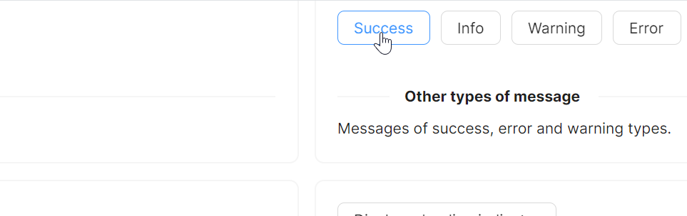

# Message 快速入门

### 基础配置条件

* Nuget安装Avalonia
* Nuget安装AtomUI

### 初始化 WindowMessageManager

`Message` 组件的展示依赖于 `WindowMessageManager`。你需要在控件挂载到视觉树后初始化它，并指定最大同时展示的消息数量。

```csharp
using AtomUI.Controls;
using Avalonia;
using Avalonia.Controls;
using Avalonia.Interactivity;
using Avalonia.ReactiveUI;
using ReactiveUI;

namespace Your-NameSpace;

public partial class MessageShowCase : ReactiveUserControl<MessageViewModel>
{
    private WindowMessageManager? _messageManager;

    public MessageShowCase()
    {
        this.WhenActivated(disposables => { });
        InitializeComponent();
    }

    protected override void OnAttachedToVisualTree(VisualTreeAttachmentEventArgs e)
    {
        base.OnAttachedToVisualTree(e);
        var topLevel = TopLevel.GetTopLevel(this);
        _messageManager = new WindowMessageManager(topLevel)
        {
            MaxItems = 10
        };
    }
}
```

### 基础用法

通过 `WindowMessageManager` 的 `Show` 方法展示一条消息。最简单的方式是只传入消息文本内容。


axaml文件：
```xaml
<atom:Button ButtonType="Primary"
             Click="ShowSimpleMessage">
    Display normal message
</atom:Button>
```

code-behind文件：
```csharp
private void ShowSimpleMessage(object? sender, RoutedEventArgs e)
{
    _messageManager?.Show(new Message(
        "Hello, AtomUI/Avalonia!"
    ));
}
```

### 消息类型

通过初始化 `Message` 时设定 `type` 参数来指定不同的消息类型。`MessageType` 枚举提供以下五种类型：

* `MessageType.Information` - 信息提示
* `MessageType.Success` - 成功提示
* `MessageType.Warning` - 警告提示
* `MessageType.Error` - 错误提示
* `MessageType.Loading` - 加载状态



axaml文件：
```xaml
<StackPanel Orientation="Horizontal" Spacing="10">
    <atom:Button ButtonType="Default"
                 Click="ShowSuccessMessage">
        Success
    </atom:Button>
    <atom:Button ButtonType="Default"
                 Click="ShowInfoMessage">
        Info
    </atom:Button>
    <atom:Button ButtonType="Default"
                 Click="ShowWarningMessage">
        Warning
    </atom:Button>
    <atom:Button ButtonType="Default"
                 Click="ShowErrorMessage">
        Error
    </atom:Button>
</StackPanel>
```

code-behind文件：
```csharp
private void ShowInfoMessage(object? sender, RoutedEventArgs e)
{
    _messageManager?.Show(new Message(
        type: MessageType.Information,
        content: "This is a information message."
    ));
}

private void ShowSuccessMessage(object? sender, RoutedEventArgs e)
{
    _messageManager?.Show(new Message(
        type: MessageType.Success,
        content: "This is a success message."
    ));
}

private void ShowWarningMessage(object? sender, RoutedEventArgs e)
{
    _messageManager?.Show(new Message(
        type: MessageType.Warning,
        content: "This is a warning message."
    ));
}

private void ShowErrorMessage(object? sender, RoutedEventArgs e)
{
    _messageManager?.Show(new Message(
        type: MessageType.Error,
        content: "This is a error message."
    ));
}
```

### Loading 状态

将 `type` 设为 `MessageType.Loading` 即可展示加载中的消息提示。


axaml文件：
```xaml
<atom:Button ButtonType="Default"
             Click="ShowLoadingMessage">
    Display a loading indicator
</atom:Button>
```

code-behind文件：
```csharp
private void ShowLoadingMessage(object? sender, RoutedEventArgs e)
{
    _messageManager?.Show(new Message(
        type: MessageType.Loading,
        content: "Action in progress..."
    ));
}
```

### 顺序消息与回调

通过 `expiration` 参数设定消息的显示时长，配合 `onClose` 回调可以实现消息链式触发。以下示例展示了 Loading -> Success -> Information 的顺序消息流程。


axaml文件：
```xaml
<atom:Button ButtonType="Default"
             Click="ShowSequentialMessage">
    Display sequential messages
</atom:Button>
```

code-behind文件：
```csharp
private void ShowSequentialMessage(object? sender, RoutedEventArgs e)
{
    _messageManager?.Show(new Message(
        type: MessageType.Loading,
        content: "Action in progress...",
        expiration: TimeSpan.FromSeconds(2.5),
        onClose: () =>
        {
            _messageManager?.Show(new Message(
                type: MessageType.Success,
                expiration: TimeSpan.FromSeconds(2.5),
                content: "Loading finished",
                onClose: () =>
                {
                    _messageManager?.Show(new Message(
                        type: MessageType.Information,
                        expiration: TimeSpan.FromSeconds(2.5),
                        content: "Loading finished"
                    ));
                }
            ));
        }
    ));
}
```
