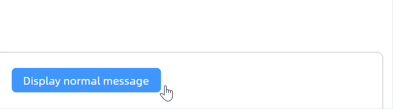

# Message 概述

### 简介

`MessageCard` 是一个基于 `TemplatedControl` 的全局消息提示组件，用于向用户反馈操作结果或系统状态。它支持多种消息类型，包括信息提示、成功、警告、错误以及加载状态，适用于轻量级的非阻断式通知场景。

### 主要功能

* 支持五种消息类型：Information、Success、Warning、Error、Loading
* 支持自定义图标（PathIcon）
* 支持消息关闭动画（Motion）
* 支持消息关闭事件回调
* 支持顺序消息与链式回调

### 适用场景

* 操作成功或失败后的结果反馈
* 系统级信息提示或警告
* 异步任务的加载状态展示
* 需要按顺序展示多条消息的流程
