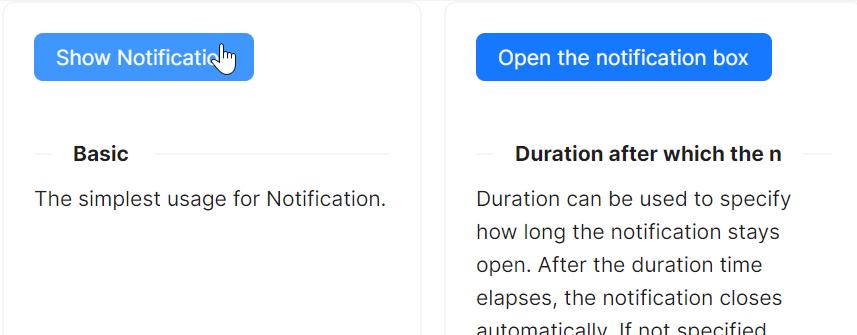

# Notification 快速入门

### 基础配置条件

* Nuget安装Avalonia
* Nuget安装AtomUI

### 基础用法

`Notification` 组件的使用需要基于一个现有的组件，比如 `Button` 组件。通过点击 `Button` 组件，会弹出一个 `Notification` 组件。

本示例中，通过点击按钮后，`ShowSimpleNotification` 会继续处理后续流程（当然，更推荐使用 `Command` 来处理这个事件），具体代码参考code-behind文件。

在code-behind文件中，我们可以看到整个组件的初始化逻辑：
1、创建一个 `WindowNotificationManager` 对象，并设置 `MaxItems` 属性为3
2、给 `WindowNotificationManager` 对象的`Show` 方法传入一个 `Notification` 对象
3、`Notification` 对象的初始化参数为title和content



axaml文件：
```axaml
<atom:Button ButtonType="Primary" Click="ShowSimpleNotification">
    Show Notification
</atom:Button>
```

code-behind文件：
```csharp
using AtomUI.Controls;
using AtomUI.IconPkg.AntDesign;
using AtomUIGallery.ShowCases.ViewModels;
using Avalonia;
using Avalonia.Controls;
using Avalonia.Interactivity;
using Avalonia.ReactiveUI;
using ReactiveUI;

public partial class NotificationShowCase : ReactiveUserControl<NotificationViewModel>
{
    private WindowNotificationManager? _basicManager;
    
    public NotificationShowCase()
    {
        this.WhenActivated(disposables => { });
        InitializeComponent();
        HoverOptionGroup.OptionCheckedChanged += HandleHoverOptionGroupCheckedChanged;
    }
    
    private void HandleHoverOptionGroupCheckedChanged(object? sender, OptionCheckedChangedEventArgs args)
    {
        if (_basicManager is not null)
        {
            if (args.Index == 0)
            {
                _basicManager.IsPauseOnHover = true;
            }
            else
            {
                _basicManager.IsPauseOnHover = false;
            }
        }
    }
    
    protected override void OnAttachedToVisualTree(VisualTreeAttachmentEventArgs e)
    {
        base.OnAttachedToVisualTree(e);
        var topLevel = TopLevel.GetTopLevel(this);
        _basicManager = new WindowNotificationManager(topLevel)
        {
            MaxItems = 3
        };
    }
    
    private void ShowSimpleNotification(object? sender, RoutedEventArgs e)
    {
        _basicManager?.Show(new Notification(
            "Notification Title",
            "Hello, AtomUI/Avalonia!"
        ));
    }
}
```
