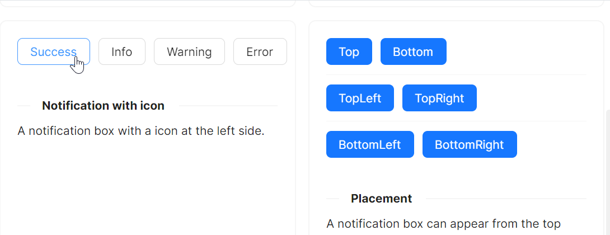

# Notification 快速入门

### 基础配置条件

* Nuget安装Avalonia
* Nuget安装AtomUI

### 基础用法

`Notification` 组件的使用需要依赖 `WindowNotificationManager` 来管理通知的显示。通常在 code-behind 中创建 `WindowNotificationManager` 实例，然后调用其 `Show` 方法弹出通知。

基本步骤如下：
1. 在 `OnAttachedToVisualTree` 中创建 `WindowNotificationManager` 对象，并设置 `MaxItems` 属性控制最大显示数量
2. 调用 `WindowNotificationManager` 的 `Show` 方法，传入 `Notification` 对象
3. `Notification` 对象支持设置 `title`、`content`、`type`、`icon`、`expiration`、`showProgress` 等参数


axaml文件：
```xaml
<atom:Button ButtonType="Primary" Click="ShowSimpleNotification">
    Show Notification
</atom:Button>
```

code-behind文件：
```csharp
using AtomUI.Controls;
using Avalonia;
using Avalonia.Controls;
using Avalonia.Interactivity;

public partial class NotificationShowCase : UserControl
{
    private WindowNotificationManager? _basicManager;

    protected override void OnAttachedToVisualTree(VisualTreeAttachmentEventArgs e)
    {
        base.OnAttachedToVisualTree(e);
        var topLevel = TopLevel.GetTopLevel(this);
        _basicManager = new WindowNotificationManager(topLevel)
        {
            MaxItems = 3
        };
    }

    private void ShowSimpleNotification(object? sender, RoutedEventArgs e)
    {
        _basicManager?.Show(new Notification(
            "Notification Title",
            "Hello, AtomUI/Avalonia!"
        ));
    }
}
```

### 内置图标类型

通过 `Notification` 的 `type` 参数来设置通知类型图标，支持 `NotificationType.Success`、`NotificationType.Information`、`NotificationType.Warning`、`NotificationType.Error` 四种类型。



axaml文件：
```xaml
<StackPanel Orientation="Horizontal" Spacing="10">
    <atom:Button ButtonType="Default" Click="ShowSuccessNotification">
        Success
    </atom:Button>
    <atom:Button ButtonType="Default" Click="ShowInfoNotification">
        Info
    </atom:Button>
    <atom:Button ButtonType="Default" Click="ShowWarningNotification">
        Warning
    </atom:Button>
    <atom:Button ButtonType="Default" Click="ShowErrorNotification">
        Error
    </atom:Button>
</StackPanel>
```

code-behind文件：
```csharp
private void ShowSuccessNotification(object? sender, RoutedEventArgs e)
{
    _basicManager?.Show(new Notification(
        type: NotificationType.Success,
        title: "Notification Title",
        content: "This is the content of the notification."
    ));
}

private void ShowInfoNotification(object? sender, RoutedEventArgs e)
{
    _basicManager?.Show(new Notification(
        type: NotificationType.Information,
        title: "Notification Title",
        content: "This is the content of the notification."
    ));
}

private void ShowWarningNotification(object? sender, RoutedEventArgs e)
{
    _basicManager?.Show(new Notification(
        type: NotificationType.Warning,
        title: "Notification Title",
        content: "This is the content of the notification."
    ));
}

private void ShowErrorNotification(object? sender, RoutedEventArgs e)
{
    _basicManager?.Show(new Notification(
        type: NotificationType.Error,
        title: "Notification Title",
        content: "This is the content of the notification."
    ));
}
```

### 自定义图标

当内置图标无法满足需求时，可通过 `Notification` 的 `icon` 参数来自定义图标。图标可以使用 `AntDesignIconPackage` 图标库中的任意图标。


axaml文件：
```xaml
<atom:Button ButtonType="Primary" Click="ShowCustomIconNotification">
    Open the notification box
</atom:Button>
```

code-behind文件：
```csharp
using AtomUI.IconPkg.AntDesign;

private void ShowCustomIconNotification(object? sender, RoutedEventArgs e)
{
    _basicManager?.Show(new Notification(
        "Notification Title",
        "This is the content of the notification.",
        icon: AntDesignIconPackage.SettingOutlined()
    ));
}
```

### 永不关闭

在某些业务场景中，需要通知不自动关闭。通过将 `expiration` 参数设置为 `TimeSpan.Zero`，可以实现永不自动关闭的效果，用户需要手动关闭通知。


axaml文件：
```xaml
<atom:Button ButtonType="Primary" Click="ShowNeverCloseNotification">
    Open the notification box
</atom:Button>
```

code-behind文件：
```csharp
private void ShowNeverCloseNotification(object? sender, RoutedEventArgs e)
{
    _basicManager?.Show(new Notification(
        expiration: TimeSpan.Zero,
        title: "Notification Title",
        content: "I will never close automatically. This is a purposely very very long description that has many many characters and words."
    ));
}
```

### 进度指示器与悬停暂停

通过设置 `showProgress` 为 `true`，可以在通知底部显示关闭倒计时进度条。同时可通过 `WindowNotificationManager` 的 `IsPauseOnHover` 属性控制鼠标悬停时是否暂停倒计时。


axaml文件：
```xaml
<StackPanel Orientation="Vertical" Spacing="10">
    <atom:OptionButtonGroup Name="HoverOptionGroup" ButtonStyle="Outline">
        <atom:OptionButton IsChecked="True">Pause on hover</atom:OptionButton>
        <atom:OptionButton>Don&apos;t pause on hover</atom:OptionButton>
    </atom:OptionButtonGroup>
    <atom:Button ButtonType="Primary" Click="ShowProgressNotification">
        Show Notification
    </atom:Button>
</StackPanel>
```

code-behind文件：
```csharp
public NotificationShowCase()
{
    InitializeComponent();
    HoverOptionGroup.OptionCheckedChanged += HandleHoverOptionGroupCheckedChanged;
}

private void HandleHoverOptionGroupCheckedChanged(object? sender, OptionCheckedChangedEventArgs args)
{
    if (_basicManager is not null)
    {
        _basicManager.IsPauseOnHover = args.Index == 0;
    }
}

private void ShowProgressNotification(object? sender, RoutedEventArgs e)
{
    _basicManager?.Show(new Notification(
        type: NotificationType.Information,
        title: "Notification Title",
        content: "This is the content of the notification.",
        showProgress: true
    ));
}
```

### 弹出位置

通过设置 `WindowNotificationManager` 的 `Position` 属性，可以控制通知的弹出位置。支持六种位置：`TopLeft`、`TopCenter`、`TopRight`、`BottomLeft`、`BottomCenter`、`BottomRight`。


axaml文件：
```xaml
<StackPanel Orientation="Vertical" Spacing="10">
    <StackPanel Orientation="Horizontal" Spacing="10">
        <atom:Button ButtonType="Primary" Click="ShowTopNotification">Top</atom:Button>
        <atom:Button ButtonType="Primary" Click="ShowBottomNotification">Bottom</atom:Button>
    </StackPanel>
    <atom:Separator />
    <StackPanel Orientation="Horizontal" Spacing="10">
        <atom:Button ButtonType="Primary" Click="ShowTopLeftNotification">TopLeft</atom:Button>
        <atom:Button ButtonType="Primary" Click="ShowTopRightNotification">TopRight</atom:Button>
    </StackPanel>
    <atom:Separator />
    <StackPanel Orientation="Horizontal" Spacing="10">
        <atom:Button ButtonType="Primary" Click="ShowBottomLeftNotification">BottomLeft</atom:Button>
        <atom:Button ButtonType="Primary" Click="ShowBottomRightNotification">BottomRight</atom:Button>
    </StackPanel>
</StackPanel>
```

code-behind文件：
```csharp
private WindowNotificationManager? _topLeftManager;
private WindowNotificationManager? _topManager;
private WindowNotificationManager? _topRightManager;
private WindowNotificationManager? _bottomLeftManager;
private WindowNotificationManager? _bottomManager;
private WindowNotificationManager? _bottomRightManager;

protected override void OnAttachedToVisualTree(VisualTreeAttachmentEventArgs e)
{
    base.OnAttachedToVisualTree(e);
    var topLevel = TopLevel.GetTopLevel(this);

    _topLeftManager = new WindowNotificationManager(topLevel)
    {
        MaxItems = 3, Position = NotificationPosition.TopLeft
    };
    _topManager = new WindowNotificationManager(topLevel)
    {
        MaxItems = 3, Position = NotificationPosition.TopCenter
    };
    _topRightManager = new WindowNotificationManager(topLevel)
    {
        MaxItems = 3, Position = NotificationPosition.TopRight
    };
    _bottomLeftManager = new WindowNotificationManager(topLevel)
    {
        MaxItems = 3, Position = NotificationPosition.BottomLeft
    };
    _bottomManager = new WindowNotificationManager(topLevel)
    {
        MaxItems = 3, Position = NotificationPosition.BottomCenter
    };
    _bottomRightManager = new WindowNotificationManager(topLevel)
    {
        MaxItems = 3, Position = NotificationPosition.BottomRight
    };
}

private void ShowTopNotification(object? sender, RoutedEventArgs e)
{
    _topManager?.Show(new Notification("Notification Top", "Hello, AtomUI/Avalonia!"));
}

private void ShowBottomNotification(object? sender, RoutedEventArgs e)
{
    _bottomManager?.Show(new Notification("Notification Bottom", "Hello, AtomUI/Avalonia!"));
}

private void ShowTopLeftNotification(object? sender, RoutedEventArgs e)
{
    _topLeftManager?.Show(new Notification("Notification TopLeft", "Hello, AtomUI/Avalonia!"));
}

private void ShowTopRightNotification(object? sender, RoutedEventArgs e)
{
    _topRightManager?.Show(new Notification("Notification TopRight", "Hello, AtomUI/Avalonia!"));
}

private void ShowBottomLeftNotification(object? sender, RoutedEventArgs e)
{
    _bottomLeftManager?.Show(new Notification("Notification BottomLeft", "Hello, AtomUI/Avalonia!"));
}

private void ShowBottomRightNotification(object? sender, RoutedEventArgs e)
{
    _bottomRightManager?.Show(new Notification("Notification BottomRight", "Hello, AtomUI/Avalonia!"));
}
```
