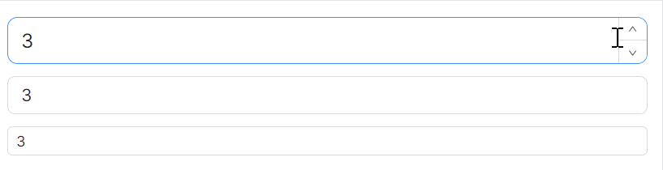
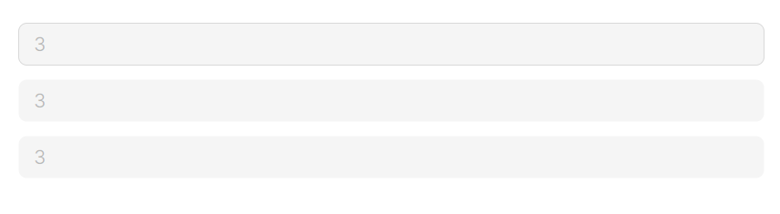
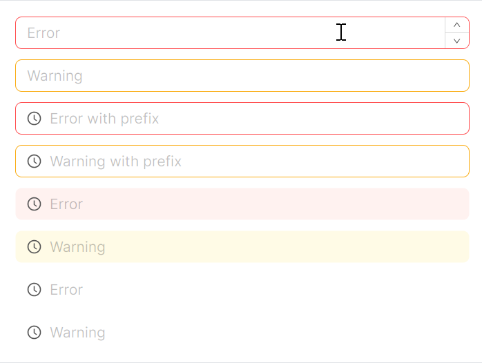
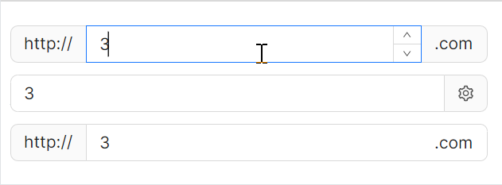
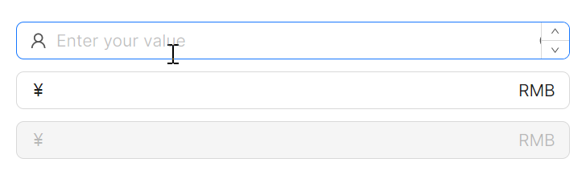
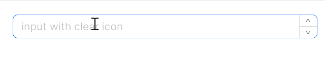

# NumericUpDown 快速入门

### 基础配置条件

* Nuget安装Avalonia
* Nuget安装AtomUI

### 基础用法

`Value` 属性用于设定控件的初始数值。


axaml文件：
```xaml
<atom:NumericUpDown Value="3" />
```

### 大小尺寸

`SizeType` 属性用于设定控件大小，目前预设值有三种：Large、Middle、Small。



axaml文件：
```xaml
<StackPanel Orientation="Vertical" Spacing="10">
    <atom:NumericUpDown SizeType="Large" Value="3" />
    <atom:NumericUpDown SizeType="Middle" Value="3" />
    <atom:NumericUpDown SizeType="Small" Value="3" />
</StackPanel>
```

### 禁用状态

`IsEnabled` 属性用于设定控件是否可用。



axaml文件：
```xaml
<StackPanel Orientation="Vertical" Spacing="10">
    <atom:NumericUpDown Value="3" StyleVariant="Outline" IsEnabled="False" />
    <atom:NumericUpDown Value="3" StyleVariant="Filled" IsEnabled="False" />
    <atom:NumericUpDown Value="3" StyleVariant="Borderless" IsEnabled="False" />
</StackPanel>
```

### 状态色

* `PlaceholderText` 属性用于设定控件水印文本，类似于网页表单中的 `placeholder`，可以说明控件的用途。
* `Status` 属性用于设定控件状态色，目前预设值有三种：Error、Warning、Normal（默认项）。
* `InnerLeftContent` 属性用于设定控件前缀图标，图标参考 `atom:IconProvider` 组件。



axaml文件：
```xaml
<StackPanel Orientation="Vertical" Spacing="10">
    <atom:NumericUpDown PlaceholderText="Error" Status="Error" />
    <atom:NumericUpDown PlaceholderText="Warning" Status="Warning" />
    <atom:NumericUpDown PlaceholderText="Error with prefix"
                        InnerLeftContent="{atom:IconProvider Kind=ClockCircleOutlined}" Status="Error" />
    <atom:NumericUpDown PlaceholderText="Warning with prefix"
                        InnerLeftContent="{atom:IconProvider Kind=ClockCircleOutlined}" Status="Warning" />

    <atom:NumericUpDown PlaceholderText="Error" Status="Error"
                        InnerLeftContent="{atom:IconProvider Kind=ClockCircleOutlined}"
                        StyleVariant="Filled" />
    <atom:NumericUpDown PlaceholderText="Warning" Status="Warning"
                        InnerLeftContent="{atom:IconProvider Kind=ClockCircleOutlined}"
                        StyleVariant="Filled" />

    <atom:NumericUpDown PlaceholderText="Error" Status="Error"
                        InnerLeftContent="{atom:IconProvider Kind=ClockCircleOutlined}"
                        StyleVariant="Borderless" />
    <atom:NumericUpDown PlaceholderText="Warning" Status="Warning"
                        InnerLeftContent="{atom:IconProvider Kind=ClockCircleOutlined}"
                        StyleVariant="Borderless" />
</StackPanel>
```

### 前后标签

前后标签用于在输入框外部添加装饰性内容：

* `LeftAddOn` 表示输入框左侧的前置标签，其值可以是图标，也可以是字符串。
* `RightAddOn` 表示输入框右侧的后置标签，其值可以是图标，也可以是字符串。
* `InnerRightContent` 则作为内部内容，位于输入框内部的右侧，是输入框的一部分。

`InnerRightContent` 与 `RightAddOn` 的区别：前者更趋向于输入框内部的补充，而后者更趋向于输入框外部的装饰。



axaml文件：
```xaml
<StackPanel Orientation="Vertical" Spacing="10">
    <atom:NumericUpDown LeftAddOn="http://" RightAddOn=".com" Width="400"
                        HorizontalAlignment="Left" Value="3" />
    <atom:NumericUpDown RightAddOn="{atom:IconProvider Kind=SettingOutlined}" Width="400"
                        HorizontalAlignment="Left" Value="3" />
    <atom:NumericUpDown LeftAddOn="http://" InnerRightContent=".com" Width="400"
                        HorizontalAlignment="Left" Value="3" />
</StackPanel>
```

### 前后缀

`InnerLeftContent` 与 `InnerRightContent` 用于在输入框内部添加前缀和后缀内容。



axaml文件：
```xaml
<StackPanel Orientation="Vertical" Spacing="10">
    <atom:NumericUpDown PlaceholderText="Enter your value"
                        InnerLeftContent="{atom:IconProvider Kind=UserOutlined, NormalFilledColor=#D7D7D7}"
                        InnerRightContent="{atom:IconProvider Kind=InfoCircleOutlined, NormalFilledColor=#8C8C8C}" />
    <atom:NumericUpDown InnerLeftContent="￥" InnerRightContent="RMB" />
    <atom:NumericUpDown InnerLeftContent="￥" InnerRightContent="RMB" IsEnabled="False" />
</StackPanel>
```

### 一键清除

设定 `IsAllowClear` 为 `True`，即可在输入框中显示清除图标，点击后可一键清除已输入的内容。



axaml文件：
```xaml
<atom:NumericUpDown PlaceholderText="input with clear icon" Width="400"
                    HorizontalAlignment="Left" IsAllowClear="True" />
```
